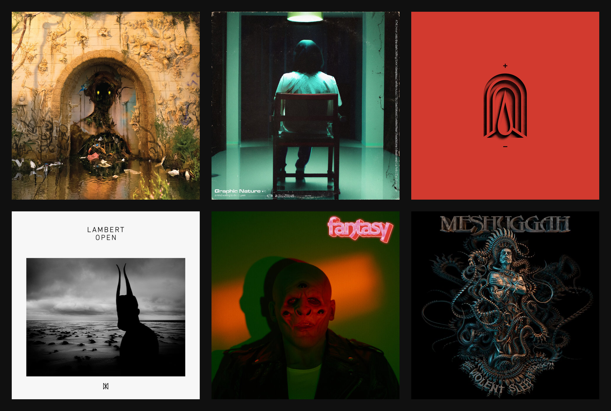
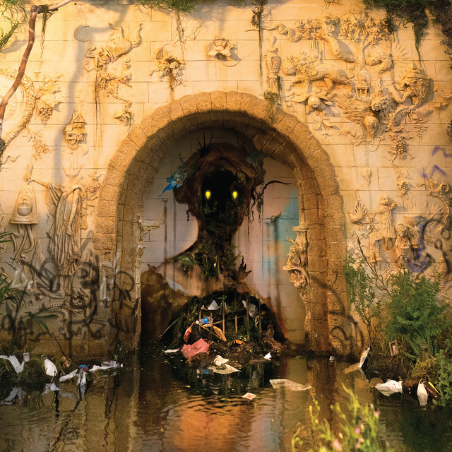
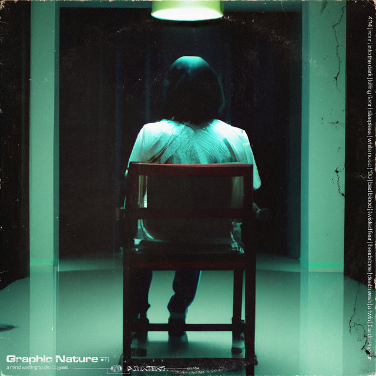
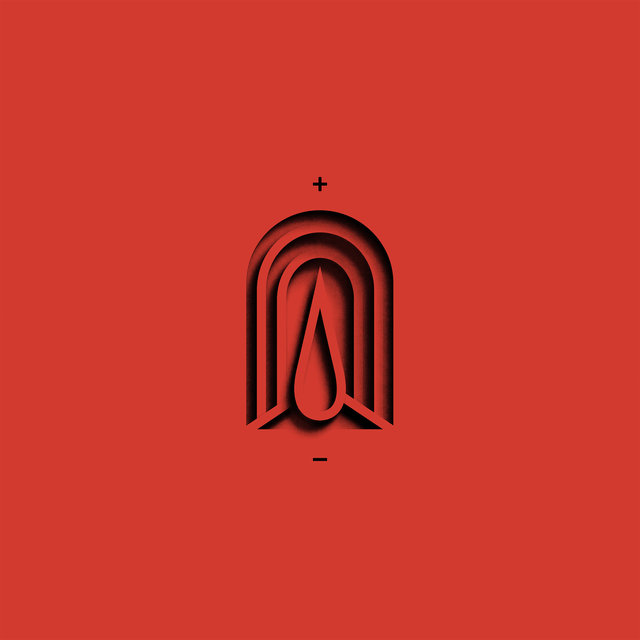
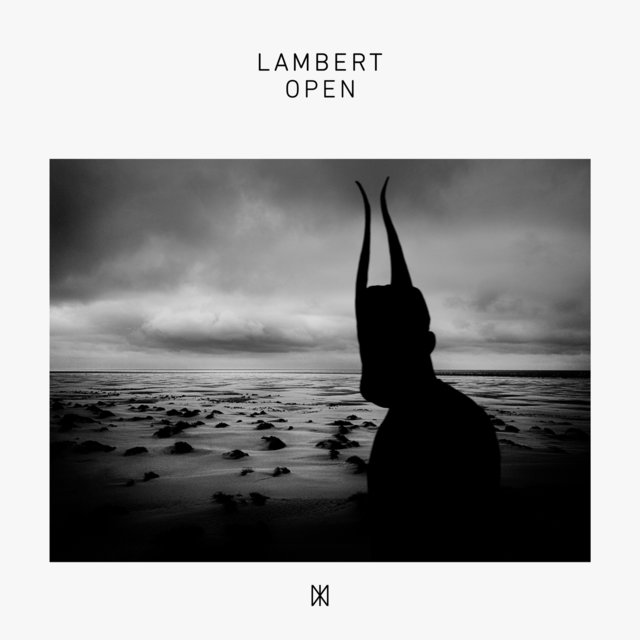
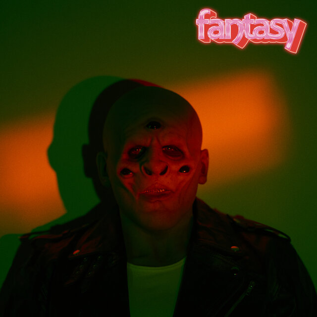
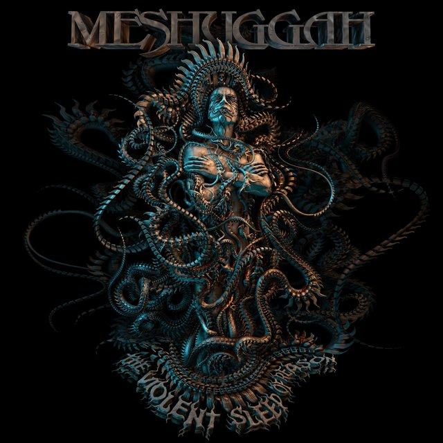

## Disclaimer

It's not really a "best of released in 2023" but rather a "best of records I listen to most in 2023".

## January 2023 - "Two Dreams" by Circa Survive

I knew the status of the band in the scene, but never listened to their music before. They got my attention because I really liked the cover, so I tought why not! Turns out I listened to it so much it became the soundtrack for the winter, as it's dark and moody vibe fit the weather perfectly. Also I'm in love with Anthony Green's unique voice.

[Listen to "Two Dreams" by Circa Survive](https://songwhip.com/circa-survive/two-dreams)

## February 2023 - "A Mind Waiting To Die" by Graphic Nature

Expectations for this record were really high because they released some killer singles before album release. Once it came out I couldn't get enough of it, especially as an early Slipknot fan. Harvey Freeman sounds a lot like Corey Taylor and this combined with the super low tuned guitars and great songwriting makes a perfect blend for any heavy metal fan. Truly a piece of art!

[Listen to "A Mind Waiting To Die" by Graphic Nature](https://songwhip.com/graphicnature/a-mind-waiting-to-die)

## March 2023 - "Burning Throne" by Acres

I once read a review for their 2019 album "Lonely World" in FUZE magazine and was interested in checking them out. This is propably my favorite record of that year. Naturally I was looking forward to the follow up and they got even more melancholic and heavy, so they once again secured the pole position, at least for this month. Best track is by far [Hold On](https://www.youtube.com/watch?v=CdIUMp0aWxw).

[Listen to "Burning Throne" by Acres](https://songwhip.com/acres/burningthrone)

## April 2023 - "Open" by Lambert

Being a fan of so-called "neo classic" artists such as Ólafur Arnalds and Ludovico Einaudi, Lambert is on who also gets mentioned a lot. He did some very cool experiments on the "False" record but this one is more back to the roots. Perfect for when you need to do some focused work and your dose of piano-centered music.

[Listen to "Open" by Lambert](https://songwhip.com/lambert/open)

## May 2023 - "Fantasy" by M83

Another record that is great for focussed work or just chilling while your reading a good book lying in the hammock. I don't feel this is a hit record but rather a record that should be listened to from front to back. Very nostalgic and yet modern sounding.

[Listen to "Fantasy" by M83](https://songwhip.com/m83/fantasy2023)

## June 2023 - "The Violent Sleep of Reason" by Meshuggah

I've been lucky enough to have witnessed four Meshuggah shows so far and everytime it got better and better. Their shows feel like an otherwordly experience and I kind of felt like reborn or at least rebooted afterwards. Last time was at Rock im Park 2023 at midnight and it was their best show yet. Not really a fan of their "Immutable" record, although the first track works REALLY well as show opener. Started to re-discover this record which has a much better flow and more bangers.

[Listen to "The Violent Sleep of Reason" by Meshuggah](https://songwhip.com/meshuggah/the-violent-sleep-of-reason)
