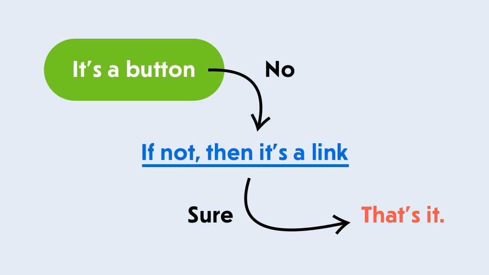
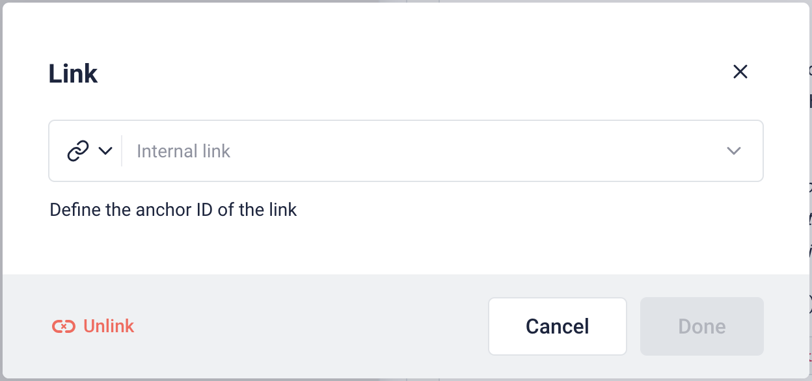

It’s fascinating to see how people can get creative when it comes to making a link look (and work) like a button and vice versa. Both elements couldn’t be more different from each other and yet many web designers and developers seem to think it doesn’t matter which to use for what.

But when we talk about links, we’re actually talking about anchor elements. So let’s get some facts straight before using a really helpful analogy.

## 1. The (actual) link element

Are you currently creating the look of a link for your design system? Have you implemented the newly designed link and handing it over for testing? I really doubt it, because this element won’t be visible to your users and is yet very important. Here’s the description from MDN:

> _The `<link>` HTML element specifies relationships between the current document and an external resource. This element is most commonly used to link to stylesheets, but is also used to establish site icons (both "favicon" style icons and icons for the home screen and apps on mobile devices) among other things._

And here’s what it looks like (also from [MDN](https://developer.mozilla.org/)):

```html
<link href="/media/examples/link-element-example.css" rel="stylesheet" />
```

Now that’s curios, isn’t it! Because all this time you and maybe your entire company were referring to something that has absolutely nothing to do with what your talking about. What you actually meant was

## 2. The anchor element

This work horse is what get’s the job done and it comes with tons of functionality and screen reader support out-of-the-box. But don’t take my word for it, here’s how MDN describes it:

> _The anchor HTML element (or anchor element), with its href attribute, creates a hyperlink to web pages, files, email addresses, locations in the same page, or anything else a URL can address. Content within each anchor should indicate the link's destination. If the href attribute is present, pressing the enter key while focused on the anchor element will activate it._

Here’s what an anchor element looks like. It might be a bit underwhelming but let me tell you in just a bit of all the things it can do:

```html
<a href="https://stevefrenzel.dev">Website</a>
```

Do you want it to open an e-mail client with a pre-filled recipient, subject and body? Start your `href` string with `mailto:` and adjust it accordingly. Do you want it to make it very easy to call a certain number when clicking on it? Add the `tel:` attribute, the respective telephone number and you’re good to go. Do you want it to download a file when clicking on it? Add the `download` attribute, as well as the file path and YOU ARE GOLDEN. 🤩

All this functionality comes without any JavaScript, by the way. The anchor element is a real bang for the buck! Let’s have a brief look at the last member of this love triangle:

## 3. The button element

You’re probably on the internet at least once a day, so chances are high you visited a website were some dreadful cookie banner asked for your consent. The rectangle saying “Agree”, which makes you give up all your privacy rights? That’s a button! And here’s what MDN has to say about it:

> _The button HTML element is an interactive element activated by a user with a mouse, keyboard, finger, voice command, or other assistive technology. Once activated, it then performs an action, such as submitting a form or opening a dialog._

Button example from MDN:

```html
<button class="favorite styled" type="button">Add to favorites</button>
```

Pay extra attention to the part saying “performs an action”. To simplify: A button does something. A link takes you somewhere.

## 4. The analogy



This flow chart was taken from the article [When Is A Button Not A Button](https://www.smashingmagazine.com/2019/02/buttons-interfaces/) by [Vadim Makeev](https://www.smashingmagazine.com/author/vadim-makeev/). As you can see, in their default form, they look very different from each other. You may also noticed that Vadim is calling it a link, even though he’s showing an anchor element. Is it correct? No, but it makes sense because people will understand what he’s talking about.

This “naming convention” is so common, that I also notice it in Notion and Storyblok, which I use for writing and publishing my blog posts. Have a look at the screenshots:




To make the difference between links, anchors and buttons easier to understand, I came up with the analogy of switching a light on:

- Link: This is how your lightbulb is decorated. 💡
- Anchor: The wires leading from the lightbulb to the button. 🔌
- Button: It’s the button for switching it on or of. Surprise! ⚡ ️

Even though their purposes are very different, how come we not only misuse them but also use the wrong names when describing them? Before exploring these issues, let’s talk about the looks of these elements.

## 5. The problem

I would say it is a chain of events that leads to this great confusion. It starts with the fact that we often use the wrong name. Instead of anchor, we say link element. It continues with the fact that in the design, anchor elements are made to look like buttons and the other way around.

This in itself is not too big a problem, as long as the correct HTML elements are used in the implementation. Although it would be nice if they’d look like they’re supposed to look. Here is usually when people get really creative and give an anchor element the functionality of a button (and the other way around). To illustrate this, here are a few of the wildest examples from real websites:

```html
<a type="button" class="button" href="/signup" tabindex="-1">Sign up</a>

<a href="#" onclick="modal.open()">Login</a>

<a href="https://example.com"><button>Example</button></a>
```

These examples are from [HTMLHell](https://www.htmhell.dev/), one of my favourite websites for having a laugh and weeping at the same time because it is quite unbelievable.

## 6. Conclusion

This article is supposed to inform you about the key differences between links, anchors and buttons. It’s also a way for me to think out loud why there’s so much confusion and wrong usage of these elements. What could be your takeaway?

Next time when you’re communicating with your team, you could start using the term “anchor” instead of “link”. If this raises any eyebrows, you now have the knowledge to explain the differences between these two.
