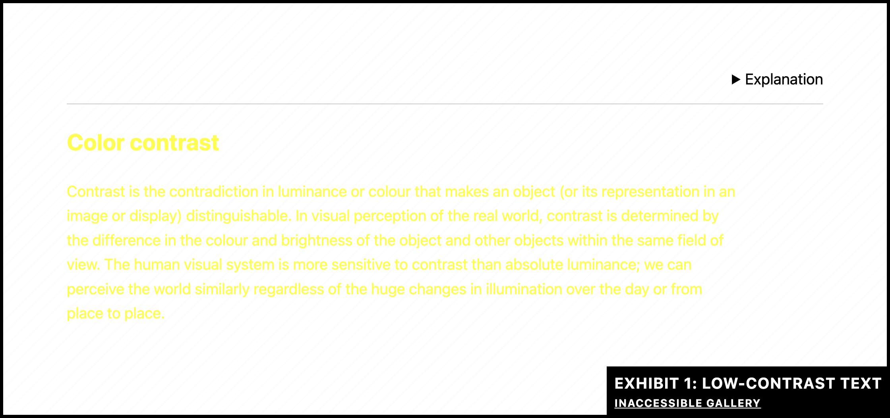
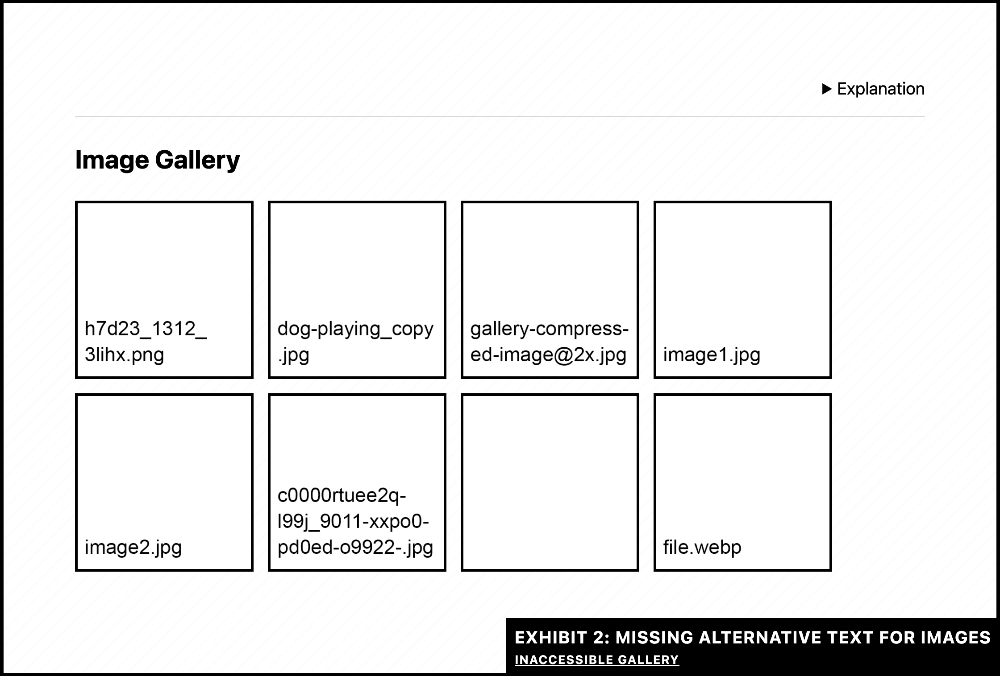
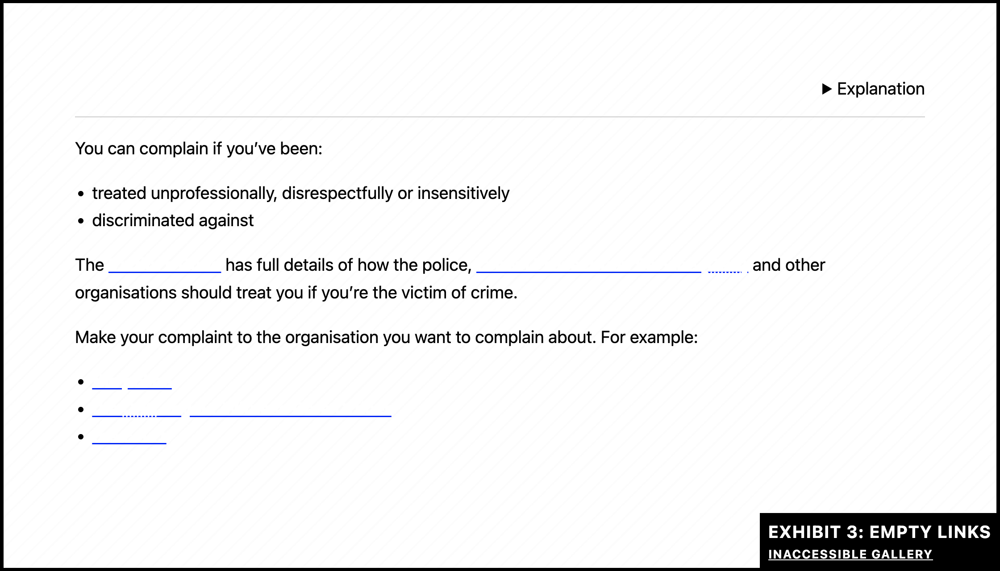
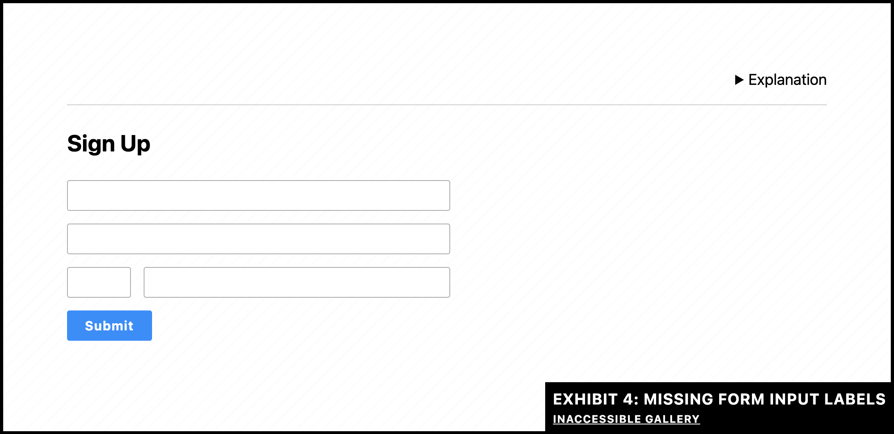
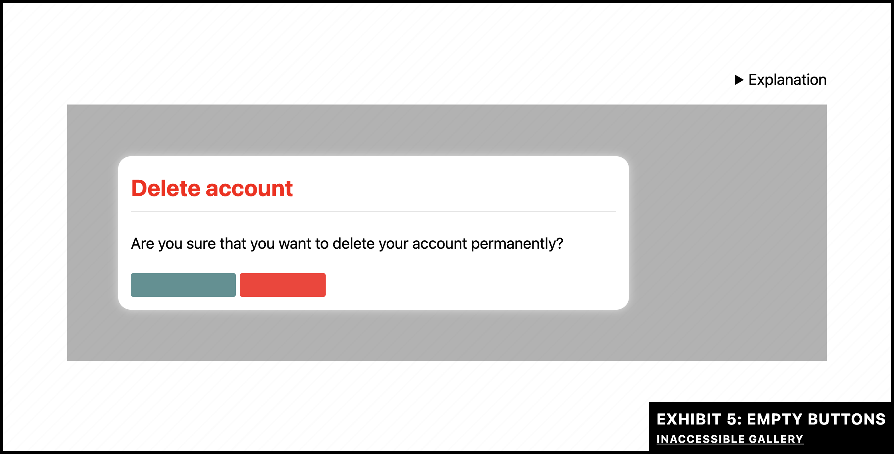
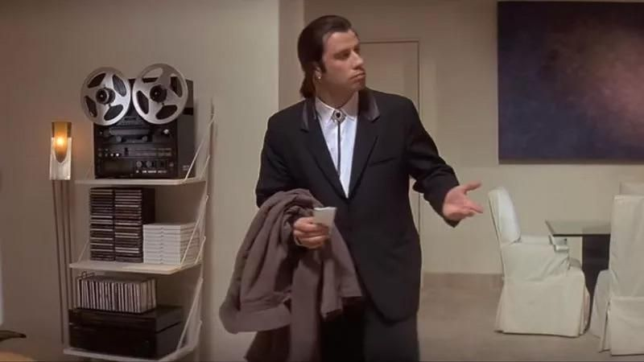

_Last updated on April 24, 2025. I felt that I was just scratching the surface when talking about these issues, so I dove a little deeper and added examples and WCAG references. I also added a table of contents and updated the thumbnail._

## Table of contents

- [TL;DR](#tldr)
- [Intro](#intro)
- [Low contrast text](#1-low-contrast-text)
- [Missing alternative text](#2-missing-alternative-text)
- [Empty links](#3-empty-links)
- [Missing form labels](#4-missing-form-labels)
- [Empty buttons](#5-empty-buttons)
- [Missing document language](#6-missing-document-language)
- [Going the extra mile](#going-the-extra-mile)

## TL;DR

Fixing the six most common issues is relatively easy and can set your website apart from 94.8% of the one million top websites [^1]. You can go even further by adding appropriate [landmark elements](https://stevefrenzel.dev/posts/x-marks-the-spot-landmark-elements/) and going through the [Easy Checks](https://www.w3.org/WAI/test-evaluate/preliminary/) checklist.

## Intro

Accessibility is a crucial aspect of web design, ensuring that as many people as possible can access and use your website. However, it's often overlooked or considered secondary to other things on a website. Wether you're just getting started with this topic or want to dive deeper, the [accessibility tutorial on MDN](https://developer.mozilla.org/en-US/docs/Web/Accessibility) could be a great resource!

According to this [report by WebAIM](https://webaim.org/projects/million/), "94.8% of home pages had detected WCAG 2 failures"! Many accessibility issues are low-hanging fruits and easy to fix with a bit of effort and attention.

Accessibility can also affect the SEO (search engine optimization) of a website. If it's easy to interact with a website for anyone, regardless of their physical or mental condition, it's possible that this could result in a better search engine ranking.

To illustrate five of the six most common issues, I used examples from [Manuel Matuzović](https://www.matuzo.at/)'s website [Inaccessible Gallery](https://inaccessible.gallery/). He's also the author of the [Web Accessibility Cookbook](https://accessibility-cookbook.com/), which is a great (physical) resource for any accessibility issue you might come across.

## 1. Low Contrast Text



**The problem:** When there's not enough contrast between text and background, you have low contrast text. This makes it difficult to read for people who have visual impairments.

**The solution:** Increase the contrast by using a darker or lighter text or background color.

For font sizes of `24px` (or bold text with `18.5px`) and lower, use a contrast ratio of 4,5:1 or higher.

For font sizes of `24px` (or bold text with `19px`) and higher, use a contrast ratio of 3:1 or higher. This contrast ratio also applies to UI elements.

Related success criterion: [Understanding SC 1.4.3: Contrast (Minimum) (Level AA)](https://www.w3.org/WAI/WCAG21/Understanding/contrast-minimum)

Two great tools for checking the color contrast ratio:

- [Contrast Checker by WebAIM](https://webaim.org/resources/contrastchecker/)
- [Colour Contrast Analyser by TPGi](https://www.tpgi.com/color-contrast-checker/)

## 2. Missing Alternative Text



**The problem:** Alternative text (or alt text) is important for people who rely on assistive technology, such as screen readers or braille displays. If it's not there or insufficient, they might be missing out crucial information that sighted users have access to.

**The solution:** It always depends on the context, what kind of alt text should be written, or if it's even necessary at all! Have a look at this article, which breaks it down really well: [What’s the alternative? How to write good alt text](https://design102.blog.gov.uk/2022/01/14/whats-the-alternative-how-to-write-good-alt-text/)

When adding alt text, write your words inside of the quotes of the `alt=""` attribute. If it's purely decorative, leave it empty and the image will be skipped by assistive technology.

When using a CMS for adding images, look for a text input field called "alternative text", "image description", "alt text" or something similar. If it's missing, ask your developers to add it. 😁

- Documentation: [HTMLImageElement: alt property](https://developer.mozilla.org/en-US/docs/Web/API/HTMLImageElement/alt#usage_notes)
- Related success criterion: [Understanding SC 1.1.1: Non-text Content (Level A)](https://www.w3.org/WAI/WCAG21/Understanding/non-text-content)

## 3. Empty Links



**Disclaimer:** Although commonly referred to as link, what we're ACTUALLY talking about is the anchor element. But for the sake of keeping things easy to understand, I'll call it a link.

**The problem:** Empty links contain no information whatsoever. When selecting an empty link with assistive technology, it might be announced just as "link". Example: Linked social media graphics that don't have alt text or an accessible name.

**The solution:** There are multiple ways to avoid empty links. One could be to provide the accessible name with the `aria-label` attribute. If it's a [functional image](https://www.w3.org/WAI/tutorials/images/functional/), the name could come from the alt text. Another way would be to wrap the text inside the `<a>` tag, for example:

```html
<a href="https://www.wikipedia.org/">Wikipedia</a>
```

- Documentation: [`<a>`: The Anchor element](https://developer.mozilla.org/en-US/docs/Web/HTML/Reference/Elements/a)
- Related success criterion: [Understanding SC 2.4.4: Link Purpose (In Context) (Level A)](https://www.w3.org/WAI/WCAG21/Understanding/link-purpose-in-context)

## 4. Missing Form Labels



**The problem:** Forms with missing labels make it difficult for _all_ users to understand what information is required. Often, instead of labels, the `placeholder` attribute is used to convey meaning. This is not sufficient for many reasons:

- It's not persistent: Once you type, the placeholder text is gone and replaced with your text.
- It's not clickable: Clicking the label will focus the input, which is crucial for people having a hard time using the mouse.
- It can cause color contrast issues: Depending on the implementation, this text might be hard to read.

**The solution:** Connect the `<label>` element with the `<input>` element. There are multiple ways to that, but the most common and reliable approach would be this one:

```html
<label for="cheese">Do you like cheese?</label>
<input type="checkbox" name="cheese" id="cheese" />
```

- Documentation: [`<label>`: The Label element](https://developer.mozilla.org/en-US/docs/Web/HTML/Reference/Elements/label)
- Related success criterion: [Understanding SC 1.3.1: Info and Relationships (Level A) ](https://www.w3.org/WAI/WCAG21/Understanding/info-and-relationships)

## 5. Empty Buttons



**The problem:** Empty buttons are buttons that contain no information at all. This makes it it difficult for _all_ users to understand what this element is for. Example: Buttons conveying meaning only through color, which would fail [Understanding SC 1.4.1: Use of Color (Level A)](https://www.w3.org/WAI/WCAG21/Understanding/use-of-color).

**The solution:** Similar to the link element, there are multiple ways to add information to a `<button>` element. The most common one would be:

```html
<button type="button">Click me!</button>
```

If that's not an option, you could also use the `aria-label` attribute to add an accessible name.

- Documentation: [`<button>`: The button element](https://developer.mozilla.org/en-US/docs/Web/HTML/Reference/Elements/button)
- Related success criterion: [Understanding SC 1.1.1: Non-text Content (Level A)](https://www.w3.org/WAI/WCAG21/Understanding/non-text-content)

## 6. Missing Document Language



_Manuel didn't provide an example for this issue. However, I always felt that confused John Travolta from "Pulp Fiction" is the best representation of a screen reader looking for the missing document language._

**The problem:** When no language is defined, screen readers might use the wrong pronunciation, which can make it difficult or impossible to understand the content of a website. Here's an [example from WebAIM](https://webaim.org/techniques/language/#lang). Also: If the document language is missing, no automated translation can be offered.

**The solution:** Let's use a German website for this example. All you gotta do is to add the appropriate `lang` attribute to your `<html>` element:

```html
<html lang="de">
  ...
</html>
```

That's it! This also applies to certain words or paragraphs which aren't in the main language of a website.

- Documentation: [lang](https://developer.mozilla.org/en-US/docs/Web/HTML/Reference/Global_attributes/lang)
- Related success criteria:
  - [Understanding SC 3.1.1: Language of Page (Level A) ](https://www.w3.org/WAI/WCAG21/Understanding/language-of-page)
  - [Understanding SC 3.1.1: Language of Parts (Level AA) ](https://www.w3.org/WAI/WCAG21/Understanding/language-of-parts)

## Going the extra mile

Once you got these six issues covered, why not continue and improve the structure of your website even further by using the appropriate landmark elements? [X marks the spot: Landmark elements](https://stevefrenzel.dev/posts/x-marks-the-spot-landmark-elements/)

Already landmarked your website? Nice, so how about going through this checklist and improve it even more? [Easy Checks – A First Review of Web Accessibility](https://www.w3.org/WAI/test-evaluate/preliminary/)

Doing all this can set you apart from the 94.8% of websites that fail basic accessibility requirements year after year. You wanna be part of the 5.2% elite? Fix your shit and be a hit! 💪

[^1]: Source: [The WebAIM Million](https://webaim.org/projects/million/)
