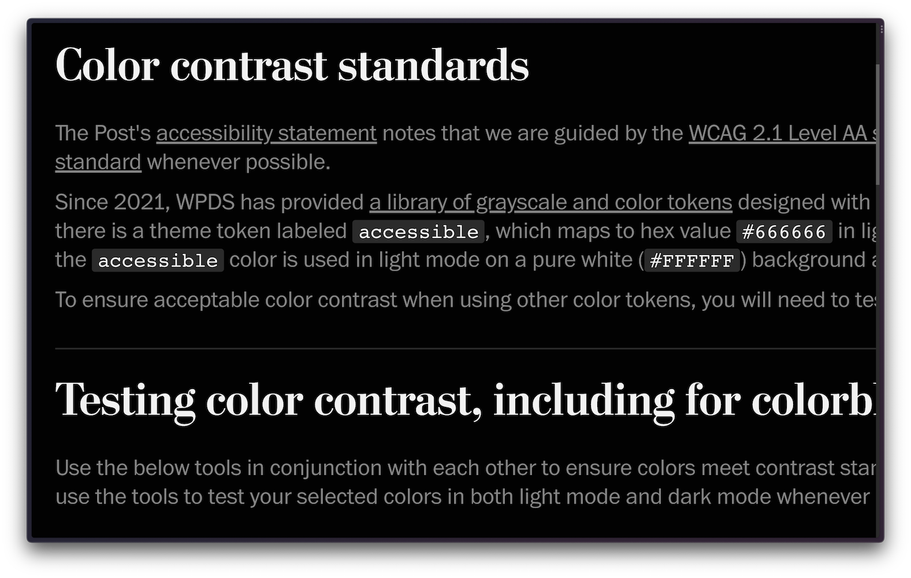
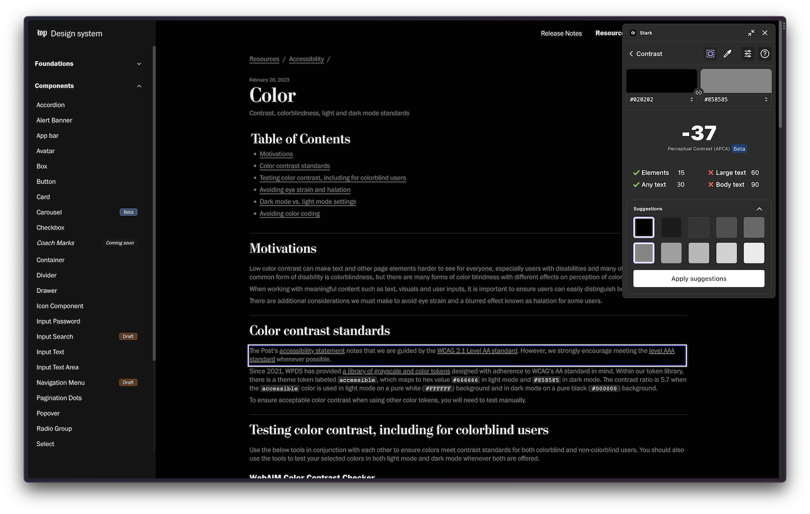
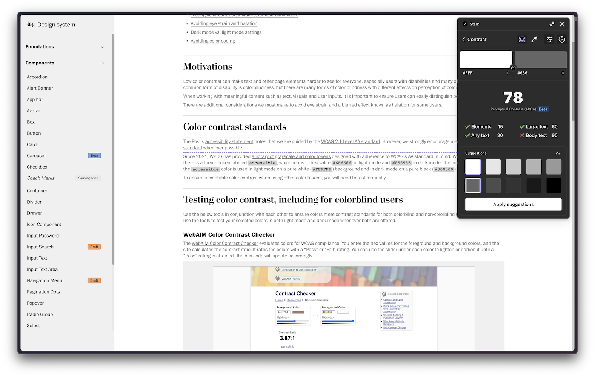

_Disclaimer: All screenshots in this article were taken on macOS Ventura 13.4.1, in Arc Browser 1.2.1. I have the dark theme as default, which is why the website was rendered accordingly. Depending on what settings you have, the site will be rendered with the light theme._

Recently someone pointed me to the [design system of the Washington Post](https://build.washingtonpost.com/resources/accessibility), especially the part about accessibility. What I noticed immediately was the poor readability of the body text and anchor elements:

So I went to the [Color](https://build.washingtonpost.com/resources/accessibility/color) section and saw that the Washington Post's minimum requirement is the level AA standard:

> _The Post's [accessibility statement](https://www.washingtonpost.com/accessibility/) notes that we are guided by the [WCAG 2.1 Level AA standard](https://www.w3.org/WAI/WCAG21/quickref/?showtechniques=143). However, we strongly encourage meeting the [level AAA standard](https://www.w3.org/WAI/WCAG21/quickref/?showtechniques=143%2C146) whenever possible._

If I want to make automatic accessibility checks in the browser very quickly, I use the Stark extension. Here my assumption was confirmed that despite poor readability almost all requirements were met:

To get a second opinion, I switched to APCA (Advanced Perceptual Contrast Algorithm). Lo and behold, the requirements for "Large text" and "Body text" were not met. You can read more about it in this article: [Announcing Stark's APCA beta](https://www.getstark.co/blog/stark-APCA-beta).

If you switch to the light theme, the criterion for "Large text" is met, but not for "Body text":

It is very important to say that the APCA value is not yet an official reference, but rather can be understood as another tool to check color contrast. However, I was interested in the details of what these numbers are all about and how to understand them. On [Why APCA as a New Contrast Method?](https://git.apcacontrast.com/documentation/WhyAPCA) there is a simplified listing of the different levels, which are also partly found in the Stark extension (Lc stands for lightness contrast):

> - Lc 90: Preferred level for fluent text and columns of body text with a font no smaller than 14px/weight 400 (normal).
> - Lc 75: The minimum level for columns of body text with a font no smaller than 18px/400. L 75 should be considered a minimum for text where readability is important.
> - Lc 60: The minimum level recommended for content text that is not body, column, or block text. In other words, text you want people to read. The minimums: 24px normal weight (400) or 16px/700 (bold). These values based on the reference font Helvetica.
> - Lc 45: The minimum for larger, heavier text (36px normal weight or 24px bold) such as headlines. This is also the minimum for pictograms with fine details.
> - Lc 30: The absolute minimum for any text not listed above. This includes placeholder text and disabled element text. This is also the minimum for large/solid semantic & understandable non-text elements.
> - Lc 15: The absolute minimum for any non-text that needs to be discernible and differentiable, and is no less than 6px in its smallest dimension. This may include disabled large buttons. **Designers should treat anything below this level as invisible**, as it will not be visible for many users. This minimum level should be avoided for any items important to the use, understanding, or interaction of the site.

One last question I have is what the minus in the APCA score is all about. On the screenshots with the dark theme the value -37 is displayed and on the one with the light theme the value 78. I understand that a positive value is displayed when the text is darker than the background and vice versa. If you want to try it yourself, have a look at the [APCA Contrast Calculator](https://www.myndex.com/APCA/).

**Conclusion: It is unclear when APCA will become an official standard for accessibility. Still, it's a good tool to get feedback on the extent to which color contrasts are perceived "in the real world". For me personally, the different levels (see quote above) are less abstract than the level A, AA and AAA classifications.**
