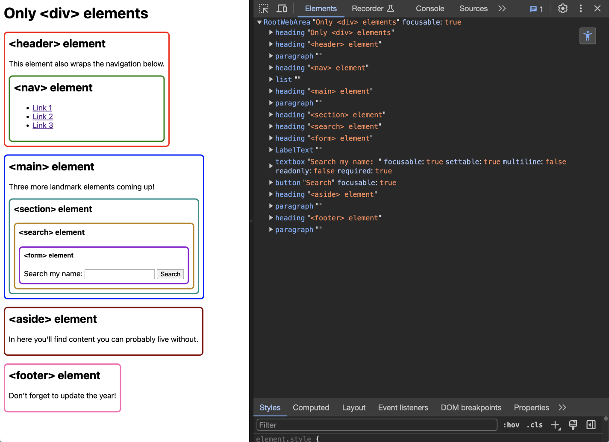
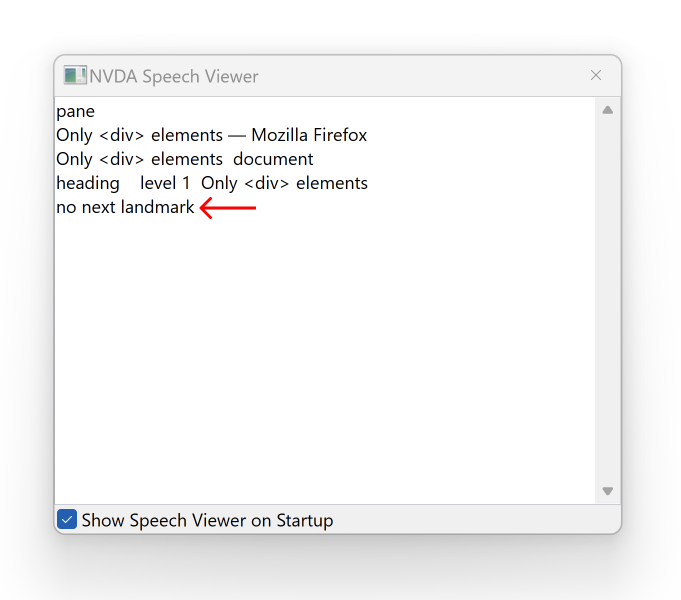
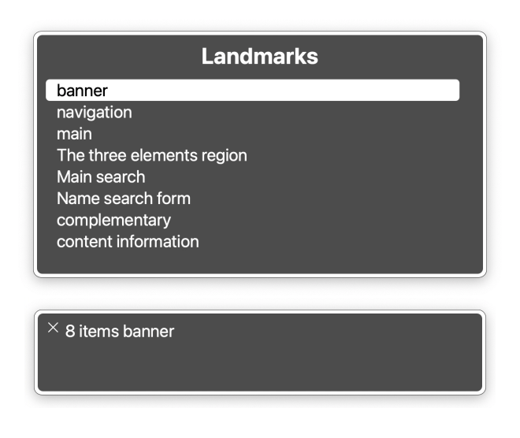
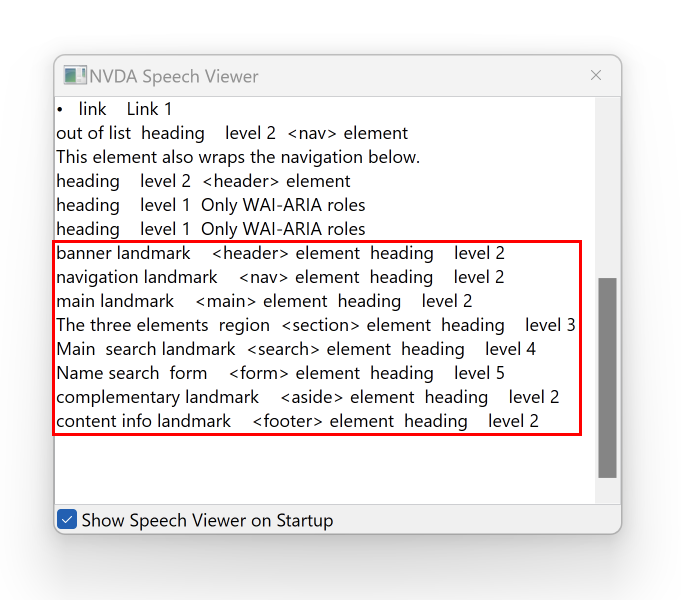
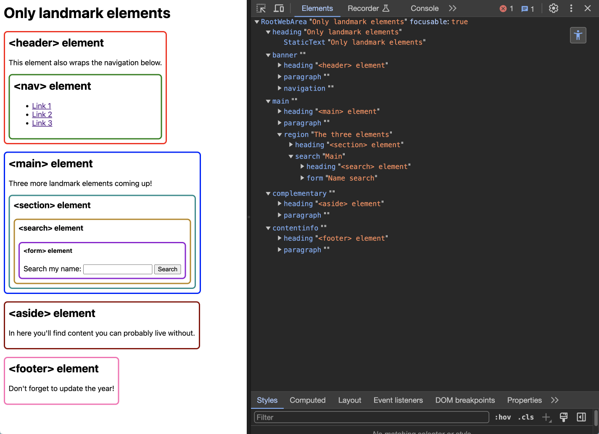
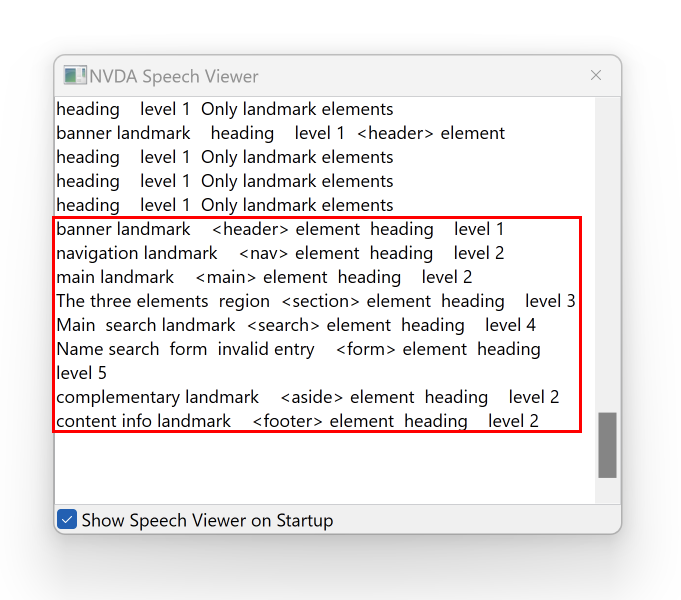

## Table of contents

- [Disclaimer](#disclaimer)
- [Prologue](#prologue)
- [A solid foundation](#a-solid-foundation)
- [Bonjour Tristesse](#bonjour-tristesse)
- [WAI would you do that](#wai-would-you-do-that)
  - [Let’s talk about `form` and `region`](#lets-talk-about-form-and-region)
- [Land in sight](#land-in-sight)
  - [The case for SEO](#the-case-for-seo)
- [Conclusion](#conclusion)

## Disclaimer

I use the abbreviation "AT" in the text, which stands for "assistive technology". I also show examples with two screen readers, [VoiceOver](https://support.apple.com/guide/voiceover/welcome/mac) on macOS Sonoma 14.3 using [Arc](https://arc.net/) and [NVDA](https://www.nvaccess.org/about-nvda/) on Windows 11 using [Firefox](https://www.mozilla.org/en-US/firefox/).

There are many other screen reader and browser combinations, but to cover them all would have gone beyond the scope of this article. In general, I recommend testing as much as possible before you ship something in production!

Want to deep-dive into the topic of screen readers? Check out this article by Adrian Roselli for plenty of resources: [Your Accessibility Claims Are Wrong, Unless…](https://adrianroselli.com/2022/11/your-accessibility-claims-are-wrong-unless.html#SRs)

## Prologue

Imagine you had to describe the way through a building to someone without being able to point out certain things that the person could use for orientation:

> First you go through the thing to get into the thing. Take the thing upstairs because the other thing is broken. After you have gone past a row of things, there is a thing that you have to climb up. Once at the top, press the thing so that you can find the thing with the things more easily.

You'll have a rough idea of what to do, but you'll have to work your way up most of the way by trial and error. But what if you had a concrete description of the landmarks?

> First, go through the door to get to the entrance hall. Take the stairs up because the elevator is broken. After you pass a row of windows, there is a ladder that you have to climb up. Once at the top, press the light switch to make it easier to find the box of photo albums.

It should now be very clear where you need to go and what you need to do to achieve your goal. This example can easily be transferred to websites, as many websites swim in a [`<div>` soup](https://i0.wp.com/css-tricks.com/wp-content/uploads/2021/09/Screen-Shot-2021-09-21-at-9.58.00-AM.png?resize=1536%2C907&ssl=1).

Its main component is the meaningless [`<div>` element](https://developer.mozilla.org/en-US/docs/Web/HTML/Element/div). It is used for all kinds of things, even if there is often a better alternative. And this is where my beloved [landmark elements](https://developer.mozilla.org/en-US/blog/aria-accessibility-html-landmark-roles/#what_are_html_landmark_roles) come into play!

## A solid foundation

I'm a basic guy, I admit it. I love it when simple solutions have a big impact. One of these solutions allows you to make the structure of your website easier to understand for AT users and your developer colleagues. You can use the following eight HTML elements to do this:

- [`<aside>`](https://developer.mozilla.org/en-US/docs/Web/HTML/Element/aside)
- [`<footer>`](https://developer.mozilla.org/en-US/docs/Web/HTML/Element/footer)
- [`<form>`](https://developer.mozilla.org/en-US/docs/Web/HTML/Element/form)
- [`<header>`](https://developer.mozilla.org/en-US/docs/Web/HTML/Element/header)
- [`<main>`](https://developer.mozilla.org/en-US/docs/Web/HTML/Element/main)
- [`<nav>`](https://developer.mozilla.org/en-US/docs/Web/HTML/Element/nav)
- [`<search>`](https://developer.mozilla.org/en-US/docs/Web/HTML/Element/search)
- [`<section>`](https://developer.mozilla.org/en-US/docs/Web/HTML/Element/section)

This article is strongly inspired by [Using HTML landmark roles to improve accessibility](https://developer.mozilla.org/en-US/blog/aria-accessibility-html-landmark-roles/#what_are_html_landmark_roles) by [Schalk Neethling](https://github.com/schalkneethling/), where you will find a concrete example for each element. I, however, will use all elements simultaneously in my examples to keep this article short and crisp.

## Bonjour Tristesse

Example website: [Only `<div>` elements](https://stevefrenzel.github.io/showcase-landmark-elements/div-soup.html)

If we now transfer our very vague directions from the beginning to HTML code, it could look like this, for example:

```html
<body>
  <h1>Only div elements</h1>

  <div class="header">
    {# ... #}
    <div class="nav">{# ... #}</div>
  </div>

  <div class="main">
    {# ... #}
    <div class="section">
      {# ... #}
      <div class="search">
        {# ... #}
        <div class="form">{# ... #}</div>
      </div>
    </div>
  </div>

  <div class="aside">{# ... #}</div>

  <div class="footer">{# ... #}</div>
</body>
```

If we open our browser inspector and look at the [accessibility tree](https://developer.mozilla.org/en-US/docs/Glossary/Accessibility_tree), we discover the following:



Apart from a few semantic HTML elements, not much structure is recognizable. If we activate VoiceOver on MacOs to view all available landmark elements, the picture is similarly bleak. None at all! If none of these elements are available, not even an empty list or a hint is displayed.

If we open NVDA together with Firefox in Windows 11, things don't look much better. Using "D" you can jump to the next landmark element, but we only get the message "no next landmark". ☹️ If we were dependent on a screen reader, only the existing elements could show us the structure of this website.



## WAI would you do that

Example website: [Only WAI-ARIA roles](https://stevefrenzel.github.io/showcase-landmark-elements/wai-aria.html)

A really sad sight... How about an interim solution that is neither elegant nor advisable? To give meaning to all these numerous, ownerless `<div>` elements and make them visible, we could assign them a [WAI-ARIA](https://www.w3.org/WAI/standards-guidelines/aria/) role. The following are available for this purpose:

- [banner](https://developer.mozilla.org/en-US/docs/Web/Accessibility/ARIA/Roles/Banner_Role)
- [complementary](https://developer.mozilla.org/en-US/docs/Web/Accessibility/ARIA/Roles/complementary_role)
- [contentinfo](https://developer.mozilla.org/en-US/docs/Web/Accessibility/ARIA/Roles/contentinfo_role)
- [form](https://developer.mozilla.org/en-US/docs/Web/Accessibility/ARIA/Roles/form_role)
- [main](https://developer.mozilla.org/en-US/docs/Web/Accessibility/ARIA/Roles/main_role)
- [navigation](https://developer.mozilla.org/en-US/docs/Web/Accessibility/ARIA/Roles/navigation_role)
- [region](https://developer.mozilla.org/en-US/docs/Web/Accessibility/ARIA/Roles/region_role)
- [search](https://developer.mozilla.org/en-US/docs/Web/Accessibility/ARIA/Roles/search_role)

Have you noticed that many of these roles have the same name as the corresponding HTML element? If it is not possible for you to use a landmark element, you can fall back on it as an emergency solution. However, the roles only add a semantic meaning, but no functionality! In the case of our form, we gain nothing, as it would be visible, but has no functionality.

```html
<body>
  <h1>Only WAI-ARIA roles</h1>

  <div class="header" role="banner">
    {# ... #}
    <div class="nav" role="navigation">{# ... #}</div>
  </div>

  <div class="main" role="main">
    {# ... #}
    <div aria-label="The three elements" class="section" role="region">
      {# ... #}
      <div aria-label="Main" class="search" role="search">
        {# ... #}
        <div aria-label="Name search" class="form" role="form">{# ... #}</div>
      </div>
    </div>
  </div>

  <div class="aside" role="complementary">{# ... #}</div>

  <div class="footer" role="contentinfo">{# ... #}</div>
</body>
```

Now there is a lot more going on in our accessibility tree, all eight elements are represented! This has the advantage for screen reader users that they can now select these elements directly. On a website with a lot of content, this can speed up navigation enormously, as they can simply skip over areas.


If we use VoiceOver, all eight elements are now also listed:



Thanks to these assigned roles, we can now also navigate quickly through the website with NVDA:



Before we look at how we can achieve the same result even more easily with landmark elements, let's take a little detour:

### Let’s talk about `form` and `region`

These two elements are somewhat out of line, as they only appear in the accessibility tree if you assign them a (descriptive) `aria-label`, at least with the setup I've used.

Also it's possible that the words "section", "region" and "form" are announced by a screen reader when using these roles, so you may not need to add them at all to your `aria-label`.

## Land in sight

Example website: [Only landmark elements example](https://stevefrenzel.github.io/showcase-landmark-elements/landmarks.html)

Finally, the awful part is over! Let’s code our example the way it’s meant to be, with native elements that also make it easier to read the code as a developer.



There are no differences in terms of the accessibility tree, but we now have a working form because we use the power and robustness of native HTML! 💪 Look at this beautiful, self-explanatory code:

```html
<body>
  <h1>Only landmark elements</h1>

  <header>
    {# ... #}
    <nav>{# ... #}</nav>
  </header>

  <main>
    {# ... #}
    <section aria-label="The three elements">
      {# ... #}
      <search aria-label="Main">
        {# ... #}
        <form action="" aria-label="Name search">{# ... #}</form>
      </search>
    </section>
  </main>

  <aside>{# ... #}</aside>

  <footer>{# ... #}</footer>
</body>
```

In NVDA the only difference is that for the `form` element, we now get a notification for "invalid entry", which proves that we have a functional form without any additional JavaScript. It's great to get things for free, isn't it?



### The case for SEO

Let's face it, your employer probably doesn't care as much about landmark elements as SEO (search engine optimization). But if it makes it easier for people to navigate your website, the same should apply to search engines, right?

Imagine that people are looking for something on your website but can't find it because it's very difficult to impossible for technical reasons. Instead, they go to the competition because it's easier for them to find it there. This can have a direct impact on your search engine ranking and a simple fix like adding landmark elements can have a positive impact.

## Conclusion

Why use landmark elements when it works just as well with WAI-ARIA roles?

Use these roles more for complex components to ensure better accessibility. In this case, there is often no suitable element and you have to get creative. This is where WAI-ARIA can help to compensate for accessibility deficits.

Whenever possible, you should use native HTML elements, as these are not only easier to read in the code, but are often also equipped with functionality. This way you can ensure that your website is robust and future-proof. Landmarks help you to build a solid foundation that you can expand with additional semantic elements so that as many people as possible can use your website.

If you're a fan of analogies: Imagine you're building a car, but instead of using functioning components (landmark elements), you use ones that look like the original (WAI-ARIA) but can't do anything else. Needless to say, this is very dangerous and could get you sued.
