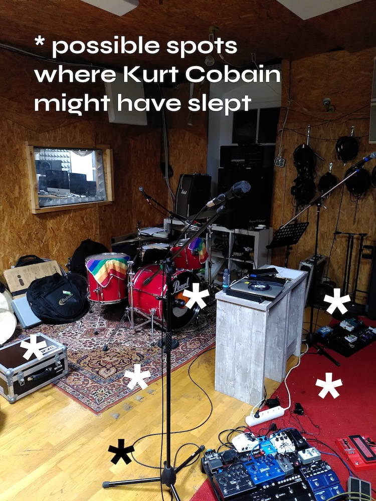

The last time I was in Austria must have been in the mid-nineties. I remember driving go-karts, hearing strange German being spoken and realizing that I would need glasses because I could see absolutely nothing at the license plate bingo.

More than twenty years later, I return, this time with my friends from [Kora Winter](https://www.instagram.com/korawinter/) and in the role of sound engineer. Unfortunately, we weren't complete as one of our guitarists couldn't come along for health reasons. 😭

It was therefore a little less fun than usual, but it was still an unforgettable experience and I'm very grateful that I was able to be there. Because a tour weekend like this doesn't happen often, I kept a diary. The following are the events as I perceived them:

## Day 1: Vienna, Viper Room

After an uneventful train ride with an hour delay (thanks Deutsche Bahn), I met our tour manager at the entrance of the venue because the band wasn't there yet. Loading in (and out) wasn't so much fun as it was a basement show and you had to walk down quite some stairs.

The concert hall was tunnel-shaped, which just screams for bass frequencies to build up. However, they solved it cleverly by placing the sub woofers on the ceiling above the stage. As a result, the bass sounded very compact and not at all out of control, as is usually the case in such venues. To find out quickly what a room and its sound system sounds like, I listen to songs that I know very well. Here is [my soundcheck playlist on TIDAL](https://tidal.com/browse/playlist/a630f32d-a62f-4a5b-9f31-b7b9be96c6c4).

It was the first time we had our own backstage with our own drinks. The Austrians know how to spoil their guests! Also, the room looked like a swingers club, with mirrors and pillars everywhere.

The show went quite well, as we are now a well-rehearsed team and every move during set-up, breakdown and soundcheck is well executed. What you can't plan for, however, is when the bassist's strap pin fails in the middle of the show. 😂

The tuning of the replacement bass was also unplanned, which had to be found out by ear due to technical problems. But the guys took it with humor like professionals and finished the show as usual.

I would have liked more people to have been there. There would have been more going on, but also because the large number of bodies absorbs the high-frequency sound in particular, which makes it rattle less. My mixing desk that night was a Midas but I don't know which one, but let me tell you: Desk shows are my favorite ones! Nothing annoys me more than having to mix a show on a tablet or even a smartphone. 🤮

After the show, the pampering program continued and we slept blissfully in our beds in our apartment not far from the venue. No sleeping mat or sleeping bag necessary that evening!

## Day 2: Linz, KAPU

We started the day with a late breakfast at a cafe before driving to Linz. Our anticipation was enormous, as we would be playing on the same stage that Nirvana had played on November 20, 1989. 😱

When we arrived, we were greeted by a brightly colored house facade outside. Inside, the super nice house technician welcomed us and confirmed to me once again that this was the stage where Nirvana played over 30 years ago (fuck yeah).

During the sound check, I noticed that the concert hall sounded very dry and controlled, which I was very pleased about. Our drummer plays his cymbals very loud and I welcome anything that can tame those high frequencies. My console that night was an Allen & Heath, but (again) I don't know which one. I took pictures of everything, but not of my desk. 🤦‍♂️

Our sleeping area was in the same building a few floors above the venue and was a very large but cozy room with lots of beds, a kitchen, dining and living area. The walls were full of band names that had played and immortalized themselves there. Of course, I asked where Nirvana left their message, but that was painted over a few years ago. CAN YOU BELIEVE IT.

Nirvana also spent the night in the building back then, but not where we stayed, but one floor below us. The room had been converted into a recording studio, but it was still humbling to be in the same room where Kurt Cobain slept.

Because of all these positive circumstances, the show was a lot of fun for all of us, even if we went on stage a bit late. I was also blown away by the support act Seeking, which rarely happens to me with unknown bands. If you wish Hundredth had carried on like they did on RARE, you should definitely [check out Seeking](https://songwhip.com/seeking2/plush). To top it off, they were all super nice. 😭

We were allowed to leave everything in the locked concert room and take it out the next morning and put it in our van. I wanted to pack it up that evening so we'd have less stress in the morning, but was overruled...

## Day 3: Salzburg, Rockhouse

Needless to say, we were pressed for time on this glorious morning because we still had to dismantle, pack and load everything. But the six of us managed! In general, our trips were always short and Salzburg announced itself with an epic mountain landscape. Arriving at the venue, I was surprised at how big the building was.

There were two concert rooms inside of it, a large one on the left and a small one on the right, where we played. In between was the entrance area where our merchandise table was and a staircase leading up to the improvised catering area. The technical equipment was excellent and the crew on site was very nice and helpful.

My mixing desk that evening was an [Allen & Heath dLive C2500](https://www.allen-heath.com/hardware/dlive-series/dlive-surfaces/), the most luxurious console I've had the pleasure of standing at. I love turning potentiometers, moving faders and pressing buttons. But when it's such an intuitive hybrid solution with a huge touchscreen, it's twice as much fun. 😍 It was also very handy to have a volume meter next to the console as the requirement was not to be above 99 decibels for too long. When the boys are on stage, they tend to reach this level of volume pretty quickly, though.

There were a handful of people at the front during the show who were really into it, but the energy in the room was a bit strange and there wasn't that much going on. Two people in metal vests were talking at the bar about Kora Winter being "emo shit" and felt affirmed after the first song and left. Well, their loss. 🤷‍♂️ We were also warned in Linz that Salzburg can be difficult when it comes to live shows for "alternative music".

Since there was a curfew, everything was packed and loaded before midnight and I went straight to the building next door because that's where our apartment was. What a luxury to be able to sleep in a bed every night!
