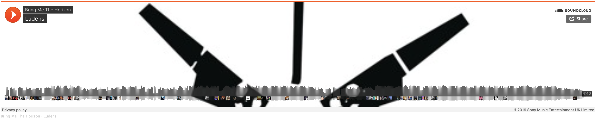
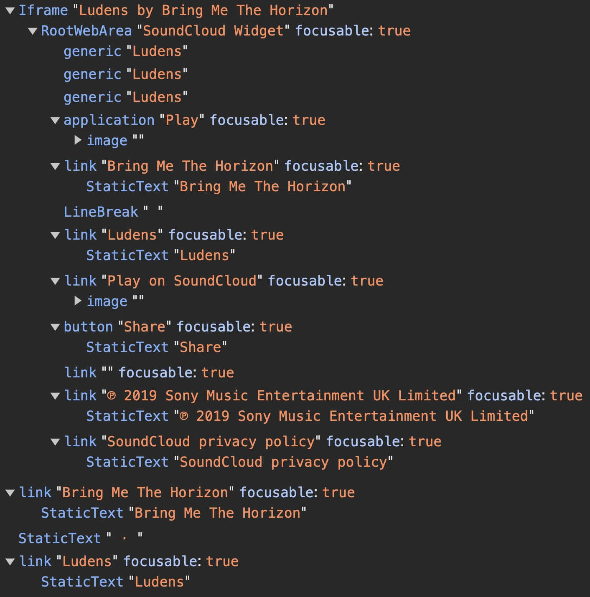
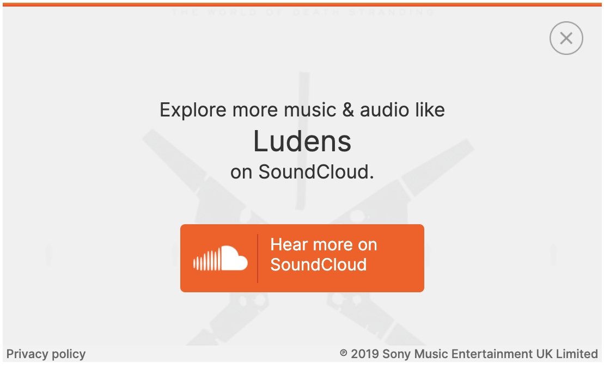
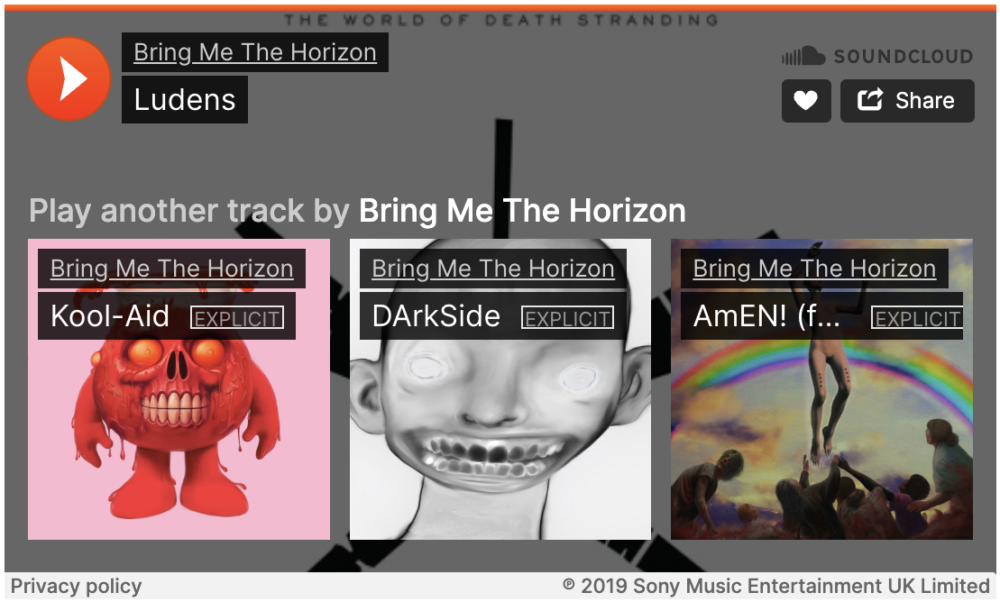
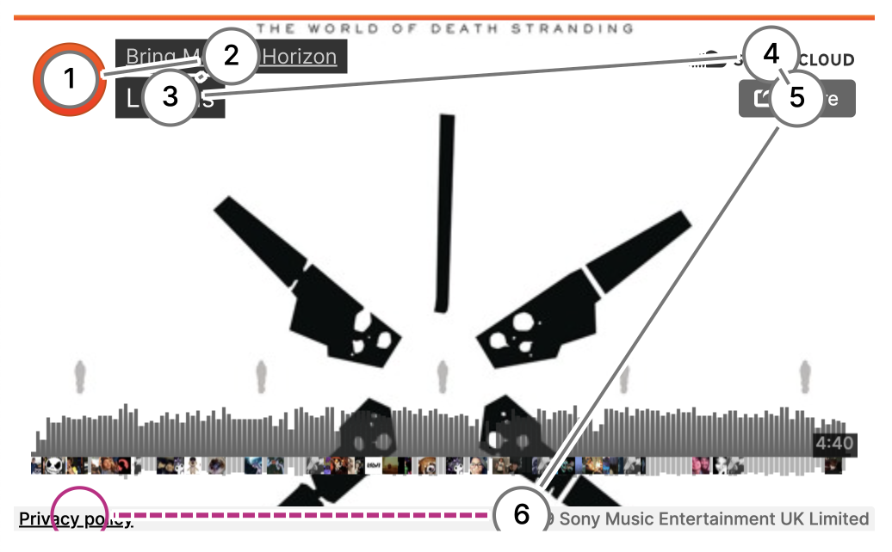

This article was inspired by [a post on Mastodon by FINOkoye](https://mastodon.online/@FINOkoye@mastodon.social/111969507444864766).

Web accessibility and music have been two very big topics in my life for a while now. Thanks to the article I mentioned, I have finally found a topic to combine these two things! And since there are so many streaming providers, I'm might make a little series out of it...

My original plan was to align this component with all the appropriate WCAG criteria, but as I went through this scenario in my head, I realized what a huge amount of work (not paid for by SoundCloud) this would be. It would also overshoot the mark and the core issue is the extent to which it works with a screen reader.

## Table of contents

- ["Ludens" by Bring Me The Horizon](#ludens-by-bring-me-the-horizon)
- [The widget itself](#the-widget-itself)
- [Testing tools (automatic and manual)](#testing-tools-automatic-and-manual)
- [How I tested](#how-i-tested)
  - [Testing with JAWS on Windows 11](#testing-with-jaws-on-windows-11)
  - [Testing with NVDA on Windows 11](#testing-with-nvda-on-windows-11)
  - [Testing with VoiceOver on macOS Sonoma](#testing-with-voiceover-on-macos-sonoma)
  - [Testing with Narrator on Windows 11](#testing-with-narrator-on-windows-11)
- [Conclusion](#conclusion)

## "Ludens" by Bring Me The Horizon


Our test subject will be one of my favorite songs by Bring Me The Horizon from Sheffield, UK: [Ludens](https://soundcloud.com/bring-me-the-horizon/ludens?utm_source=clipboard&utm_medium=text&utm_campaign=social_sharing)! Since Suicide Season came out in 2008, I've not only been a fan of the guys from Sheffield, but also of [Hideo Kojima](https://en.wikipedia.org/wiki/Hideo_Kojima) since his masterpiece [Metal Gear Solid](<https://en.wikipedia.org/wiki/Metal_Gear_Solid_(1998_video_game)>) was released for the Playstation in 1998.

The fact that they wrote a song for Death Stranding - a more recent game by Hideo Kojima - was just a match made in heaven for me. They seem to be fans of it themselves, because their song [Shadow Moses](https://www.youtube.com/watch?v=-k9qDxyxS3s) is a direct Metal Gear reference. And it fucking slaps.

As always, I've created a test website for testing purposes: [Showcase SoundCloud player embed](https://stevefrenzel.github.io/showcase-soundcloud-embed/)

## The widget itself

Already while I was inserting the "iframe" in my code editor, I received a warning from my [axe-linter](https://marketplace.visualstudio.com/items?itemName=deque-systems.vscode-axe-linter) extension:

> Ensures `<iframe>` and `<frame>` elements have an accessible name - [Deque University](https://dequeuniversity.com/rules/axe/4.8/frame-title?application=axe-linter)

In any case, it's off to a good start. 😅 Let's solve the problem by adding an `aria-label` with the text "Ludens by Bring Me The Horizon on SoundCloud".

If you use the default styling of SoundCloud, this component has a width of 100%. This means that no matter how big your screen is, this element will take up the entire width of the screen. This is not a problem if it is embedded somewhere where a width has already been set, but in our case we don't have that, so it looks like this:



If we apply 500 pixels as a fixed width (as on SoundCloud) then it looks much better:


Before we start with the practical tests, let's take a look at this component in the accessibility tree:



So far everything looks about right. Links are links with accessible names and buttons are buttons with... Wait a minute. Why does the "play" button have a role "application"? Let's take a closer look at the definition of this role:

> The `application` role indicates to assistive technologies that an element and all of its children should be treated similar to a desktop application, and no traditional HTML interpretation techniques should be used. […] - [mdn web docs](https://developer.mozilla.org/en-US/docs/Web/Accessibility/ARIA/Roles/Application_Role)

Huh. I'm no expert, but if they had left that part out, it would have been totally ok. Well, moving on! Let's take a look at the three attributes of the `iframe` element and what exactly they do (other attributes removed for claritiy):

```html
<iframe scrolling="no" frameborder="no" allow="autoplay"></iframe>
```

The `scrolling` attribute “indicates when the browser should provide a scrollbar for the frame”. In this case it will never show a scrollbar, which is an interesting choice. It’s is also deprecated and here’s what mdn web docs has to say about it:

> These attributes are deprecated and may no longer be supported by all user agents. You should not use them in new content, and try to remove them from existing content. - [mdn web docs](https://developer.mozilla.org/en-US/docs/Web/HTML/Element/iframe#deprecated_attributes)

Oops, another deprecated attribute coming right up! Here’s what `frameborder` is supposed to do:

> The value 1 (the default) draws a border around this frame. The value 0 removes the border around this frame, but you should instead use the CSS property [border](https://developer.mozilla.org/en-US/docs/Web/CSS/border) to control `<iframe>` borders.

Cool, they didn't use any of these values, they just wrote "no". I've seen this a couple of times now, so I guess it works? The last attribute of this infernal trio is `allow`, which does the following:

> Specifies a [Permissions Policy](https://developer.mozilla.org/en-US/docs/Web/HTTP/Permissions_Policy) for the `<iframe>`. The policy defines what features are available to the `<iframe>` (for example, access to the microphone, camera, battery, web-share, etc.) based on the origin of the request.

In this case, they allow the music to play automatically, which is one of THE most annoying and unpleasant things you can experience on the web. Imagine you have to rely solely on what you can here while browsing.

Suddenly the song starts playing and you have to frantically navigate through the site to turn it off. Why does anyone think that's a good idea? If we look at an explanation from WCAG [SC 1.4.2 Audio Control (Level A)](https://www.w3.org/WAI/WCAG21/Understanding/audio-control.html), the problem becomes even clearer:

> Playing audio automatically when landing on a page may affect a screen reader user's ability to find the mechanism to stop it because they navigate by listening and automatically started sounds might interfere with that navigation. [...]

For this reason, I have removed the `allow` attribute, otherwise I keep everything (apart from custom width and the added `aria-label`) as it was provided by SoundCloud. I am also throwing out the two bottom links, as they are not relevant for this test.

## Testing tools (automatic and manual)

I used the following screen readers for manual testing:

- JAWS (Version 2024.2312.53)
- NVDA (Version2023.3.3)
- VoiceOver (Sonoma 14.3.1)
- Narrator (Version 2023H2)

Which I have combined with these web browsers:

- Google Chrome (Blink engine)
- Mozilla Firefox (Gecko engine)
- Apple Safari (WebKit engine)
- Microsoft Edge (Blink engine)

There are more screen readers and web browsers, but I chose these as they are [the most popular](https://webaim.org/projects/screenreadersurvey10/#used) and I didn't want to make this article too long.

I do not rely on screen readers in my daily life, nor am I an expert using them. Nevertheless, I am quite comfortable with them, but unfortunately I don't have the time to do this study with ALL the tools available.

To get a quick overview of what problems I might encounter, I used the following automatic testing tools in Google Chrome:

- [axe DevTools®](https://www.deque.com/axe/devtools/)
- [Stark](https://www.getstark.co/)
- [WAVE Web Accessibility Evaluation Tools](https://wave.webaim.org/)

## How I tested

Let's use the good ol’ user story to define what I expect from this widget:

> As a screen reader user, I expect the widget to be announced as “Ludens by Bring Me The Horizon on SoundCloud”. It should not autoplay, but start playing when selecting the “play” button. When clicking the button again, it should stop playing the music. All links inside the widget should have a descriptive, accessible name. I should be able to leave this widget by using the tab button.

Not really that much I expect here, is it?

I have combined each screen reader with the respective (available) web browser and briefly describe what happened. This is a very subjective test and I have adapted the screen readers to my needs. This means that if you run the same tests, your experience may be very different.

Regarding the automated tests: WAVE had nothing to complain about, [Stark found an obsolete violation](https://www.getstark.co/wcag-explained/robust/compatible/parsing/) and axe DevTools found a total of 10 issues, namely the following:

- [Elements must only use permitted ARIA attributes](https://dequeuniversity.com/rules/axe/4.8/aria-prohibited-attr?application=AxeChrome) (3 issues)
- [ARIA roles used must conform to valid values](https://dequeuniversity.com/rules/axe/4.8/aria-roles?application=AxeChrome) (1 issue)
- [ARIA attributes must conform to valid values](https://dequeuniversity.com/rules/axe/4.8/aria-valid-attr-value?application=AxeChrome) (1 issue)
- [ARIA attributes must conform to valid names](https://dequeuniversity.com/rules/axe/4.8/aria-valid-attr?application=AxeChrome) (3 issues)
- [Links must have discernible text](https://dequeuniversity.com/rules/axe/4.8/link-name?application=AxeChrome) (1 issue)
- [ARIA role should be appropriate for the element](https://dequeuniversity.com/rules/axe/4.8/aria-allowed-role?application=AxeChrome) (1 issue)

When clicking the “pause” button for the first time, a dialog appears which invites you to explore more music on SoundCloud. It also introduces a list of links of recommendations with more music from the respective artist to the accessibility tree.



Visually, it’s not possible to get back to the music player unless you close this dialog. But you can still access all elements by using the `TAB` key, so there’s no focus trap. Also, the list will only become visible once you click the "pause" button for a second time. It will then show up every time after hitting the “pause” button again:



Which is not what I would expect when pressing “pause” on a music player widget, but these are the times we’re living in and these are the widgets we were given. 🤷‍♂️ Before we get to the juicy part, let’s have a quick look at the focus order, which goes clockwise instead from left to right:



### Testing with JAWS on Windows 11

When arriving on the page, the first element that can be focussed via `TAB` key is the “play” button. Focussing it announces it as “play”, but not as “play, button”. After pressing “pause” for the first time, the dialog appears.

This dialog can only be dismissed when pressing the “close” button, pressing `ESC` doesn’t work. In Chrome, an alert with the text “Get captions for your audio and video” appears after the dialog opens.

Personally, I would have found it convenient if the “close” button was focussed right after the dialog opened, so I could dismiss it quicker. [^1] I had to press the `TAB` key three times to get to the close button, so thankfully there was no need to traverse through the huge list of recommendations, which is now part of the accessibility tree.

After closing the dialog, there’s no announcement that focus is on the “play” button again. Pressing `SPACE` or `ENTER` announces it as “pause” button again. After closing the dialog in Firefox and pressing first “play” and then “pause”, the focus shifts to the second link in the recommendation list, but without announcement.

Besides that, the behavior in Chrome, Firefox and Edge was the same.

### Testing with NVDA on Windows 11

The behavior is the same as with JAWS in all three browsers, the only difference being that after closing the dialog, the focus moves to the “℗ 2019 Sony Music Entertainment UK Limited” without announcement, so you’ll have to navigate back there by yourself.

### Testing with VoiceOver on macOS Sonoma

Same behavior as with JAWS in all three browsers and Safari, except:

In Chrome, Safari and Edge, there’s no announcement that the button (aka “application”) now has a name of “pause” after pressing “play”. It only gets announced in Firefox.

When closing the dialog pressing `SPACE`, it will start the music again immediately. When pressing `ENTER`, nothing happens.

### Testing with Narrator on Windows 11

The behavior is the same as with JAWS in all three browsers, except that the role of the “play” button gets announced in all of them, so you’re gonna hear “play, application”.

Also in Firefox, when pressing “pause” for the first time, focus won’t be moved inside the dialog. You’ll have to press `B` to directly select the close button.

## Conclusion

If I compare my experiences with the user story, everything actually worked as I expected. Essentially, this widget works as it should: You press "play", the music plays, you press "pause" and it stops. Unfortunately, SoundCloud has added an annoying dialog to this logic and a large list of links with recommendations, which inflates the accessibility tree somewhat.

[^1]: If you’re interested in the topic of moving focus, check out this great article by Adrian Roselli: [Where to Put Focus When Deleting a Thing](https://adrianroselli.com/2023/08/where-to-put-focus-when-deleting-a-thing.html)
