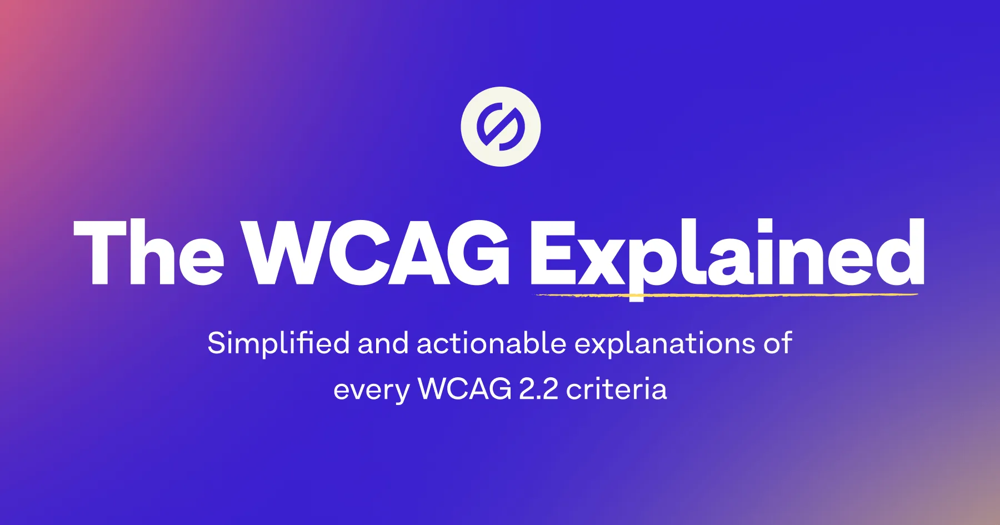
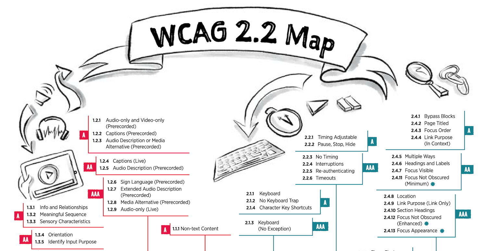
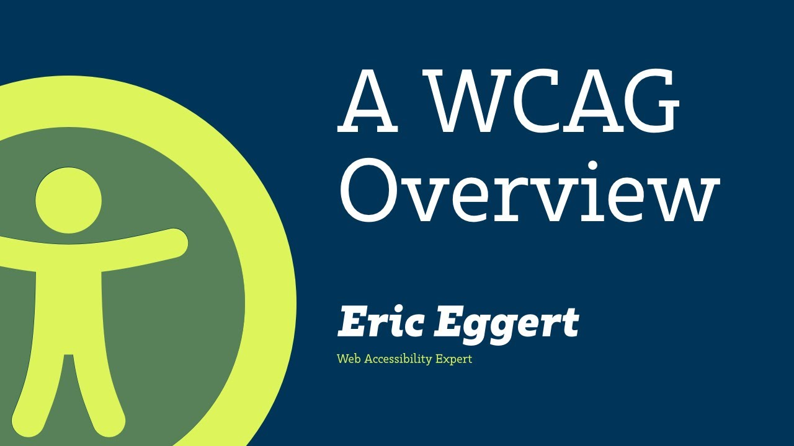

It doesn't matter whether you've just started to get to grips with the topic of web accessibility or are already more familiar with the subject: The [Web Content Accessibility Guidelines](https://www.w3.org/TR/WCAG22/) (WCAG) can be challenging and confusing at times.

In this article, I want to share three resources that simplify the content, so you can do for example the following:

- Make it easier for newcomers to get started
- Untangle a knot in your brain
- Discuss a specific criterion with someone who has little or no knowledge of the guidelines

It is very important to mention that these are to be considered as a complement and do not replace the original WCAG as a reference!

## Table of contents

- [The WCAG explained](#the-wcag-explained)
- [WCAG 2.2 Map](#wcag-22-map)
- [A WCAG Overview](#a-wcag-overview)

## The WCAG explained

[Stark](https://www.getstark.co/) is one of the companies that are tirelessly working to make web accessibility simple, modern and appealing for those interested. Their browser extension is one of my standard tools for automated testing, as is their Figma plugin.

Recently they took the trouble to present all WCAG in a simplified form (in English)! 😱 The result is a reference in easy-to-understand form, which should be understood as a supplement and not as a replacement.

[The WCAG explained](https://www.getstark.co/wcag-explained/)

## WCAG 2.2 Map

If you're more of a visual learner (like me), this WCAG map from [Intopia](https://intopia.digital/) might help you better understand the criteria. Again, a lot of complexity has been removed to make the information more accessible. It is currently only available in English and as a PDF document.

[WCAG 2.2 Map](https://intopia.digital/articles/intopia-launches-wcag-2-2-map/)

## A WCAG Overview

In case you are not in the mood for text or maps with illustrations, this video by [Eric Eggert](https://mastodon.online/@yatil@yatil.social/111942226349030469) might be something for you. He gives a good overview of WCAG itself and some of the criteria. The video is available in English (with subtitles) on YouTube.

[A WCAG Overview by Eric Eggert](https://www.youtube.com/watch?v=rIebSHUZz_w)
