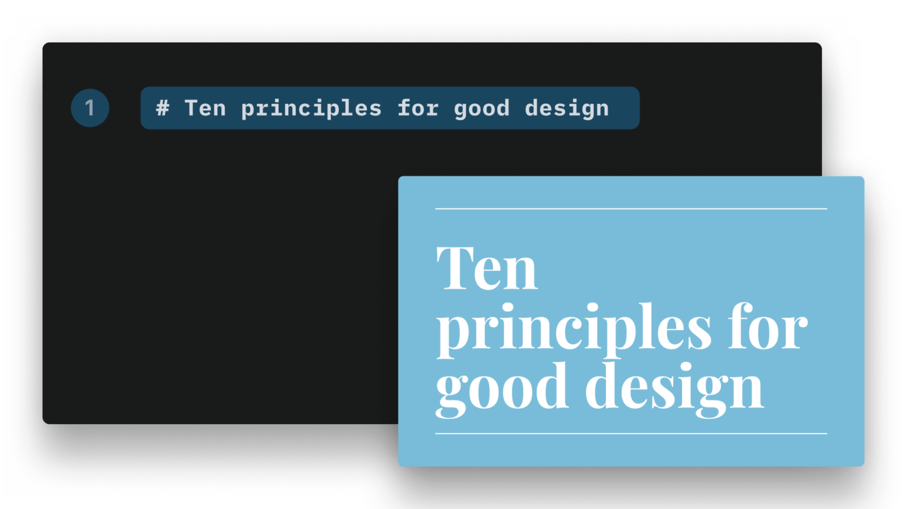
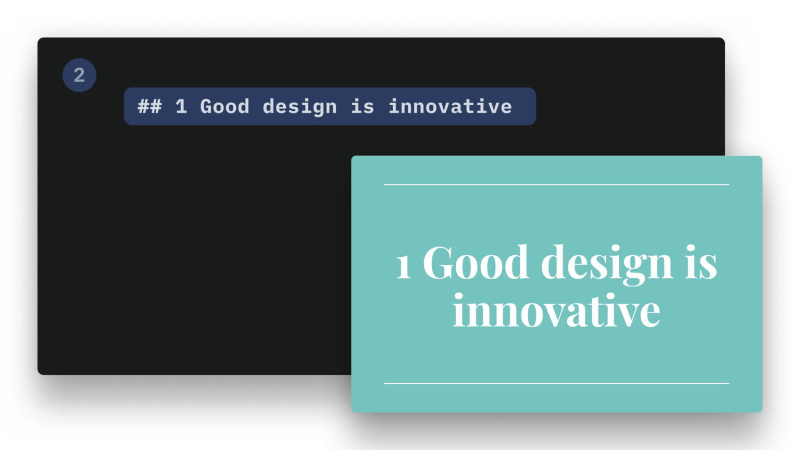
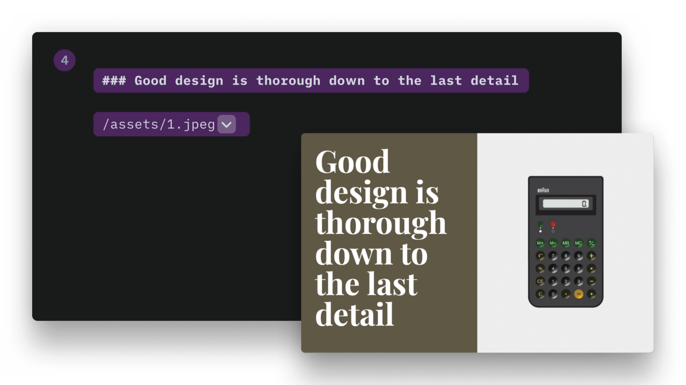
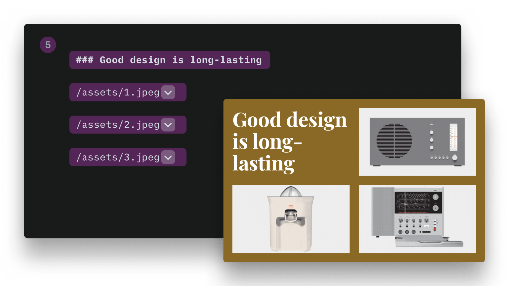
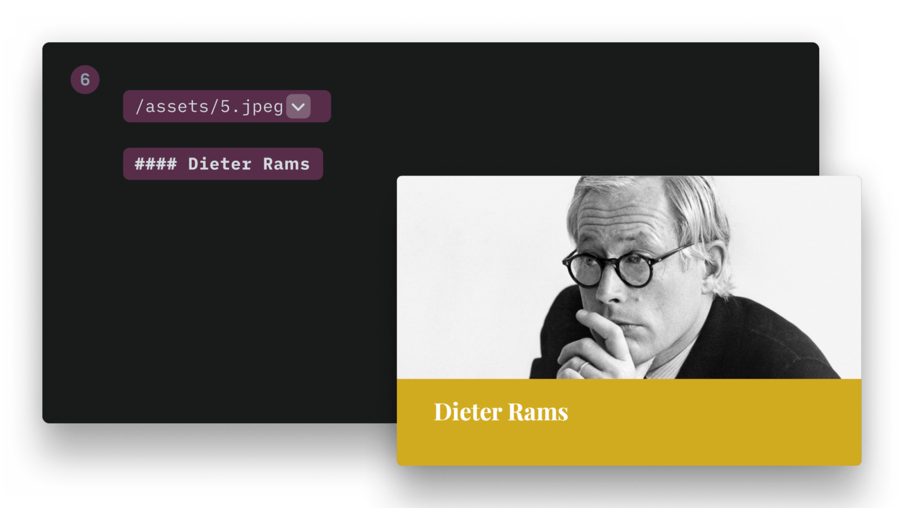
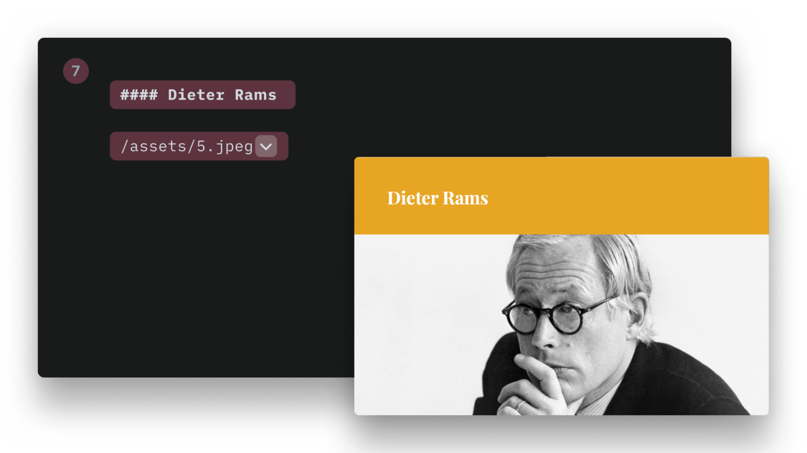
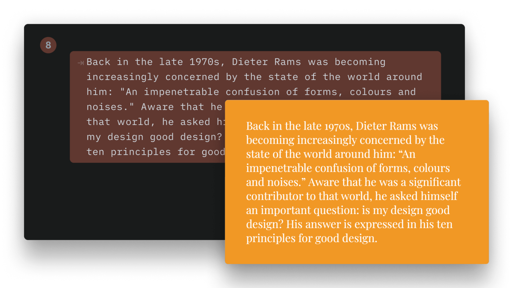

[iA Presenter](https://ia.net/presenter) is THE tool for me to create presentations easily and quickly. However, I had a hard time creating my own theme because their tutorial has two major weaknesses for me:

1. The order doesn't make sense to me
2. Individual sections cannot be navigated via anchor element and therefore cannot be shared

To make it easier for other people to create presentations with this amazing app, I have adapted the instructions so that they make sense to me. As a bonus, I've also added two goodies, you can find them in the [bonus section](#bonus)!

I did some heavy editing regarding words and grammar, but mostly it's still the original instructions, which you can find here: [Developing custom themes](#developing-custom-themes). Some names are different in version 1.2, so I updated them accordingly. _All images are property of iA, I do not own any rights!_ Here is the reworked version:

## Table of contents

- [Introduction](#introduction)
- [Developing custom themes](#developing-custom-themes)
  - [1. Create a new theme](#1-create-a-new-theme)
  - [2. Navigate to the theme files](#2-navigate-to-the-theme-files)
  - [3. Use your new theme](#3-use-your-new-theme)
  - [4. Modify your theme](#4-modify-your-theme)
- [Theme structure](#theme-structure)
- [Slides HTML structure](#slides-html-structure)
- [Layouts](#layouts)
  - [1. Cover](#1-cover)
  - [2. Title](#2-title)
  - [3. Section](#3-section)
  - [4. Split](#4-split)
  - [5. Grid](#5-grid)
  - [6. Caption](#6-caption)
  - [7. Title image](#7-title-image)
  - [8. Default (text)](#8-default-text)
- [Alignments](#alignments)
  - [1. Horizontal alignment](#1-horizontal-alignment)
  - [2. Vertical alignment](#2-vertical-alignment)
- [Responsiveness](#responsiveness)
- [Appearances](#appearances)
- [Backgrounds](#backgrounds)
- [Gradient background](#gradient-background)
- [Custom fonts](#custom-fonts)
  - [1. Add the font files to your theme folder](#1-add-the-font-files-to-your-theme-folder)
  - [2. Reference the fonts at the beginning of your CSS](#2-reference-the-fonts-at-the-beginning-of-your-css)
  - [3. Add meta data](#3-add-meta-data)
- [Using images from your theme in CSS](#using-images-from-your-theme-in-css)
- [Bonus](#bonus)

## Introduction

A [Theme](https://ia.net/presenter/support/visuals/in-app-themes) is a set of files allowing to change the visual style of a presentation.

You can change the style of a presentation at different levels:

- Using a specific Theme and its CSS
- Using presets
- Depending on your slide content (auto-layout)
- By defining CSS variables in the Style Inspector

Note that if you are not very comfortable with HTML and CSS, creating a custom theme might be difficult. To help you, we have created a [Theme Builder for iA Presenter](https://ia.net/topics/theme-builder-for-ia-presenter) that you can access here: [themes.ia.net](https://themes.ia.net/presenter/builder/editor)

But if you would rather get your hands dirty and do it yourself, keep on reading.

## Developing custom themes

### 1. Create a new theme

Go to `Settings` → `Themes`. Click on the `+` symbol in the lower left corner, select `Create Theme...` and enter a name.

### 2. Navigate to the theme files

Right-click on a theme and select `Show in Finder`.

### 3. Use your new theme

Open a presentation, go to the `Design` tab of the `Inspector`, and select the newly created theme.

### 4. Modify your theme

Open the `YOUR_THEME_NAME.css` file in your preferred editor and add your custom CSS.

## Theme structure


1. Themes assets
2. Presets (Predefined sets of CSS variables)
3. Custom fonts
4. Theme CSS definitions
5. Theme thumbnail
6. Theme definition

## Slides HTML structure

- A presentation has a collection of _slide containers_ and a collection of _slide backgrounds_
  - Each slide generates a _slide container_ and a _slide background_ `<div>`
  - The _slide background_ has the same layout CSS class as the _slide container_
- If there are no footnotes, the footnotes `<div>` has a height of `0`
  - If there are no header and footer, the slide content occupies all the available space
- You can choose to hide headers and footers on a per layout basis (see illustration for list of classes): For example `.cover-container .header { display: none; }`


## Layouts

### 1. Cover

- Container CSS Class: `.cover-container`
- Slide Content CSS Class: `.layout-cover`



### 2. Title

- Container CSS Class: `.title-container`
- Slide Content CSS Class: `.layout-title`



### 3. Section

- Container CSS Class: `.section-container`
- Slide Content CSS Class: `.layout-section`


### 4. Split

- Container CSS Class: `.v-split-container`
- Slide Content CSS Class: `.layout-v-split`



### 5. Grid

- Container CSS Class: `.grid-container`
- Slide Content CSS Class: `.layout-grid`

The Grid layout also has a CSS class indicating the number of grid cells at the slide content `<div>` level: `.grid-items-2`, `.grid-items-3`, `.grid-items-4`, and so on.



### 6. Caption

- Container CSS Class: `.caption-container`
- Slide Content CSS Class: `.layout-caption`



### 7. Title image

- Container CSS Class: `.title-image-container`
- Slide Content CSS Class: `.layout-title-image`



### 8. Default (text)

- Container CSS Class: `.default-container`
- Slide Content CSS Class: `.layout-default`



## Alignments

You need to target the inner `<div>` of each layout:

```css
.layout-cover > div {
  justify-content: flex-end; /* vertical alignment */
  align-items: flex-start; /* horizontal alignment */
}
```

### 1. Horizontal alignment

Use the `align-items` property with the `flex-start`, `center` or `flex-end` value to _horizontally_ align it either left, center or right.

### 2. Vertical alignment

Use the `justify-content` property with the `flex-start`, `center` or `flex-end` value to _vertically_ align it either left, center or right.

## Responsiveness

The themes are responsive. By default, CSS applies to mobile devices. If you want to target non-mobile devices:

```css
@media (min-width: 768px) { ... }
```

You can add additional breakpoints if, for instance, you want to provide different font-size/margins depending on the viewport size. However, iA Presenter already has its logic, and defaults should be enough.

## Appearances

iA Presenter uses a `.dark` and `.light` CSS class. – These classes are set per layout. – You can force the appearance for a specific layout in a custom theme in the `template.json` file:

```json
{
  "Name": "New York",
  "Version": 0.1,
  "Author": "iA",
  "ShortDescription": "Stylish, bold, classy.",
  "LongDescription": "Stylish, bold, classy\n- Different sizes for headlines\n- Simple color background\n- Default white on black\n- Default font: New York",
  "Css": "newyork.css",
  "TitleFont": "New York",
  "BodyFont": "New York",
  "Layouts": [
    {
      "Name": "Cover",
      "Classes": "invert"
    },
    {
      "Name": "Title",
      "Classes": "invert"
    }
  ]
}
```

## Backgrounds

You can use regular bitmap images (for example `.jpg` or `.png`), but iA Presenter also supports `.svg` backgrounds. Background images can also be inlined directly in the CSS as shown below. You can target a specific layout:

```css
.backgrounds .v-split-container {
  background-image: url('data:image/svg+xml;utf8,<svg viewBox="0 0 1024 600" xmlns="http://www.w3.org/2000/svg" xml:space="preserve" fill-rule="evenodd" clip-rule="evenodd" stroke-linejoin="round" stroke-miterlimit="2"><path fill="red" d="m541.526-57.455 584.065 49.14-56.35 669.755-584.065-49.14z"/></svg>');
  background-size: cover;
  background-position: center;
}
```

If you use a inline SVG as url directly in your CSS file, you'll need to take care of how you declare colors. Colors in hexadecimal format (like `#FFFFFF`) will break your CSS. Instead, you'll need to use the `rgb(0,0,0)` format.

If you want to target all backgrounds, no matter the layout, target the `.slide-background` class.

## Gradient background

You need to define two different gradients: One per appearance, light and dark. These gradients are defined in the `presets.json` file:

```json
{
  "Presets": [
    {
      "Name": "Default",
      "TitleFont": "system-ui",
      "BodyFont": "system-ui",
      "Appearance": "dark",
      "DarkBodyTextColor": "#000000",
      "LightBodyTextColor": "#ffffff",
      "DarkTitleTextColor": "#000000",
      "LightTitleTextColor": "#ffffff",
      "DarkBackgroundColor": "transparent",
      "LightBackgroundColor": "transparent",
      "Accent1": "#f94144",
      "Accent2": "#43aa8b",
      "Accent3": "#f9c74f",
      "Accent4": "#90be6d",
      "Accent5": "#f8961e",
      "Accent6": "#577590",
      "LightBgGradient": ["#c7e7ff", "#f0c8ff", "#ffdada", "#ffebb2"],
      "DarkBgGradient": ["#15354c", "#3e154c", "#4c2828", "#4c3900"]
    }
  ]
}
```

## Custom fonts

You'll need to follow these steps to add a custom font to your theme:

### 1. Add the font files to your theme folder

```markdown
Roboto-Slab-Regular.woff2
Roboto-Slab-Bold.woff2
```

### 2. Reference the fonts at the beginning of your CSS

```css
@font-face {
  font-family: "Roboto Slab";
  font-style: normal;
  font-weight: 400;
  src: url(Roboto-Slab-Regular.woff2) format("woff2");
}
@font-face {
  font-family: "Roboto Slab";
  font-style: normal;
  font-weight: 700;
  src: url(roboto-slab-Bold.woff2) format("woff2");
}
```

### 3. Add meta data

In this example, you'll need to add the display name of your custom fonts in `template.json`. That’s the name that will appear in the style inspector. Here's an example for the New York font:

```json
"TitleFont": "New York",
  "BodyFont": "New York",
```

In your `presets.json` you'll need to add the CSS name of your custom font. This example is for the New York font. You will notice that the name is different than the display name.

_NOTE: You could directly set your custom font in CSS, but you would lose the ability to override it using the style inspector._

```json
"TitleFont": "-apple-system-ui-serif, ui-serif",
"BodyFont": "-apple-system-ui-serif, ui-serif",
```

## Using images from your theme in CSS

Once your custom theme is installed, iA Presenter preserves the directories structure. You can then reference an image using the `url()` function. Example:

```css
.backgrounds .default-container {
  background-image: url("image1.jpg");
  background-size: cover;
  background-position: center;
}
```

## Bonus

Center everything except `<h1>` elements vertically and horizontally:

```css
.layout-caption > div,
.layout-default > div,
.layout-grid > div,
.layout-section > div,
.layout-title-image > div,
.layout-v-split > div,
.section-container {
  align-items: center !important;
  justify-content: center !important;
  text-align: center !important;
}

.layout-cover > div {
  justify-content: center !important;
}
```

Colored and shaped borders on everything for easier debugging. Unfortunately, there is no hot reload (yet?), so as soon as you save changes in the CSS file, Presenter has to be closed and reopened. The following clumsy approach helped me a lot to find out when which element is displayed:

```css
.cover-container {
  border: 5px solid red;
}
.layout-cover > div {
  border: 5px dashed red;
}

.title-container {
  border: 5px solid blue;
}
.layout-title > div {
  border: 5px dotted blue;
}

.section-container {
  border: 5px solid aqua;
}
.layout-section > div {
  border: 5px dashed aqua;
}

.v-split-container {
  border: 5px solid yellow;
}
.layout-v-split > div {
  border: 5px dotted yellow;
}

.grid-container {
  border: 5px solid green;
}
.layout-grid > div {
  border: 5px dotted green;
}

.caption-container {
  border: 5px solid orange;
}
.layout-caption > div {
  border: 5px dashed orange;
}

.title-image-container {
  border: 5px solid violet;
}
.layout-title-image > div {
  border: 5px dotted violet;
}

.default-container {
  border: 5px solid chartreuse;
}
.layout-default > div {
  border: 5px dashed chartreuse;
}
```
