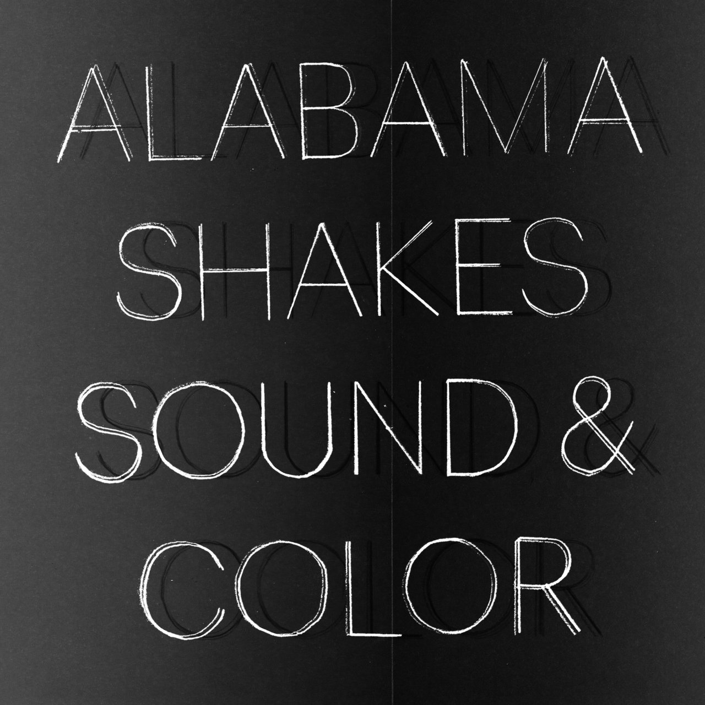

Today is international women's fight day and I want to celebrate all the women who help me get through the day with their music, lift my spirits or simply put me in a certain mood.

No matter if you're into metal, pop, hardcore, punk or something in-between: I bet there's at least on record in this list of female-fronted and man-reared albums that you're gonna like. 🎧

## "Sound & Color" by Alabama Shakes

The only interesting Grammy category for me is "Best Engineered Album", which is how I discovered this awesome band!

[Listen to "Sound & Color" by Alabama Shakes](https://songwhip.com/alabama-shakes/sound-and-color-2015)

## "Is It Light Where You Are" by Art School Girlfriend

A friend recommended this one, which is prefect for a moody, rainy day. Or maybe Tokyo at night.

[Is It Light Where You Are" by Art School Girlfriend](https://songwhip.com/artschoolgirlfriend/is-it-light-where-you-are)

## "Only Constant" by Gel

Imagine Motörhead with a strong Hardcore and Punk influence plus female vocals and you"ll know what to expect from this one.

[Listen to "Only Constant" by Gel](https://songwhip.com/gel2/only-constant)

## "Keepsake" by Hatchie

Dreamy pop music with a 90s vibe. Hard to describe, but a pleasure to listen to.

[Listen to "Keepsake" by Hatchie](https://songwhip.com/hatchie/keepsake)

## "Retrovision" by Honey Revenge

This is for the old school Paramore funs: Epic hooks, fat guitars and juicy drums.

[Listen to "Retrovision" by Honey Revenge](https://songwhip.com/honeyrevenge/retrovision)

## "EVERGREEN" by PVRIS

On of my favorite records ever! Every song is super catchy, the hooks are spectular and the production is stellar. My go-to album for getting the crowd pumped up before a gig (when I work as live sound engineer).

[Listen to "EVERGREEN" by PVRIS](https://songwhip.com/pvris/evergreen)

## "The Fear of Fear" by Spiritbox

Canada's finest 🇨🇦✨ If you"re a fan of modern metal, low-tuned guitars, beefy screamed vocals and great vocal melodies, then GET THE FUCK IN HERE 👇

[Listen to "The Fear of Fear" by Spiritbox](https://songwhip.com/spiritbox/the-fear-of-fear)

## "COPINGMECHANISM" by WILLOW

Her music is a bit diffult to describe, but I would call it super polished garage pop? The songs are well written and produced but sound raw at the same time.

[Listen to "COPINGMECHANISM" by WILLOW](https://songwhip.com/willow-2/copingmechanism2022)
