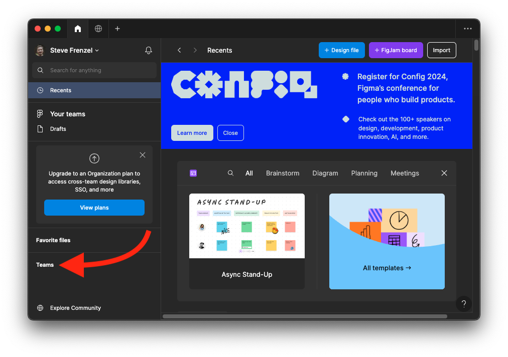
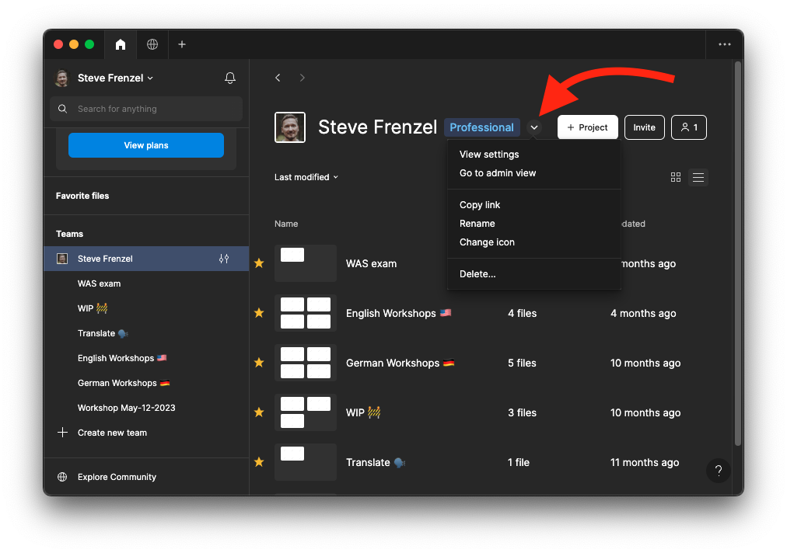
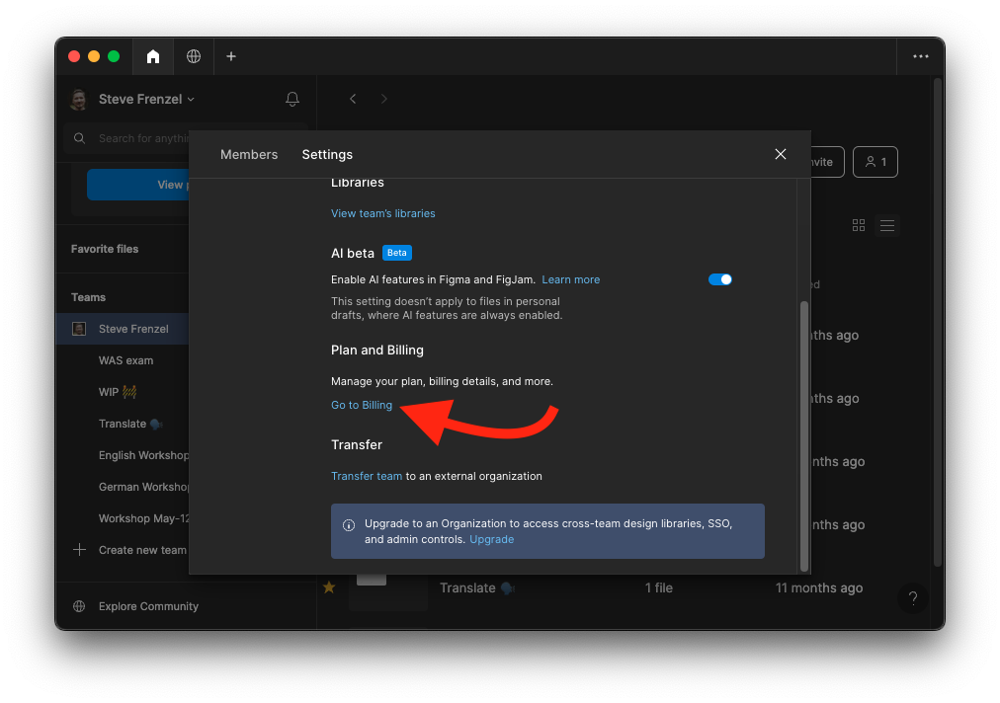
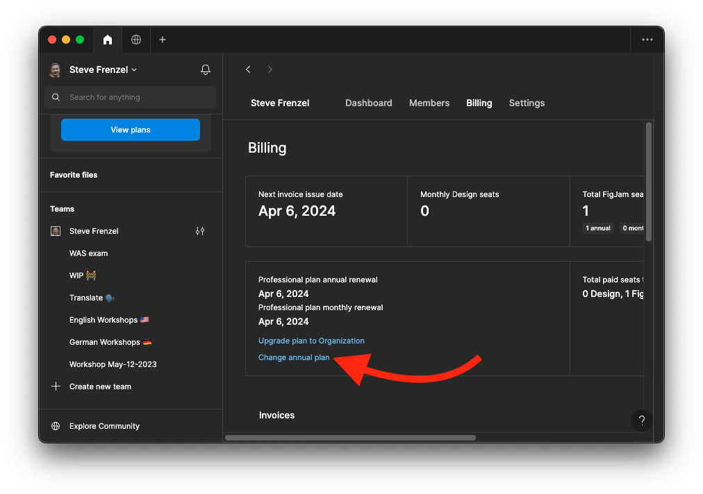
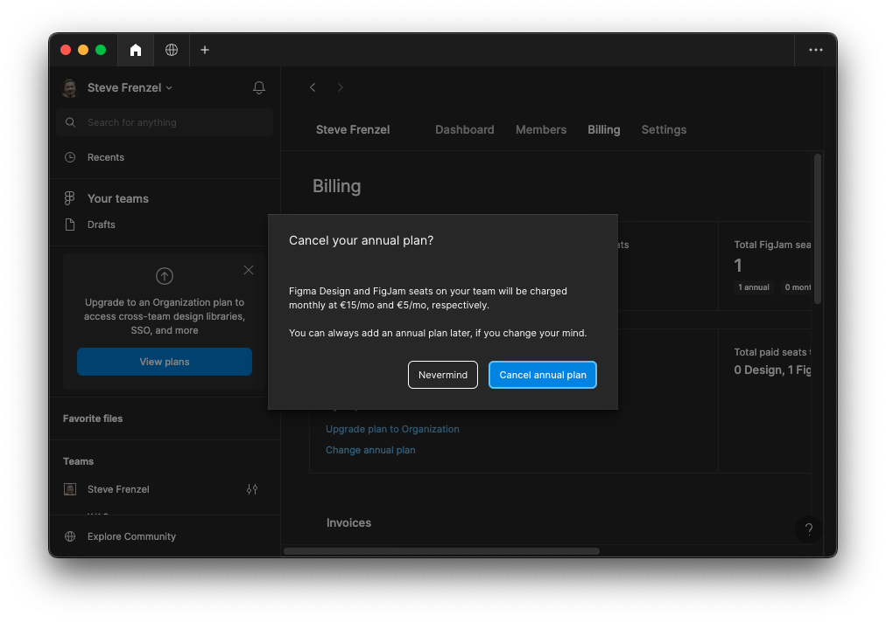
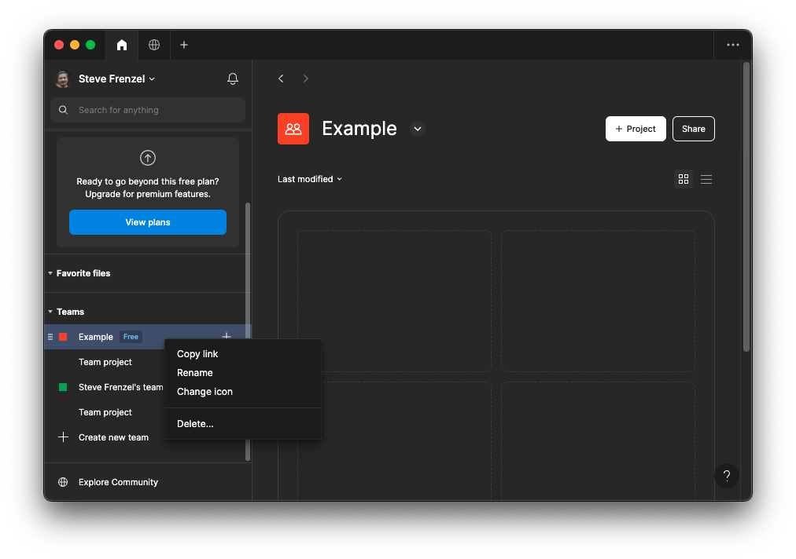
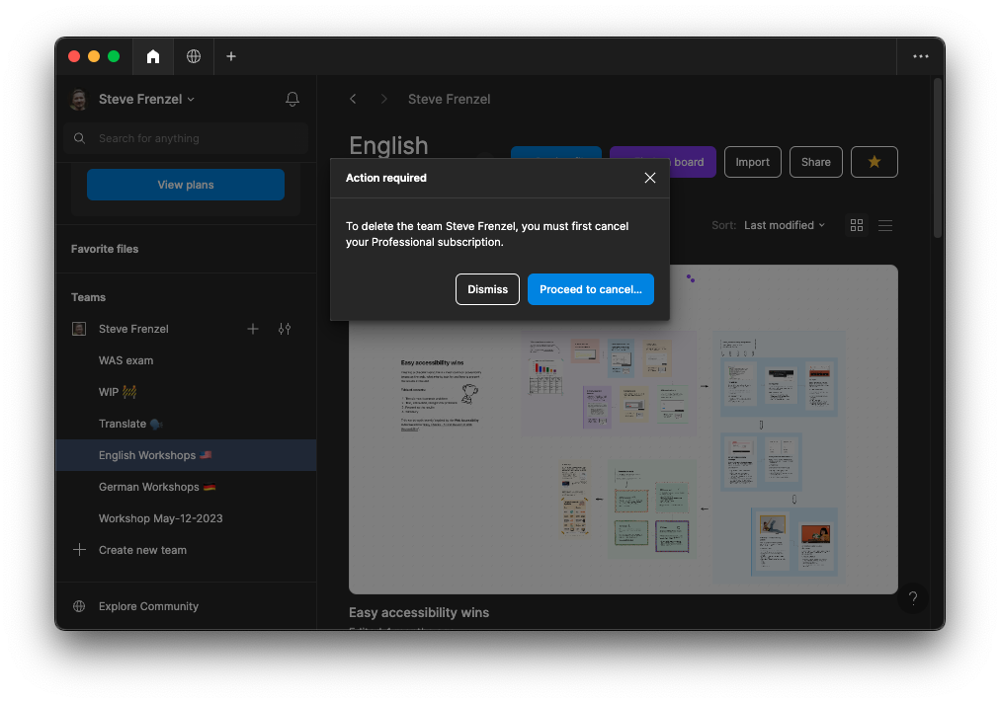

I had actually planned to write my next article for my "screen reader check" series, which I started with the [SoundCloud widget](https://stevefrenzel.dev/posts/screen-reader-check-soundcloud-widget/).

Since I already knew how I was going to design the thumbnail, I wanted to do that first and opened Figma. Then I remembered that I had received a reminder a few days earlier that my subscription was about to be renewed.

I bought one for FigJam, which wasn't expensive, but I don't use it for my workshops anymore so I wanted to cancel it. And here is where my journey begins...

## Table of contents

- [One does not simply cancel a subscription](#one-does-not-simply-cancel-a-subscription)
- [Cancelling the subscription](#cancelling-the-subscription)
  - [Step 1](#step-1)
  - [Step 2](#step-2)
  - [Step 3](#step-3)
  - [Step 4](#step-4)
  - [Step 5](#step-5)
- [Simply cancel and Figma will charge you even more](#simply-cancel-and-figma-will-charge-you-even-more)
  - [Step 6](#step-6)
  - [Step 7](#step-7)
  - [Step 8](#step-8)
  - [Step 9](#step-9)
  - [Step 10](#step-10)
- [Check the amount of seats](#check-the-amount-of-seats)

## One does not simply cancel a subscription

My first impulse was to click on the three dots in the top right-hand corner to go directly to a place where you can manage your subscriptions and delete them if necessary.

But Figma doesn't make it that easy. They want to prevent you from doing exactly that at all costs, so they make the process as cumbersome and frustrating as possible. The goal is to upset / confuse / tire you out so much that you give up before you get there.

This is called a deceptive pattern and you can read more about it here: [What are deceptive design patterns?](https://blog.mozilla.org/en/internet-culture/deceptive-design-patterns/). You will find more info when looking for the term "dark patterns" but I refuse to use this term. Click the footnote to find out why. [^1]

Let's find out how to cancel this subscription, shall we? 👏

## Cancelling the subscription

I was able to cancel my subscription in 10 easy steps and 13 clicks:

### Step 1

First you have to select "Teams" on the Figma start page:

### Step 2

Click the downward arrow right to the "Professional" badge to open a context menu and click "View settings":

### Step 3

In the dialog, select "Go to Billing" under the "Plan and Billing" section:

### Step 4

In the section regarding the annual and monthly renewal, select "Change annual plan":

### Step 5

When I arrived here, I thought I just change the number in the "Number of FigJam seats on annual plan:" input from 1 to 0:

But when doing that or clicking "Don't renew my annual plan", I receive the following message:

## Simply cancel and Figma will charge you even more

I currently pay 36 euros a year and if I had confirmed here with "Cancel annual plan", it would cost me 5 euros a month, so 60 euros a year! There are no instructions on how to avoid this and REALLY cancel.

Except for the note that it will be 5 euros per seat in the team. So I canceled and researched how to delete my team BEFORE I cancel.

### Step 6

To do this, I opened the context menu for my team name and selected "Delete...":

### Step 7

Then I receive a message to first cancel my Professional subscription, which was my plan in the first place. 🙃

### Step 8

But to make it really clear to me what a poor decision it would be for me to cancel this subscription, I am given a list of everything I will miss out on:

### Step 9

After confirming this fatal decision further below, I am asked why I want to cancel:

### Step 10

I receive a final warning that by canceling I will be joining the mob and will only have the free "Starter" plan:

It is done! I receive confirmation that my plan will be downgraded from "Professional" to "Starter" at the end of the period. 🥳

I had to click 13 times (15 if you count the checkboxes) and navigate through numerous menus to cancel my subscription. As I mentioned at the beginning, I expected to be able to do this with just a few clicks, but I didn't take Figma's deceitful tactics into account.

Another deceptive pattern I have seen on numerous websites is the presentation of pricing tiers. The focus here is not on the limited, boring but very reasonably priced "Starter" plan, but "Professional":

![Overview of pricing tiers inside the Figma app on macOS. It's the last step when creating a new team, titled "Finish setup". The first step is called "Name your team" and the second one is called "Add team members". The headline of the current step says "Choose your team plan". Below is a table of four columns with three options. First column lists all features, second one more info on the "Starter" plan, third and fourth for the "Professional" and "Organization" plan. "Starter" is for free and has the least amount of features and "Professional" is highlighted and very prominent.](./13-screenshot.png)

Anyway, I hope this article will help you navigate through the dense jungle of links and context menus to cancel your Figma subscription.

## Check the amount of seats

I learned the following information during one of my FigJam workshops: If you invite people to join your team (so that they can take part in the workshop), 5 euros per seat will be deducted from your account each month.

It's made very easy to invite people and there is NO indication that it will cost you money if you do so.

To find out how much you have to pay per month, follow the instructions until step 3.

[^1]: Partial quote from the linked article: _"You may notice we use “deceptive design patterns” rather than “dark patterns” throughout this article. While the latter is commonly used and has been for years, the phrase also reinforces the idea that being “dark” is “bad,” which is directly tied to white supremacy."_

_Thumbnail image credit: Taken from the article [The outsized role culture plays in attracting design talent](https://www.figma.com/blog/the-outsized-role-culture-plays-in-attracting-design-talent/)._
