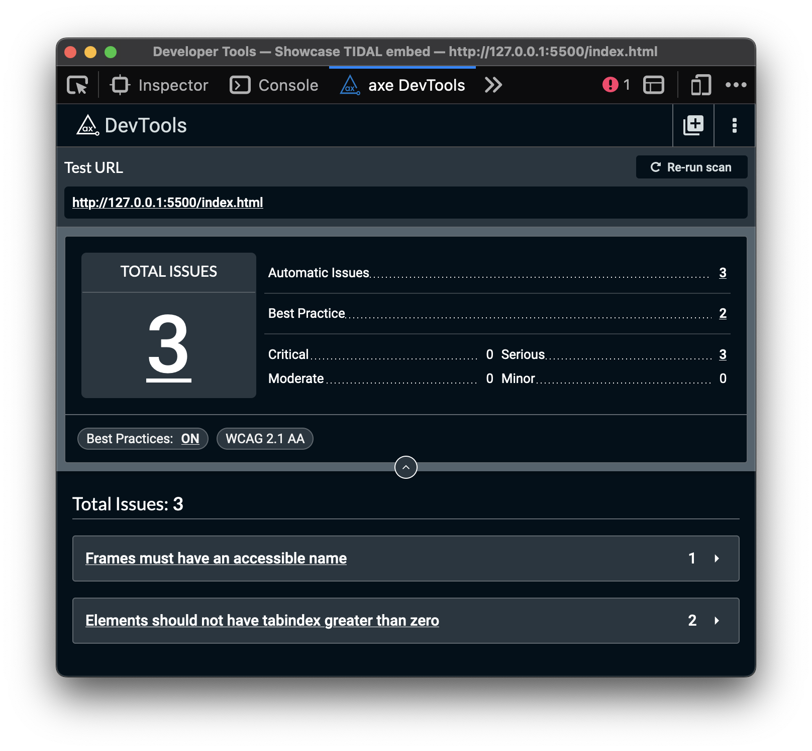

It’s time for the second article in a series where I test how various music player widgets interact with the four most popular screen readers and web browsers. Check out the first article to find out why I’m doing this: [Screen reader check: SoundCloud widget](https://stevefrenzel.dev/posts/screen-reader-check-soundcloud-widget/).

Disclaimer: I’m not an expert nor a regular screen reader user but I know my way around them. I do this purely out of curiosity and are not sponsored or compensated in any way. Also I'm using a virtual Windows machine on macOS, thanks to this tutorial by Sara Soueidan: [Setting up a screen reader testing environment on your computer](https://www.sarasoueidan.com/blog/testing-environment-setup/). Let’s dive in! 🏊

## Table of contents

- [The Tools](#the-tools)
  - [Operating Systems](#operating-systems)
  - [Web browsers](#web-browsers)
  - [Screen readers](#screen-readers)
- [The widget itself](#the-widget-itself)
- [The Test](#the-test)
  - [Without a screen reader](#without-a-screen-reader)
  - [JAWS on Windows 11](#jaws-on-windows-11)
  - [NVDA on Windows 11](#nvda-on-windows-11)
  - [VoiceOver on macOS Sonoma](#voiceover-on-macos-sonoma)
  - [Narrator on Windows 11](#narrator-on-windows-11)
- [Conclusion](#conclusion)
- [Bonus: Music recommendations](#bonus-music-recommendations)
  - ["When No Birds Sang" by Full Of Hell & Nothing](#when-no-birds-sang-by-full-of-hell--nothing)
  - ["Every Sound Has A Color In The Valley Of Night" by Night Verses](#every-sound-has-a-color-in-the-valley-of-night-by-night-verses)
  - ["Stereo Grief" by Greyhaven](#stereo-grief-by-greyhaven)

## The tools

### Operating systems

- macOS Sonoma (Version 14.4.1)
- Windows 11 Home (Version 22H2)

### Web browsers

- Google Chrome (Version 123.0.6312.124)
- Mozilla Firefox (Version 124.0.2)
- Apple Safari (Version 17.4.1)
- Microsoft Edge (Version 123.0.2420.81)

### Screen readers

- JAWS (Version 2024.2403.3)
- NVDA (Version 2024.1.0.31547)
- VoiceOver (Version 10)
- Narrator (Version 2023H2)

## The widget itself

Very similar to the SoundCloud one, as they’re also using some deprecated attributes. Let’s have a look at the original code:

```html
<div
  style="
    position: relative;
    padding-bottom: 100%;
    height: 0;
    overflow: hidden;
    max-width: 100%;
  "
>
  <iframe
    src="https://embed.tidal.com/tracks/121378214?layout=gridify"
    frameborder="0"
    allowfullscreen
    style="
      position: absolute;
      top: 0;
      left: 0;
      width: 100%;
      height: 1px;
      min-height: 100%;
      margin: 0 auto;
    "
  ></iframe>
</div>
```

Which makes it look ginormous:


So I removed the default styling, added some of my own and got rid of the [axe-linter](https://marketplace.visualstudio.com/items?itemName=deque-systems.vscode-axe-linter) warning regarding the accessible name of an `iframe` element:

```html
<iframe
  allowfullscreen
  title="Ludens by Bring Me The Horizon on TIDAL"
  frameborder="0"
  src="https://embed.tidal.com/tracks/121378214?layout=gridify"
></iframe>
```

Now it looks a lot nicer, don't you think?


Sweet, now let’s have a quick look (in Chrome) at the accessibility tree of this element:


Most interesting thing is that the "play" button is nowhere to be found so... This should be interesting!

You can give it a go yourself on the [example website](https://stevefrenzel.github.io/showcase-tidal-embed/). Be aware that your experience might be different then mine, depending on your operating systems and the web browsers you use.

## The test

Different than last time I’m also gonna describe my experience without the screen reader. Consider it a bonus! 🤗 Here's the user story from last time. It's general and specific enough at the same time, so let's reuse it for this widget:

> As a screen reader user, I expect the widget to be announced as “Ludens by Bring Me The Horizon on TIDAL. It should not auto-play, but start playing when selecting the “play” button. When clicking the button again, it should stop playing the music. All links inside the widget should have a descriptive, accessible name. I should be able to leave this widget by using the tab button.

As last time, I'm running three automated accessibility checks BEFORE my changes with [axe DevTools®](https://www.deque.com/axe/devtools/), [Stark](https://www.getstark.co/) and [WAVE](https://wave.webaim.org/). Only axe found three issues, the other two said there's nothing to worry about:



[Frames must have an accessible name](https://dequeuniversity.com/rules/axe/4.8/frame-title) was expected and fixed by me, but let's see if [Elements should not have tabindex greater than zero](https://dequeuniversity.com/rules/axe/4.8/tabindex?application=AxeChrome) becomes an issue when testing with a keyboard.

### Without a screen reader

When hovering the widget, the whole album cover gets slightly darker to increase contrast for the text and icons. Also the “share” icon appears when hovering it.

Hovering the TIDAL and “share” icon in the top right corner gives you the pointer as visual feedback, while hovering the links will add a underline to them. There’s no visual feedback for hovering the “play” button.

Clicking the TIDAL icon and the two text links opens a new tab to take you to the respective content. Shameless plug: I wrote an article why you should consider avoiding this behavior: [Should links open in a new tab?](https://stevefrenzel.dev/posts/should-links-open-in-a-new-tab/).

Clicking the “share” button opens an overlay to presents options to share the song. When hovering these icons, they get slightly bigger.


After the overlay opens (in Chrome and Firefox), it immediately focusses the “close” button, presented with an “X” icon. Hitting `ENTER` or pressing `ESC` will close the overlay. The focus trap is also working as expected, you can only navigate inside the overlay while it's open.

The focus ring for the social media icons is barely visible. I was presently surprised how nice this overlay works, although there are considerations if you should auto-focus elements. Adrian Roselli wrote a few words about this: [Dialog Focus in Screen Readers](https://adrianroselli.com/2020/10/dialog-focus-in-screen-readers.html).

So far the behavior was the same in all four browsers, except that this overlay will open only in Chrome and Firefox (macOS) or only Firefox (Windows), depending on your operating system.

When using the `TAB` key, all elements can be focused and provide (barely) visible feedback, except the “play” button. It can only be focussed in Safari, but hitting `ENTER` or `SPACE` doesn’t do anything.

Funny, considering that this is (in my opinion) the most important element in a music player embed. 🤷‍♂️

Clicking the play button or anywhere inside this widget will start a preview of the song after a second or so. When playing, all UI elements are removed.

The progress bar will only appear when hovering the widget and the rest of the elements will appear again when pausing. To pause, you can click anywhere in the widget.


I expected that it would at least be possible to play and pause via a keyboard after clicking the play button, but still no luck.

### JAWS on Windows 11

Very similar to the visual experience, as every element gets announced as expected, also when opening the overlay (only possible in Firefox). Unfortunately there’s no feedback at all when using Edge with JAWS.

The auto-focus of the overlay does it’s job and announces the buttons accordingly, so you shouldn’t get lost. All icons are announced correctly, but unfortunately there’s no audible feedback when copying the link to the clipboard, only visual feedback.

### NVDA on Windows 11

Amazing, it is actually possible to hit the “play” button when using NVDA and it’s working in all three browsers! After pressing `ENTER` or `SPACE` it’s announced as “clickable play” when pressing it once and as “pause” when pressing it again.

I don't know how this is possible, as there's no indication that this is a button or has the accessible name "play" or "pause". 🤯

The overlay works the same as with JAWS, also no audible feedback when copying to clipboard.

### VoiceOver on macOS Sonoma

Also very similar to the visual experience. A nice touch would have been to add an empty alt-text to the TIDAL link / icon to reduce the amount of announced text here, but it’s fine I guess.

The "play" button is only announced as “image” and you can select the two `time` elements, but it’s still not possible to start the music via keyboard.

The overlay works the same as with JAWS and NVDA, also no audible feedback when copying to clipboard.

### Narrator on Windows 11

Same experience as with NVDA, the “play” button can also be operated! Only difference is that it’s announced as “play, group” or “pause, group”, depending on it’s state.

The overlay can only be opened (in Firefox) when selecting the “share” button with the `TAB` key, otherwise it won’t work when using the native Narrator navigation. Also no audible feedback when copying to clipboard.

## Conclusion

I had high hopes for this one, as I'm a TIDAL fan and supporter. Although it looks cleaner than the SoundCloud widget, I was disappointed that it has limited keyboard functionality, depending on the browser you use.

This is where NVDA really shines, as it provided the most consistent experience with all three (Windows) browsers. Narrator also made it possible to hit the "play" button, but my overall user experience was better with NVDA.

## Bonus: Music recommendations

While we are here, why not check out some of the music I'm currently listening to? Have fun:

### "When No Birds Sang" by Full Of Hell & Nothing


If you're a fan of these two bands, you're in for a ride. This could also be interesting for you when you're a fan of [Celtic Frost](https://tidal.com/browse/artist/3569642?u).

[Listen to "When No Birds Sang" by Full Of Hell & Nothing](https://tidal.com/browse/album/316979894?u)

### "Every Sound Has A Color In The Valley Of Night" by Night Verses


I listened a lot to [From the Gallery of Sleep](https://tidal.com/browse/album/87131015?u) when it came out but found it a little bit exhausting at times. This new one though has become one of my favorite instrumental albums ever! Also they have a feature with Brandon Boyd of [Incubus](https://tidal.com/browse/artist/1086?u) and Anthony Green of [Circa Survive](https://tidal.com/browse/artist/3677780?u).

[Listen to "Every Sound Has A Color In The Valley Of Night" by Night Verses](https://tidal.com/browse/album/339236923?u)

### "Stereo Grief" by Greyhaven


This is one of the records I checked out just because of the cover artwork and was expecting [Shoegaze](https://en.wikipedia.org/wiki/Shoegaze), but got something with a heavy [The Dillinger Escape Plan](https://tidal.com/browse/artist/3619519?u) vibe. 😍

[Listen to "Stereo Grief" by Greyhaven](https://tidal.com/browse/album/339236923?u)
