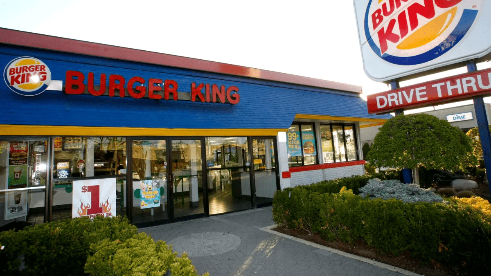

I recently gave several smaller workshops on the subject of web accessibility and started with a rough overview of the topic. It was about the [general meaning](https://developer.mozilla.org/en-US/docs/Learn/Accessibility/What_is_accessibility#so_what_is_accessibility), the [WCAG](https://www.w3.org/WAI/standards-guidelines/wcag/), the [four principles](https://developer.mozilla.org/en-US/docs/Web/Accessibility/Understanding_WCAG#the_four_principles) and the [European Accessibility Act](https://en.wikipedia.org/wiki/European_Accessibility_Act).

After this workshop, I was asked if I knew of any examples of companies being sued because of web accessibility problems. I spontaneously thought of two: Beyoncé and Domino's Pizza.

Unfortunately, I had to stop here because I couldn't give any more details. So I would like to list a few famous law suits here for future reference and show that most of the problems were trivial and among the [six most common](https://webaim.org/projects/million/#wcag) on the web. Which in most cases are very easy to fix.

All information comes from the "Digital Accessibility Lawsuits" subpage of [accessibility.com](http://accessibility.com/). More details can be found under the link for each example. Also I’m not a lawyer and cannot give you any legal advice.

## Table of contents

- [Beyoncé case](#mary-conner-vs-parkwood-entertainment-llc)
- [Domino's Pizza case](#guillermo-robles-vs-dominos-pizza-llc)
- [Walmart case](#thompson-vs-walmart-inc)
- [Burger King case](#jack-kang-vs-burger-king-corporation)
- [Adidas case](#elia-haggar-vs-adidas-america-inc)
- [Conclusion](#conclusion)

## Mary Conner vs. Parkwood Entertainment LLC

[More information about the Beyoncé case](https://www.accessibility.com/digital-lawsuits/mary-parkwood-2019-01-03)

### Case summary - Parkwood Entertainment LLC

On January 3, 2019, MARY CONNER filed a Complaint in New York Federal court against PARKWOOD ENTERTAINMENT LLC.

Plaintiff MARY CONNER alleges that [www.Beyonce.com](http://www.beyonce.com/) is not accessible per the WCAG 2.1, Section 508 accessibility standard(s).

### Case details - Parkwood Entertainment LLC

Case arises out of Parkwood’s policy and practice of denying the blind access to the goods and services offered by [Beyonce.com](http://beyonce.com/).

Due to Parkwood’s failure and refusal to remove access barriers to [Beyonce.com](http://beyonce.com/), blind individuals have been and are being denied equal access to Beyonce, as well as to the numerous goods, services and benefits offered to the public through [Beyonce.com](http://beyonce.com/).

### My comment

Unfortunately, there are no details here as to what exactly the problems are, but since it cites "practice of denying the blind access to the goods and services" as the reason, I suspect the following:

- Missing alt text
- Empty links
- Empty buttons
- Elements cannot be operated with screen reader

## Guillermo Robles vs. Domino’s Pizza LLC

[More information about the Domino's Pizza case](https://www.accessibility.com/digital-lawsuits/guillermo-dominos-2016-09-01)

### Case summary - Domino's Pizza

On September 1, 2016, GUILLERMO ROBLES filed a Complaint in California State court against Dominos, LLC.

Plaintiff GUILLERMO ROBLES alleges that [www.Dominos.com](http://www.dominos.com/) is not accessible per the WCAG 2.0, Section 508 accessibility standard(s).

### Case details - Domino's Pizza

This is a summarized version of mine:

- Website cannot be operated by a blind or visually-impaired person
- Mobile app cannot be operated by a blind or visually-impaired person
- Request that these be adapted so that blind or visually-impaired people can use the website and mobile app
- Missing alternative text or a suitable text alternative
- Empty links
- Redundant links

## Thompson vs. Walmart, Inc

[More information about the Walmart case](https://www.accessibility.com/digital-lawsuits/tyrone-walmart-2021-03-11)

### Case summary - Walmart, Inc

On March 11, 2021, Tyrone Thompson filed a Complaint in California Federal court against Walmart, Inc.

Plaintiff Tyrone Thompson alleges that [www.walmart.com](http://www.walmart.com/) is not accessible per the WCAG 2.1 accessibility standard(s).

### Case details - Walmart, Inc

This is a summarized version of mine:

- Landmark elements have a missing description
- Images were used for visual separation of elements
- Redundant & empty links
- External links are not announced as such when screen reader is used
- No skip links available to bypass content
- Purpose of `iframe` elements is not clear, missing `title` or `aria-label` attribute
- Links are wrapping elements and do not have sufficient description

## Jack Kang vs. Burger King Corporation

[More information about the Burger King case](https://www.accessibility.com/digital-lawsuits/jack-burger-2019-04-30)

### Case summary - Burger King Corporation

On April 30, 2019, Jack Kang filed a Complaint in Florida Federal court against Burger King Corporation.

Plaintiff Jack Kang alleges that [www.bk.com](http://www.bk.com/) is not accessible per the WCAG 2.0 accessibility standard(s).

### Case details - Burger King Corporation

This is a summarized version of mine:

- Lack of Alternative Text (“alt-text”), or a text equivalent
- Empty links
- Redundant links
- Linked Images missing alt-text

## Elia Haggar vs. Adidas America, Inc

[More information about the Adidas case](https://www.accessibility.com/digital-lawsuits/elia-adidas-2019-02-25)

### Case Summary - Adidas America, Inc

On February 25, 2019, Elia Haggar, Kyo Hak Chu, and Valerie Brooks filed a Complaint in California Federal court against Adidas America, Inc.

Plaintiff Elia Haggar, Kyo Hak Chu, and Valerie Brooks alleges
that [www.adidas.com/us](http://www.adidas.com/us) is not accessible.

### Case details - Adidas America, Inc

This is a summarized version of mine:

- Lack of Alternative Text (“alt-text”), or a text equivalent.
- Empty links
- Redundant links
- Linked Images missing alt-text

## Conclusion

These are just a few examples from very well-known companies, but they all make more or less the same mistakes, which can be easily avoided and rectified. So what I told my workshop participants is:

If you can avoid the six most common problems, you will not only provide a good experience for your users, but you will make yourself less vulnerable to law suits. The work doesn't stop here, but you've already taken a big step in the right direction.
