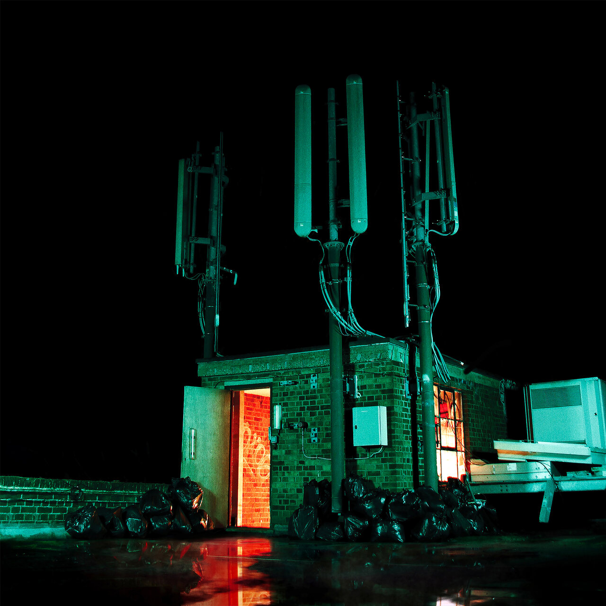

I usually only associate a few albums with a particular year, even if there were many more that touched and moved me.

This post is primarily a reminder to myself why I put certain records on this list. But also, of course, to share them with you, dear reader. Maybe one or two are on your own list, or maybe you don't know them all but are interested in giving them a listen.

It's a good mix of genres, maybe there's something on there? The first quarter has started very well for me musically, let's see what ended up in my favorites:

## Table of contents

- ["How To Disappear" by Casey](#how-to-disappear-by-casey)
- ["Obsidian Wreath" by Infant Island](#obsidian-wreath-by-infant-island)
- ["Wall Of Eyes" by The Smile](#wall-of-eyes-by-the-smile)
- ["A City in the Skies" by Ulver](#a-city-in-the-skies-by-ulver)
- ["Effigy" by Talk Show](#effigy-by-talk-show)
- ["Close to Home" by A Burial At Sea](#close-to-home-by-a-burial-at-sea)
- ["Cold Waves Divide Us" by Midas Fall](#cold-waves-divide-us-by-midas-fall)
- ["Eden" by Tua](#eden-by-tua)

## "How To Disappear" by Casey

My first contact with Casey was when I had my training at coding bootcamp. [Love Is Not Enough](https://tidal.com/browse/album/314881390?u) was on my radar at the time because it hit that sweet spot between emo and hardcore that I grew to love.

After I got more involved with the band (and their second album [Where I Go When I Am Sleeping](https://tidal.com/browse/album/314869863?u)), I was very sad when I found out that they had broken up.

So I was all the more delighted when [Puncture Wounds to Heaven](https://www.youtube.com/watch?v=Yh16Bqw2uGA) was the first sign of life after five years. There was no doubt in my mind that it would end up at the top of my Top Albums of 2024 without having heard the rest of the record.

Each subsequent single I soaked up like a sponge and confirmed my prediction even more. I love Casey, especially this record! 😍

[Listen to "How To Disappear" by Casey](https://tidal.com/browse/album/322218976?u)

## "Obsidian Wreath" by Infant Island

This is one of those records that caught my interest with its artwork. I didn't know what to expect and was very pleased to hear atmospheric black metal that doesn't just blast all the way through but also slows down from time to time.

Especially the vocals, which are sometimes out of breath, hooked me; it makes their music feel very raw and authentic.

[Listen to "Obsidian Wreath" by Infant Island](https://tidal.com/browse/album/317634846?u)

## "Wall Of Eyes" by The Smile

When random songs were played that I might like, something by The Smile came on and I thought to myself "boy, this guy sounds a lot like Thom Yorke!". Turns out it was another one of his projects! 😂

If you like Radiohead but with a lot less electronic gimmicks, you should give it a listen. I'd even say it's a bit unwieldy, but the craftsmanship is world class as you'd expect.

[Listen to "Wall Of Eyes" by The Smile](https://tidal.com/browse/album/338279162?u)

## "A City in the Skies" by Ulver

Ulver have made an incredible transition from black metal to ambient to a proper pop band. On album length I often lost interest after the “hits”, so this EP with its three songs is just right! Also check out [Rolling Stone](https://tidal.com/browse/track/231388647?u), what a banger!

[Listen to "A City in the Skies" by Ulver](https://tidal.com/browse/album/340237152?u)

## "Effigy" by Talk Show

Another record that only sparked my interest because of its artwork. I would categorize it under electronic garage pop (?) with spoken words lyrics. I don't really listen to music in this genre, so I can't make a “for fans of” recommendation here. Listen to it, or don't. 🤷‍♂️

[Listen to "Effigy" by Talk Show](https://tidal.com/browse/album/319710008?u)

## "Close to Home" by A Burial At Sea

To be honest, I thought this was a new [After The Burial](https://tidal.com/browse/artist/3540799?u) record, but oops, it's something completely different! If you're in the mood for some not-so-typical post-rock with a lot of "happy" mathcore like [Standards](https://tidal.com/browse/artist/7485276?u), then give it a listen.

[Listen to "Close to Home" by A Burial At Sea](https://tidal.com/browse/album/330869951?u)

## "Cold Waves Divide Us" by Midas Fall

This record is a real grower and hard to describe. Guitar music in the broadest sense with an incredible, gifted female singer, EXTREMELY thick reverb on the vocals and very good songs.

Again, my interest was piqued by the cover. I was expecting something more technical and was pleasantly surprised.

[Listen to "Cold Waves Divide Us" by Midas Fall](https://tidal.com/browse/album/328790136?u)

## "Eden" by Tua

My German rap phase is long gone, but Tua has managed to keep my interest over the years. [Stevia](https://tidal.com/browse/album/26886042?u) is one of the best German pop albums and the self-tilted [Tua](https://tidal.com/browse/album/199604902?u) is in no way inferior, even if the rap portion was a bit too much for me. Still he's one of the best producers and songwriters in Germany!

I listened to and loved every single from "Eden" before its release. The grey, monochrome phase is behind him and it suits his music very well that there is so much color in it now.

[Listen to "Eden" by Tua](https://tidal.com/browse/album/347112181?u)
