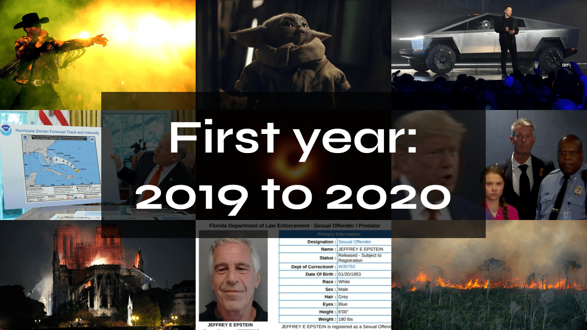
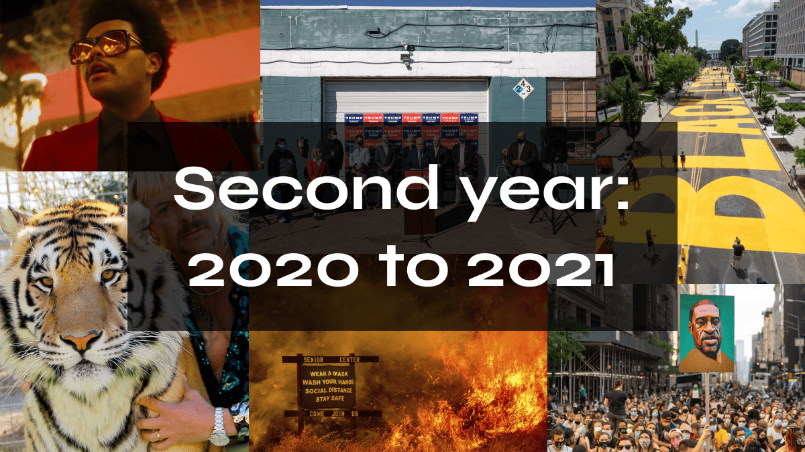
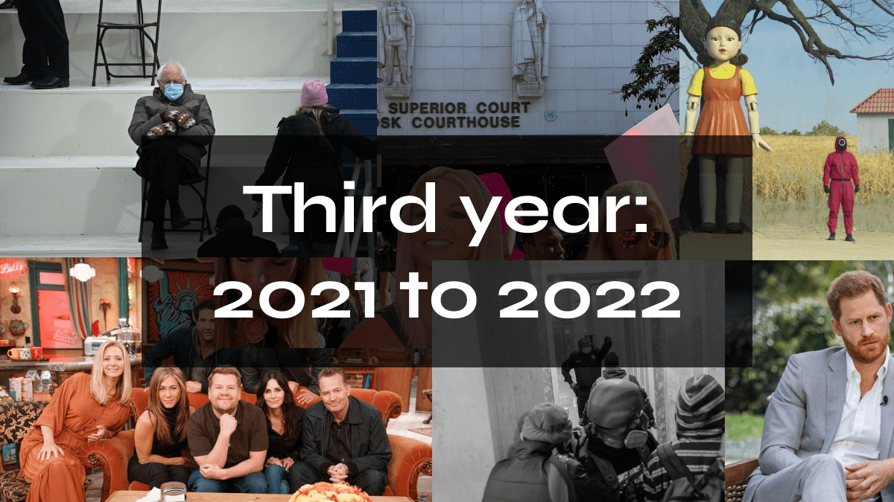
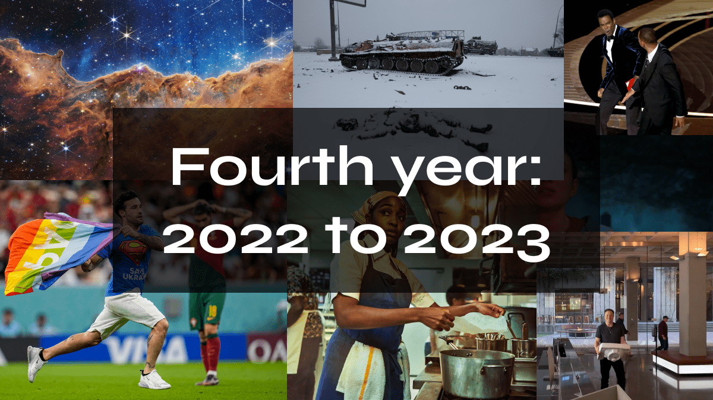
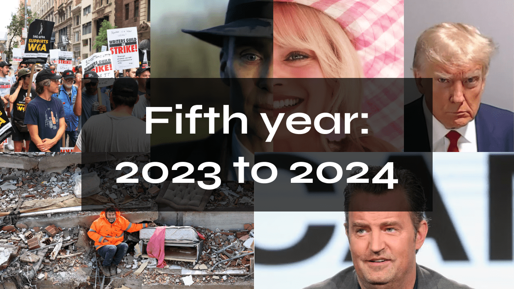

Five years ago today, I received my certificate from the [Spiced Academy](https://www.spiced-academy.com/en), which recognized me as a “Fullstack Developer”. Time to look back and evaluate whether this decision was worth it for me, what I have experienced and learned about the industry so far.

## Table of contents

- [First year: 2019 to 2020](#first-year-2019-to-2020)
- [Second year: 2020 to 2021](#second-year-2020-to-2021)
- [Third year: 2021 to 2022](#third-year-2021-to-2022)
- [Fourth year: 2022 to 2023](#fourth-year-2022-to-2023)
- [Fifth year: 2023 to 2024](#fifth-year-2023-to-2024)
- [The future](#the-future)
- [Conclusion](#conclusion)

## First year: 2019 to 2020

After I graduated, my head was spinning. There was so much input and material that I wanted to catch up on. At the same time, I had to start applying for jobs and stay on the ball so that I would remember what I had just learned.

Even during the boot camp, I realized that I didn't like the backend part at all. I did what was asked of me, knowing that I would hopefully never have to deal with it again. Frontend was just so much more fun!

But here, too, there are many points of contact with the backend, which already confused me at the time. Elly Loel summarized this dilemma very well in her article [Front-end development's identity crisis](https://www.ellyloel.com/blog/front-end-development-s-identity-crisis/).

### Keep on grinding

My main project during the job search was the [Mars Rover Picture Search](https://github.com/stevefrenzel/mars-rover-picture-search), which only exists as a GitHub repository, as I didn't manage to get the website online at the time. 😂

I like space stuff, I wasn't (and still am not) very good at backend stuff, but still I decided to “feel the pain” and improve my skills in this area. In the end, this project and the recommendation of a friend led me to land my first job.

Before that happened, however, I had to spend a lot of time on LinkedIn and make various recruiters aware that I was happy about their offers, but that I didn't have the several years of experience they were so impressed by. I don't remember the application phase very well, but I do remember my very first coding challenge:

### The interview phase

This was live in front of an experienced developer and for me one of the most stressful situations I have experienced. Needless to say, I blacked out and got absolutely nothing together.

I also remember an interview where I made it to the final round (of several), was invited in person, only to be told a little later that I didn't have enough experience for the position.

Oops, didn't I mention that when I said I had no work experience in this field and therefore just completed a coding boot camp? Sorry, my bad.

### Landing the first job

And so five months went by before I had an interview with an [Internet of Things](https://en.wikipedia.org/wiki/Internet_of_things) company. Not only did we get on very well personally, they also seemed to be impressed by my side project and my career to date. So much so that they hired me! 😱

Until the end of the year, I worked a lot with [React](https://react.dev/), [Storybook](https://storybook.js.org/) and [Adobe XD](https://helpx.adobe.com/xd/get-started.html) and was very happy that the company was so small and the communication lines were short. The office was in a nice co-working space and my commute was short, good times.

To get to this point, however, I had gone through a long, exhausting process. I only got this job through a personal recommendation. Not through my LinkedIn profile or my cover letter, but because someone said “you should meet Steve”.

I then put the ball over the line into the goal during the interview, but I was only given this opportunity because someone else helped me (thank you Ingrid ❤️).

### Imposter syndrome

I had many different jobs before my time at boot camp, where I never had the feeling that I would be thrown out because I wasn't good enough. I was often thrown in at the deep end and did well by learning by doing. But for some reason it was different during the boot camp. 😅

Especially when I saw how good some people were with [JavaScript](https://developer.mozilla.org/en-US/docs/Web/javascript), I often thought to myself: You'll never find a job. Interestingly, in my cohort, these people had less of a knack for visual design than those who felt more comfortable with CSS (like me).

My [imposter syndrome](https://en.wikipedia.org/wiki/Impostor_syndrome) didn't just get stronger during the first job, after all, losing my job would have threatened my existence. It also grew a little bit every time I watched video tutorials by well-known developers from the “scene”. I asked myself: Do I have to make videos now to learn in public? Will it be easier for me to find a job if I have a blog?

At this point, the answer is clearly no.

## Second year: 2020 to 2021

In February, the time had come: I had the interview in which I was told that I unfortunately couldn't be there for “financial reasons” and would have to be let go. I remember that day very well because I had just done some cool shit in Storybook and this sudden conversation threw me completely off track.

Looking back, I realize why it happened: I was just too “junior”. In a very small company, time really is money and you don't have the luxury of a monolith that is too big to fail.

### Second job, one month

As I still had enough muscle memory, it was easy for me to apply for other jobs straight away. I quickly came into contact with a company that was developing a cash back app based on [Material UI](https://mui.com/). I can't remember how the contact came about, maybe it was because I approached the company directly.

The interview was strange and my gut feeling told me that something was off. But my wallet told me that I needed a job. So I agreed to do a coding challenge.

In this case, I was supposed to use their [API](https://www.freecodecamp.org/news/how-apis-work/) to display something with progress bars, I don't remember what it was. Just the fact that I was supposed to do something with the backend on my own made me very nervous. I didn't complete the coding challenge in time either, but at least this time I didn't have to code live.

At the second interview, we discussed my work and I explained my thought process. That seemed to be enough for them to offer me an employment contract! The job was completely remote and I could work from my own laptop, which was more convenient for me, but in hindsight another red flag.

When I started the job, I was then asked to change the [React Native](https://reactnative.dev/) version of the app to a “desktop version”, i.e. rewrite it to React. Perhaps it was mentioned during the interview that this would be my task. But if that had been the case, I would have immediately said that I had absolutely no idea about React Native. 🤷‍♂️

My only contact was a backend programmer who worked according to the motto “I don't need a [GUI](https://en.wikipedia.org/wiki/Graphical_user_interface), I just use the terminal” (direct quote) and was no help at all. One day he even wanted to watch me while working, to make comments, even though he himself said he’s not too familiar with frontend stuff. I felt like in my first interview all over again, having someone experienced watch me, while I have no clue what I’m doing. After several minor panic attacks and a few weeks, it was over and I was laid off. I'm sure that both sides were very happy with this decision.

### Lockdowns, (real) second job and a change of scenery

The whole lockdown phase is a blur for me, but I think I remember getting my second job through a recruiter. (That one-month interlude doesn't count for me.) Which is amazing, because so far my experience with them has been very bad, as they either

- didn't even look at my profile but still found my several years of experience with programming language XYZ “impressive”
- realized during the interview that I am not as experienced as expected (see point 1)
- get in touch FOR SURE as soon as they hear something

I was lucky, however, and this person was able to refer me to a company that put me through several interviews and a coding challenge, but left me with a very positive impression. The only problem was that I would have had to relocate.

### Tschüss Berlin, servus Nürnberg!

But that was the smallest problem for me, because I was planning to leave the city at that point anyway. They were a little hesitant and said that they would like to have me on the team, but the fact that I live in Berlin would be a problem. I then said “well then, give me a yes and I'll be on my way to Nuremberg”. Said and done!

I remember a very good onboarding process and that I was impressed that each of the bosses (from this 250+ employee company) wanted to get to know me personally, even if only briefly. There were also many benefits which were actually attractive and I don't mean a foosball table, fresh fruit and Friday beers. The tech stack was [Next.js](https://nextjs.org/), Storybook, TypeScript and [Figma](https://www.figma.com/), at least the main tools.

During this time, I had the privilege of working on several projects with various excellent and experienced designers and developers. As a result, I not only got to know different colleagues, but also different ways of working, different characters and different ways of writing code.

One of the biggest plus points was that I had a personal mentor with whom I not only got on extremely well (he was also a music nerd), but with whom I also developed a joint curriculum. This included getting better at [TypeScript](https://www.typescriptlang.org/) and so far I can't say that's the case. 😂

I also learned how important it is to stick to the definition of done and that it is an advantage to have strict but friendly colleagues who slap you on the wrist if you don't do exactly that.

Despite the large number of employees, communication internally was very good in my opinion and it didn't feel so big. Meeting various colleagues in person was also very nice and I definitely let myself go at a summer party. 🍻

Thanks to my employer, I also had the opportunity to give an (online) presentation on the topic of web accessibility at [Nürnberg Digital](https://nuernberg.digital/programm/programmuebersicht/details-vorschau/the-benefits-of-an-accessible-website-with-a-practical-example.html). Rarely have I been so excited and rarely have I put so much work into a presentation, as I also built a website with Next.js especially for it. Which I cannot find on my GitHub account, so I assume I created it with my work account, to which I have no access. 🙃

Unfortunately, there were technical problems and my presentation was not recorded. Nevertheless, I had a great time, was very satisfied with the organization and especially with the questions I was asked after the presentation.

### Obsessing with web accessibility

It was during this period that I became very interested in web accessibility. The initial spark was after a colleague gave me [Inclusive Components by Heydon Pickering](https://inclusive-components.design/), which I just soaked up. Not only did I enjoy his dry, British humor, but he also showed me how important and impactful it can be to master the basics of HTML, CSS and JavaScript.

From then on, I dove deep into the Twitter bubble to follow various people who were making waves in the scene and making a big contribution:

- [Adrian Roselli](https://adrianroselli.com/)
- [Sara Soueidan](https://www.sarasoueidan.com/)
- [Andy Bell](https://piccalil.li/author/andy-bell)
- [Stephanie Eckles](https://thinkdobecreate.com/)
- [Adam Argyle](https://nerdy.dev/)
- [Eric Eggert](https://yatil.net/)

And many others that I discovered as mentors. I also learned that to keep tabs on the scene and what’s latest and hottest, subscribing to certain newsletters is key to stay ahead of the curve. So my e-mail inbox and Twitter became my most important research tool.

During that time, it was already clear that the [European Accessibility Act](https://www.tpgi.com/european-accessibility-act-eaa-resource-center/) (or EAA) would come into force and I saw it as a sign to make this topic my focus. I was also given a lot of freedom to express myself, even if it was not (yet) a priority. That wasn't a problem for me, I had only just discovered it for myself and there was still a lot to learn.

What did become a problem over time, however, was my pay. I was officially a junior and was paid accordingly, which was no longer compatible with ever-increasing costs (and an upcoming wedding).

### Dabbling with freelancing

At that time, I also started to earn some money on the side as a freelancer because I needed money for my wedding. It was always frontend positions that I applied for, but in these interviews I made it clear that I wanted to focus on web accessibility.

I had worked with a few companies, but often only for a short time because I wasn't producing results fast enough. That's my biggest problem with working as a freelancer: there's no time to really get to know colleagues, the tech stack and the company because it costs the company money.

I also often had the problem that the tech stack was too new to me and colleagues didn't have time to help me. It was an interesting trip, but I'm glad that I no longer have to do it on the side. Also because in the end it cost me more money than it made, because you have to pay incredibly high taxes in Germany.

At least if you're not a millionaire, there are ways around it, but that's a completely different topic...

## Third year: 2021 to 2022

I was very happy with the job and my colleagues, but pay also plays an important role. So after two years, I felt it was time for a pay raise. Both parties were happy with each other and they wanted to give me more responsibility, but unfortunately this wasn't reflected in the salary.

For this reason, we unfortunately had to go our separate ways, as I received a VERY good offer (from a recruiter) and the tech stack was very similar to my previous one (switch out Next.js with [Nuxt.js](https://nuxt.com/)). There were also only two interviews. The first was with all my future colleagues, who asked me various personal and programming-related questions.

When it came to JavaScript-specific questions, I started to sweat a bit and didn't know the answers to many of them. A few days after the interview, the recruiter contacted me again to ask how it went. I said that I was a bit overwhelmed that there were so many people in the meeting, but that it went quite well until the JavaScript questions came up. Everyone was very nice and I could imagine working with them, but I thought that I screwed up so badly (hello, imposter syndrome) that it wasn't going to work out anyway.

He then told me that my future boss would like to meet me in person to clarify the details of my employment with me. At first I thought I had misheard him, but they wanted to work with me despite my problems in the interview and my non-existent backend knowledge.

During the interview, I made it clear once again that the topic of web accessibility was very important to me and that I wanted to focus on it as much as possible during my work. I was told that they would be happy if someone would take on this topic and that they would try to support me as much as possible. Done deal. 🤝

That was towards the end of the year and I got to know my colleagues and tech stack in a relaxed way before going on Christmas vacation.

## Fourth year: 2022 to 2023

Maybe I wasn't done with freelancing after all, because I focused even more on web accessibility than before and started giving workshops for small companies, back then with [FigJam](https://www.figma.com/figjam/). The best way for me to learn is to talk about a topic in front of others, get feedback from participants and thus work on myself and my workshops.

This year I've also left my footprints more and more in the area of web accessibility within my company. Also to make it clear to them that the EAA is very likely to affect us and that we still have enough time for training and adjustments.

In October of this year, it was also time for me to say goodbye to Twitter [after Elon Musk bought it](https://edition.cnn.com/2022/10/28/tech/elon-musk-twitter-deal-close/index.html). One of his first moves was to [axe the accessibility team](https://techcrunch.com/2022/11/04/elon-musk-twitter-layoffs/?guccounter=1), which would become one of many nails in that coffin. I had signed up long before that, but now it was time for me to make myself comfortable on Mastodon and become more active there. 👏

### Teaching at Spiced Academy

Sometimes I randomly check the Spiced Academy Slack channel, which I still have access to. There I saw that they were looking for teachers in the field of UI & UX who were familiar with the topic of accessibility, among other subjects.

I wasn't interested in this job, but suggested that I could tell the students something about the topic. After an introductory meeting with the super nice head coach Boaz, I was invited to talk about the topic for half an hour.

And although I was late because I drove to the wrong street with the same name, I still managed to do just that. And I had a blast! The people from Spiced also liked it, which is why I was invited back afterwards and introduced as an “expert”.

I was very flattered, but I had to make it clear that I'm more of an enthusiast than an expert. 😅 If there was an opportunity for me to teach online on this topic at Spiced, I would be seriously interested.

## Fifth year: 2023 to 2024

After many failed iterations, I finally managed to put [my personal website](https://stevefrenzel.dev/) online. Shortly after I did that, I decided to start blogging as there were and are enough topics for me to write about.

By the way, the tech stack of my website is [Astro](https://astro.build/), nothing else! It combines the best of all worlds for me: I can write with a [component based approach](https://en.wikipedia.org/wiki/Component-based_software_engineering) using only HTML, CSS and JavaScript and the result is a static website without JavaScript payload. And I even managed to include an RSS feed! 🚀

I've also tried working with [Eleventy](https://www.11ty.dev/) (or 11ty) again and again, because the community is large, active and very helpful, but it's still too abstract for me. It just flows better with Astro, what can I say?

### From FigJam to iA Presenter

When I did a workshop with FigJam once, I noticed that it took us quite some time to set everything up, as my participants didn’t have a Figma account and I needed to walk them through how to get everything working. As this presented many barriers for a workshop teaching how to REMOVE barriers, I had to come up with a different solution.

I saw a post once by Andy Bell where he praised [iA Writer](https://ia.net/writer) and when checking it out, I noticed they also offer a product called [iA Presenter](https://ia.net/presenter). This seemed to be the perfect solution for my problem, as I would be able to create simple, clean presentations, write them in [Markdown](https://www.markdownguide.org/getting-started/#what-is-markdown) and export them to a plethora of formats. The speed of creating a whole presentation with this app still amazes me.

One thing that concerned me though, was the misuse of headings. iA advertised to use the headings levels based on their styling to achieve a certain look, which is very bad practice, as [heading levels are super important for screen reader users](https://webaim.org/projects/screenreadersurvey9/#heading). So I pointed this out on Mastodon and their CEO got back to me quickly, offering to discuss this rather complex issue.

I had a lovely chat with him and understood why they chose this approach. Still I told him to at least educate customers about the issue or even set up guard rails when exporting a presentation. I offered my services if he ever needed help with anything accessibility related and he told me to stay in touch.

### SmashingConf Belgium

Thanks to my generous employer, I had the chance to attend the great [SmashingConf in Belgium](https://smashingconf.com/antwerp-2023) with a couple of colleagues. It was in a beautiful venue and almost all of the talks were very interesting and inspirational. A learned a lot about the importance typography and UX writing. The most impressive talk was by Nick DiLallo, he’s such a talented speaker and I hope to reach his quality level one day when speaking publicly.

The most hilarious (and still very informative) one was by Oliver Schöndorfer. This guy’s energy is at 💯, I enjoyed it so much. Brad Frost’s talk about the death of [Atomic Design](https://bradfrost.com/blog/post/atomic-web-design/) and his idea of a global design system made out of [Web Components](https://developer.mozilla.org/en-US/docs/Web/API/Web_Components) approved by the [W3C](https://www.w3.org/) was also super interesting.

This conference taught me that it’s important to remember that, while our work as developers is very technical in nature, at the end of the day we’re creating something for human beings. Not search engines or “AI”s.

## The future

What has already happened this year and what is still to come?

### Mastodon

Mastodon has become a very important tool for me for inspiration and research. While I was very passive on Twitter and hardly posted anything, I'm the exact opposite here. It also helps a lot that there is no algorithm and no advertising, I only see content from the people I follow.

### The CPACC certificate

I am currently studying for the CPACC certificate from the IAAP. These two acronyms stand for [Certified Professional in Accessibility Core Competencies](https://www.accessibilityassociation.org/s/certified-professional) and [International Association of Accessibility Professionals](https://www.accessibilityassociation.org/s/).

While I am somewhat critical of this organization, as they have schmoozed with [accessibility overlay](https://overlayfactsheet.com/en/) vendors in the past, preparing for the exam will help me become an even better accessibility advocate. If I pass the exam, I will of course be happy to take the certificate with me, as it could increase my market value and job opportunities. 🤗

By the way, I'm preparing for it with this (paid) course from [Deque University](https://dequeuniversity.com/online-courses/web-accessibility) and while it sometimes seems a bit high maintenance, I've already learned an extreme amount here. Another excellent and free course is [W3Cx: Introduction to Web Accessibility](https://www.edx.org/learn/web-accessibility/the-world-wide-web-consortium-w3c-introduction-to-web-accessibility?index=product&objectID=course-8ac6f7ff-0ff9-4894-a5f3-cc34fc5768fa&webview=false&campaign=Introduction+to+Web+Accessibility&source=edX&product_category=course&placement_url=https://www.edx.org/learn/web-accessibility) from edX.

### Volksverpetzer

The political situation in Germany is currently very critical, as the neo-Nazis of the AfD (Alternative for Germany) are unfortunately gaining more and more ground and are already in a position to co-govern.

For this reason, I keep myself informed about their schemes and the ban procedure via a platform called [Volksverpetzer](https://www.volksverpetzer.de/). I support not only this but other independent institutions with a donation.

I offered my services to the Volksverpetzer on the subject of accessibility because I see a lot of potential for improvement on their website and I would like to contribute to something that I am 100% behind. They were open to it and we'll have a chat soon. 💪

### Webmentions

I would like to show in my blog posts to what extent they have been interacted with, but not use a third party product for this. And this is where [webmentions](https://indieweb.org/Webmention) come into play. However, it's not so easy to integrate them into Astro as there isn't much information available yet. But getting this done is on the bucket list for this year.

## Conclusion

Since I've already written a lot, I'll keep it short: Switching to this industry to work as a web developer was the best decision I've ever made in my professional life.

I don't like a lot of things that happen on the web and are considered “normal” or “best practice”. But I now have enough knowledge to be able to educate people on what they can improve to make it a little bit more of a user-friendly place. Which ultimately leads to reducing the legal risk and expanding the customer radius.

But honestly, making the web accessible to as many people as possible is just the right thing to do. No matter where they come from or what condition they are in.
