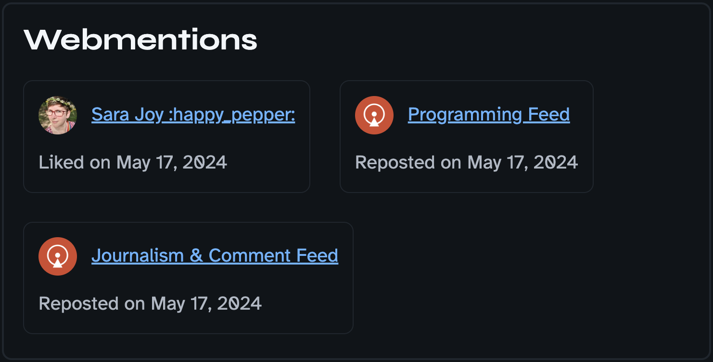

## Table of contents

- [TL;DR](#tldr)
- [How I got hooked](#how-i-got-hooked)
- [Taking a step back](#taking-a-step-back)
- [Implementing it](#implementing-it)
- [My Webmentions component](#my-webmentions-component)
- [Conclusion](#conclusion)

## TL;DR

You want to get started right away? Add this code to your [Component Script](https://docs.astro.build/en/basics/astro-components/#the-component-script) in your blog post layout and replace `YOUR_DOMAIN` with your domain name.

If there are [Webmentions](https://www.w3.org/TR/webmention/#introduction), you will get back an (empty) array through which you can loop. You can find more information here: [Find links to a specific page](https://github.com/aaronpk/webmention.io#api).

```javascript
const webmentionsUrl = import.meta.env.PROD
  ? `https://webmention.io/api/mentions.jf2?target=https://YOUR_DOMAIN${Astro.url.pathname}`
  : `https://webmention.io/api/mentions.jf2?target=https://YOUR_DOMAIN${Astro.url.pathname}/`;
const response = await fetch(webmentionsUrl);
const json = await response.json();
const webmentions = json.children;
```

## How I got hooked

I've been aware of webmentions peripherally for some time, but hadn't paid much attention to them until recently. That changed after I saw [Henry Desroches' talk at The 11ty International Symposium on Making Web Sites Real Good](https://www.youtube.com/watch?v=iLxJ6PtuF9M&t=8542s)!

So I was feverishly searching for information that would help me to receive, send and display Webmentions in [Astro](https://astro.build/). Fortunately, I found this blog post: [Adding Webmentions to a static Astro site](https://kld.dev/adding-webmentions/).

Unfortunately, I couldn't get it to work, partly because the article is a bit outdated (more on that later). And because I'm not really good with [Node.js](https://nodejs.org/en). 👉👈

As always when I get stuck, I put out a call for help to the Mastodon community and got a lot of suggestions, but almost all of them were for [Eleventy](https://www.11ty.dev/).

While I was very grateful for the help, unfortunately it didn't get me anywhere. I tried a lot, pushed and undid changes. Partly I was successful and something sort of worked. So it was time for:

## Taking a step back

Before I took care of the Webmentions, I first followed all the steps on [IndieWebify.me](http://IndieWebify.me) to successfully make my website and blog posts available on the [IndieWeb](https://indieweb.org/). Then I looked at the [example URL from the webmention.io repository](https://github.com/aaronpk/webmention.io#api) and pasted it into my browser:

> https://webmention.io/api/mentions.jf2?target=https://indieweb.org

Then I thought to myself: Ok, that should also work with my website? It didn't work with stevefrenzel.dev, nor with stevefrenzel.dev/blog. After I tried it with this blog post URL:

> https://webmention.io/api/mentions.jf2?target=https://stevefrenzel.dev/posts/from-boot-camp-to-blog-five-years-in-the-tech-industry/

I got a response, which was this:

```json
{
  "type": "feed",
  "name": "Webmentions",
  "children": [
    {
      "type": "entry",
      "author": {
        "type": "card",
        "name": "Sara Joy :happy_pepper:",
        "photo": "https://webmention.io/avatar/files.mastodon.online/a06118ca119ec1183309db1aa65689d6bd69349b68713fd0c3f49cc5de8ca683.jpg",
        "url": "https://front-end.social/@sarajw"
      },
      "url": "https://mastodon.online/@stvfrnzl/112457754528196561#favorited-by-109297968568930830",
      "published": null,
      "wm-received": "2024-05-17T18:51:48Z",
      "wm-id": 1828656,
      "wm-source": "https://brid.gy/like/mastodon/@stvfrnzl@mastodon.online/112457754528196561/109297968568930830",
      "wm-target": "https://stevefrenzel.dev/posts/from-boot-camp-to-blog-five-years-in-the-tech-industry/",
      "wm-protocol": "webmention",
      "like-of": "https://stevefrenzel.dev/posts/from-boot-camp-to-blog-five-years-in-the-tech-industry/",
      "wm-property": "like-of",
      "wm-private": false
    },
    {
      "type": "entry",
      "author": {
        "type": "card",
        "name": "Programming Feed",
        "photo": "https://webmention.io/avatar/files.mastodon.online/2a355e8ebe7968eff2c0f472b2ddf0e673bb20294c43adc29145fbe2c2a358e9.png",
        "url": "https://newsmast.community/@programming"
      },
      "url": "https://mastodon.online/@stvfrnzl/112457754528196561#reblogged-by-111653441837787906",
      "published": null,
      "wm-received": "2024-05-17T18:25:47Z",
      "wm-id": 1828650,
      "wm-source": "https://brid.gy/repost/mastodon/@stvfrnzl@mastodon.online/112457754528196561/111653441837787906",
      "wm-target": "https://stevefrenzel.dev/posts/from-boot-camp-to-blog-five-years-in-the-tech-industry/",
      "wm-protocol": "webmention",
      "repost-of": "https://stevefrenzel.dev/posts/from-boot-camp-to-blog-five-years-in-the-tech-industry/",
      "wm-property": "repost-of",
      "wm-private": false
    },
    {
      "type": "entry",
      "author": {
        "type": "card",
        "name": "Journalism & Comment Feed",
        "photo": "https://webmention.io/avatar/files.mastodon.online/2a355e8ebe7968eff2c0f472b2ddf0e673bb20294c43adc29145fbe2c2a358e9.png",
        "url": "https://newsmast.community/@journalismandcomment"
      },
      "url": "https://mastodon.online/@stvfrnzl/112457754528196561#reblogged-by-111653306305749482",
      "published": null,
      "wm-received": "2024-05-17T18:25:46Z",
      "wm-id": 1828649,
      "wm-source": "https://brid.gy/repost/mastodon/@stvfrnzl@mastodon.online/112457754528196561/111653306305749482",
      "wm-target": "https://stevefrenzel.dev/posts/from-boot-camp-to-blog-five-years-in-the-tech-industry/",
      "wm-protocol": "webmention",
      "repost-of": "https://stevefrenzel.dev/posts/from-boot-camp-to-blog-five-years-in-the-tech-industry/",
      "wm-property": "repost-of",
      "wm-private": false
    }
  ]
}
```

Sweet, now we’re talking! Let’s try to make this work with Astro. 👏

## Implementing it

This is the bare minimum I need to make them available in the respective blog post. Feel free to expand, change and configure it to your personal needs. We’ll go through the code line by line:

```javascript
const webmentionsUrl = import.meta.env.PROD
  ? `https://webmention.io/api/mentions.jf2?target=https://stevefrenzel.dev${Astro.url.pathname}`
  : `https://webmention.io/api/mentions.jf2?target=https://stevefrenzel.dev${Astro.url.pathname}/`;
```

This part is very interesting and has given me a lot of headaches. Remember when I mentioned that the article above is a bit outdated?

It says that you access the environment variables using `process.env.WEBMENTION_API_KEY`. This no longer works in Astro, because you need `import.meta.env.WEBMENTION_API_KEY`, as you can read in the [Astro documentation](https://docs.astro.build/en/guides/environment-variables/#default-environment-variables).

Why is this relevant if I don't use an API key at all? After I proudly pushed my code with the working Webmentions, I noticed that nothing was visible online.

No problems with the commit, no problems with the build, no error message in the console, nothing. Why do they work locally but not in production?

Quite simple: A trailing slash is required live, but not locally... I can't believe that a slash cost me so much time and nerves. 🤦‍♂️

This [ternary operator](https://developer.mozilla.org/en-US/docs/Web/JavaScript/Reference/Operators/Conditional_Operator) is used to check whether my server is in `production` or `development` mode. Accordingly, it has a slash at the end, or not.

To reference the current file pathname, I'm using the [Astro global](https://docs.astro.build/en/reference/api-reference/#astrourl), which is available in all contexts in `.astro` files

```javascript
const response = await fetch(webmentionsUrl);
```

Here we’re leveraging the powerful [fetch() method of the Web API](https://developer.mozilla.org/en-US/docs/Web/API/fetch). We do an asynchronous call to retrieve all the content of this call and turn it into a JavaScript object with the [json() method](https://developer.mozilla.org/en-US/docs/Web/API/Response/json):

```javascript
const json = await response.json();
```

As we’re just interested in the children of this object, we store them accordingly in a variable:

```javascript
const webmentions = json.children;
```

And that’s it! Now you can loop through this array to your liking and display all the content however you want. I created a `Webmentions.astro` component to do just that.

## My Webmentions component

Let’s brake it down into chunks and see what I did in the Component Script:

```javascript
---
import { Image } from "astro:assets";

interface AuthorProps {
  name: string;
  photo: string;
  url: string;
}

interface WebmentionProps {
  author: AuthorProps;
  "wm-received": string;
  "wm-property": string;
}

interface Props {
  webmentions: WebmentionProps[];
}

const { webmentions } = Astro.props;

const showDate = (webmention: string) =>
  new Date(webmention).toLocaleDateString(undefined, {
    day: "numeric",
    month: "long",
    year: "numeric",
  });
---
```

Nothing too fancy, just some type definitions and a method to show a human readable date. Moving on to the [Component Template](https://docs.astro.build/en/basics/astro-components/#the-component-template):

```javascript
{
  webmentions.length > 0 ? (
    <section aria-label="Webmentions">
      <h2>Webmentions</h2>

      <ul>
        {webmentions.map((webmention: WebmentionProps) => (
          <li>
            <div class="avatar-and-author">
              {webmention.author.photo ? (
                <Image
                  alt=""
                  height="50"
                  src={webmention.author.photo}
                  width="50"
                />
              ) : null}
              <a href={webmention.author.url} rel="author">
                {webmention.author.name}
              </a>
            </div>
            <div class="information">
              {webmention["wm-property"] === "like-of" ? (
                <p>
                  Liked on
                  <time aria-hidden="true" datetime={webmention["wm-received"]}>
                    {showDate(webmention["wm-received"])}
                  </time>
                </p>
              ) : null}
              {webmention["wm-property"] === "repost-of" ? (
                <p>
                  Reposted on
                  <time aria-hidden="true" datetime={webmention["wm-received"]}>
                    {showDate(webmention["wm-received"])}
                  </time>
                </p>
              ) : null}
            </div>
          </li>
        ))}
      </ul>
    </section>
  ) : null
}
```

If the array of Webmentions is empty, I don’t show this component at all, so it’s gonna equal `null`.

If they're present, I'll show the author picture, or not. And depending on the type of Webmention (like or repost), I'll show just that.

The current implementation looks like this, but it's gonna change for sure. If you’re curios regarding the styling, have a [look at the code on GitHub](https://github.com/stevefrenzel/dev-portfolio/blob/main/src/components/utils/Webmentions.astro).



## Conclusion

Those few lines of code were a whole weekend of trying back and forth and I'm glad I stuck with it. I like the idea of an open, decentralized web that isn't dependent on monolithic companies _doing devious and evil 2024 website things_. [^1]

I hope this article helps other Astro users to integrate Webmentions more easily into their blog and I would be happy to receive many Webmentions so that I have more data to work with and can update this article accordingly. ✌️

[^1]: Quote from [The Cascade](https://csscade.com/membership/#1-i-like-the-simplicity)
