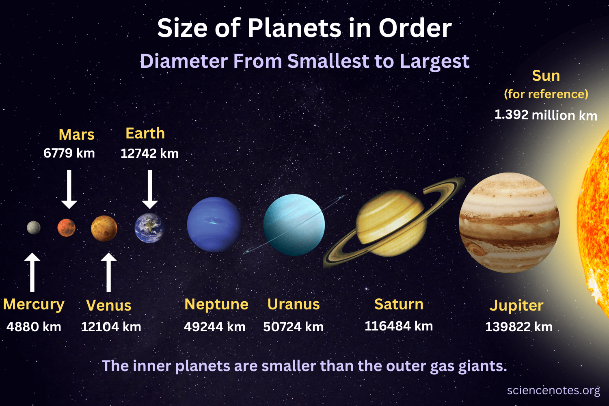
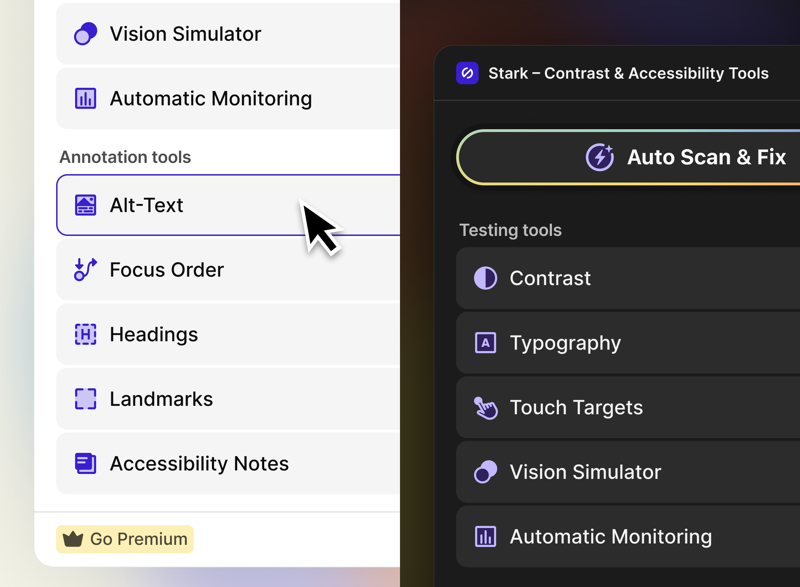
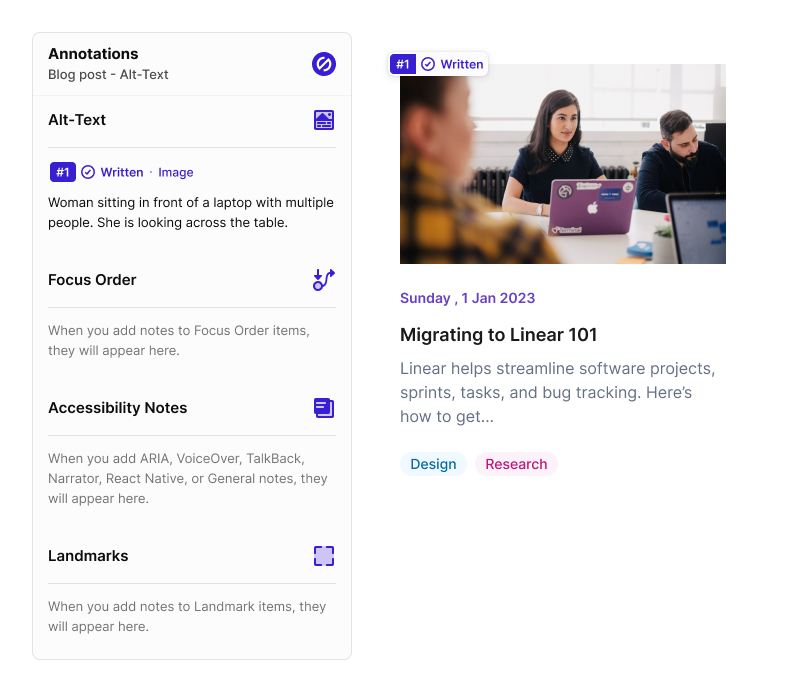
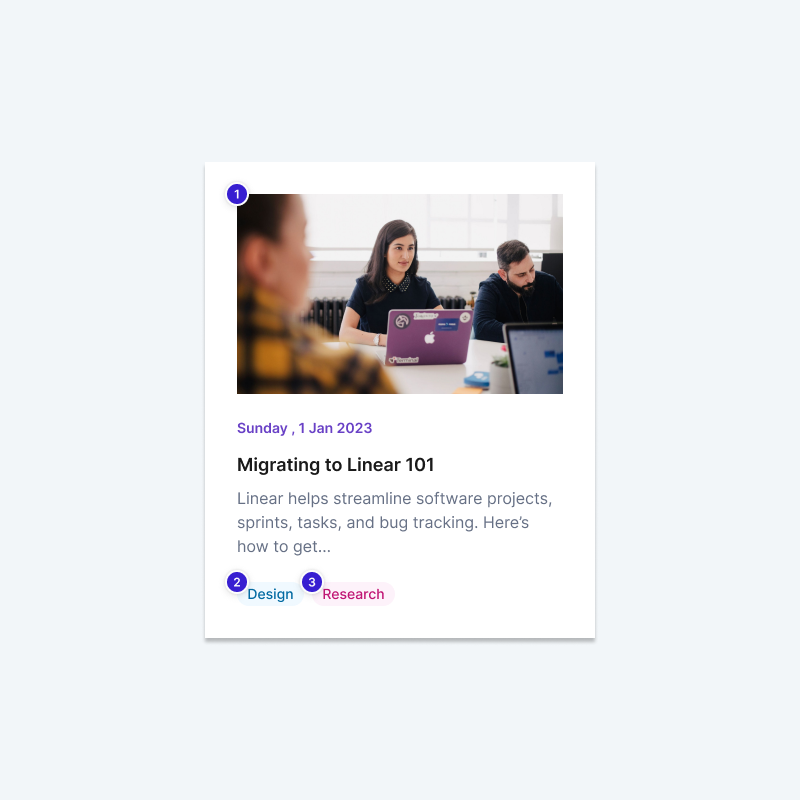
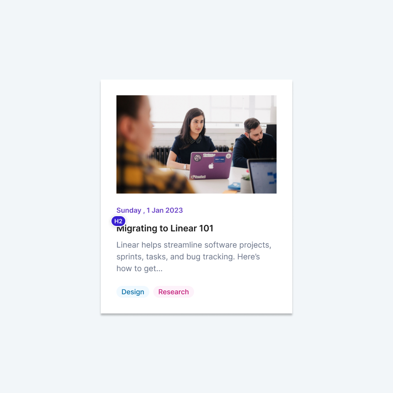
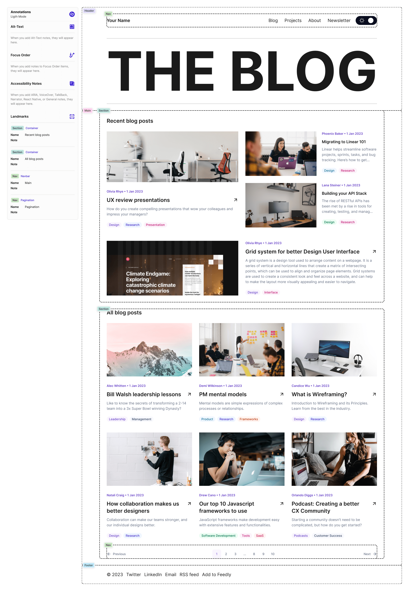
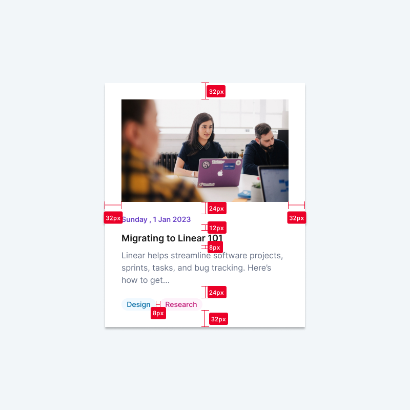

## Table of contents

- [Why I’m writing this](#why-im-writing-this)
- [Back & forth in Figma](#back--forth-in-figma)
  - [Smallest & largest viewport](#smallest--largest-viewport)
  - [Annotations (with Stark)](#annotations-with-stark)
    - [Alt-Text](#alt-text)
    - [Focus Order](#focus-order)
    - [Headings](#headings)
    - [Landmarks](#landmarks)
    - [Measure Tools](#measure-tools)
- [Creating the ticket](#creating-the-ticket)
  - [User story](#user-story)
  - [Tasks](#user-story)
  - [Design](#design)
- [Doing the hand-off](#doing-the-hand-off)
- [Conclusion](#conclusion)

## Why I’m writing this

Do you sometimes feel irritated when opening a ticket for a task that only has one line of text, but it seems to be a big, complex component or feature you have to implement? Does it feel like a gentle, but distinguished “fuck off, this your responsibility now“ coming from the person creating the ticket?

I might have a solution for this, if you’re a developer knowing your way around in design tools and willing to take more responsibility. (And increase your market value along the way.)

Recently I had the privilege of doing web development with a holistic approach, or "the way it used to be" 🌈. Which means that I was responsible for the following things:

- Design (in Figma)
- Ticket creation (in JIRA)
- Implementation (in code)

The workload for this task was immense, but I learned a lot about what worked well and where things could be improved.

The fewer open questions there are in the design phase and the more detailed a ticket is written, the faster the implementation goes. I have created around ten of them and there were almost no follow-up questions from my developer colleagues.

I would like to share my approach, as it can make your workflow run smoothly if used in this or a similar way. As an example I use a Figma template from Faqih Sopyan called [A Web Personal Blog](https://www.figma.com/community/file/1235152009438565697/the-blog-a-web-personal-blog), which is freely available.

This article is very much inspired by [The time for designers to learn to code is now](https://piccalil.li/blog/the-time-for-designers-to-learn-to-code-is-now), as it was published at almost exactly the same time. Similar articles are [The Great Divide](https://css-tricks.com/the-great-divide/) and [Front-end development's identity crisis](https://www.ellyloel.com/blog/front-end-development-s-identity-crisis/).

## Back & forth in Figma

This is NOT a Figma tutorial. I'm not going to tell you how to create something there, but which tools you should use for a hand-off that will bring tears of joy to your eyes and those of your developers.

At this stage, it is important that you communicate openly and a lot so that you can work quickly and efficiently for yourself from a certain point onwards.

Talk to the person who is responsible for this project: product owner, product manager, [master of puppets](https://tidal.com/browse/album/80813905?u), whatever label is used for this particular position. Have you both clarified all your questions? Good, then let's move on:

Make sure you use your design system for your templates. You have one, don't you?

Again, sustainability and efficiency are key here, so work with [components](https://help.figma.com/hc/en-us/articles/360038662654-Guide-to-components-in-Figma) and [auto layout](https://help.figma.com/hc/en-us/articles/5731482952599-Add-auto-layout-to-a-design) as much as possible (if you’re using Figma).

If you have questions related to a backend implementation, ask your backend developers if it's possible. The same applies to frontend specific questions. If they have a better suggestion how to implement it in the real world, consider adjusting your design.

Some questions must be asked in writing in the group so that everyone can give their feedback. Others may only concern individuals and in this case you could simply call this person to clarify it quickly.

This phase can be a bit messy as there will be a lot of back and forth. That's ok as long as you clean up your mess after all the issues have been resolved.

### Smallest & largest viewport

[Image source](https://sciencenotes.org/size-of-planets-in-order/)

All questions and arguments on this topic have been answered on [The ideal viewport doesn't exist](https://viewports.fyi/). For our example, I'm only using the smallest viewport, but just use your imagination to envision the largest viewport version.

Try to get away from the terms “mobile”, “tablet” and “desktop” because they don't apply to the real world. Instead, use terms like:

- “smallest” and “largest”
- “minimum” and “maximum”

You could also use planet names, such as “Mercury” and “Sun”. Like the universe, the possibilities are endless! Leave everything in between to the browser, following the motto [Be the browser's mentor, not its micromanager.](https://buildexcellentwebsit.es/)

Once you're done, export these two as images and add them to the ticket. Don't just throw a Figma link in the ticket like it's breadcrumbs and your developers are pigeons in the park and hope for the best.

If you have a lot of templates in your Figma page, do yourself and the others a favour and use [sections](https://help.figma.com/hc/en-us/articles/9771500257687-Organize-your-canvas-with-sections) in Figma. It's simple, looks good and is... well, really easy to use!

### Annotations (with Stark)

[Image source](https://www.getstark.co/blog/all-new-beautiful-design-smart-suggestions-from-design-system-new-annotation-tools/)

I am a very big fan of Stark as they present the topic of accessibility in a light, easy-to-understand and sexy way, same goes for their products. There are different tools to add accessibility annotations in Figma and maybe this is not the right one for you.

For me, however, it is currently an all-in-one solution as I can easily cover different areas. From the following annotations you create an additional template in Figma and export it as an image:

#### Alt-Text

Here’s one big “It depends”™️ topic! Are there images in your design, that are purely decorative? Mark them accordingly.

Do you have images, where you know that they’ll need alt-text and it can be provided by you? Add them or read [What’s the alternative? How to write good alt text](https://design102.blog.gov.uk/2022/01/14/whats-the-alternative-how-to-write-good-alt-text/) first before you get started.

The alt-text will be provided by someone else? Mark it accordingly and pray to the [flying spaghetti monster](https://en.wikipedia.org/wiki/Flying_Spaghetti_Monster) they know how to write proper alt-text. Maybe send them the link above?

#### Focus Order

Anything that can be interacted with via keyboard should be marked accordingly.

If the focus order looks funny to you and goes up, down, left and right, tack a step back and rearrange the UI, please.

Keyboard support is crucial for anyone who is dependent on it and you want to get it right BEFORE it’s implemented.

#### Headings

One of my favourite topics! Most developers have no clue what these HTML elements are for, so here’s a handy resource for them: [The HTML Section Heading elements](https://developer.mozilla.org/en-US/docs/Web/HTML/Element/Heading_Elements)

What I’ve seen way too often is that these elements where picked based on their look but not there semantic meaning.

Do NOT do this, [heading levels are very important for screen reader users](https://webaim.org/projects/screenreadersurvey9/#heading) and search engine crawlers as well!

Do you really need an H3 to look like an H1? Create CSS classes (in your design system), use the correct HTML element, add the class to it, done. Although this shouldn’t be necessary, but at least your heading order will remain intact.

#### Landmarks

Very underrated, yet super important for screen reader users. These are invisible to the eye, but provide the structure of a website through semantics.

There are only a couple of them, so chances are high you’re gonna get this right on the first try: [Using HTML landmark roles to improve accessibility](https://developer.mozilla.org/en-us/blog/aria-accessibility-html-landmark-roles/)

I wouldn’t annotate individual components, but rather full pages where they all come together. This way you and your developers will have a better overview of which landmark elements to use.

#### Measure tools

I consider [Measure Tools](https://www.figma.com/community/plugin/822781486072277843) by Habo Chen a nice-to-have. It displays the spacing used in your design system (hopefully) and developers will know which spacing or utility class to apply (fingers crossed).

## Creating the ticket

You may use [JIRA](https://www.atlassian.com/software/jira), [Asana](https://asana.com/logged-in), [GitHub Issues](https://docs.github.com/en/issues), or some other tool to create your tickets. You may love or you may hate it. You may have a pre-defined structure for tickets in place.

When I have the chance to write a ticket, I want it to be understandable by anyone who takes a look at it. Here’s my approach:

### User story

Unless it’s something internal you work on where no end-users are involved, this is the most important part. It describes (in first-person mode) what the user experience with this particular thing you’ll create will be like.

Try to keep it brief and avoid technical jargon, if possible. Assume that the person on the other end has no clue how to use it. It could look something like this:

> _As a user, I want to have a preview of a blog article. When pressing the “read more” button, I can access the whole article on a new page._

See what I did there? Keeping the [P.O.U.R. principles](https://www.w3.org/WAI/fundamentals/accessibility-principles/) in mind! 💪

- I didn’t use the word “see”, cause some people might not be able to. But they will have this blog article preview available on the page and can interact with it however they want.
- I didn’t use the word “click”, cause people might not be able to use a mouse. But they can both press the button with a mouse and a keyboard (or other assistive technology).
- I didn’t use the word “read”, cause some people might not be able to actively read but have it read out loud by a screen reader.
- I didn’t use the word “redirect”, but this is what’s gonna happen after interacting with the button.

I covered both the presentational and functional part of it in two shorts sentences. You might disagree with me here, but that’s the way how I write user stories to get the point across.

Don’t forget: Whatever you build, you build it for people!

### Design

Here you’re gonna add two things:

1. Link(s) to the design in Figma, Sketch, Adobe XD, whatever
2. The images of the templates for
   1. Smallest viewport
   2. Largest viewport
   3. Alt text annotations
   4. Focus order annotations
   5. Heading annotations
   6. Landmark annotations
   7. Spacing annotations

Depending on the provider, you might not be able to add the images directly to the ticket. That’s cool, as long as you can at least add a link to them.

If there are images or icons which are not part of the frontend or design system; add them directly to the ticket!

The goal here is to reduce the amount of follow-up questions, so it’s essential that all the info is available at once, one way or another.

### Tasks

Here’s the part where you can go in-depth and describe how something should be implemented.

Let’s keep the example of the blog article preview. How would you describe it to your developers?

If you’re using [atomic design](https://bradfrost.com/blog/post/atomic-web-design/) for your design system and have everything pre-defined, you could at first specify which atoms, molecules and / or organisms should be used.

I then like to work my way from outer to inner shell when describing:

- Which landmark element(s) should be used
- Which other semantic HTML element(s) should be used
  - If they need an aria-label, describe it’s content
  - If it should be hidden via aria-hidden=”true”, add the info
  - If they need other aria roles, describe them accordingly
- Which font-sizes should be used
- Which colors should be used
- Which tracking parameters should be added (if applicable)

If done properly, this should cover enough, if not all the ground for developers to get started right away. This might be borderline micromanaging, but so far my experience with a detailed list of requirements has been very good.

## Doing the hand-off

When you think you’re done with your ticket, present it to your team lead, designers and developers. Do they have any questions or suggestions? Update the ticket or design accordingly. By this point, the amount of work to adjust something should be very little.

If everyone’s happy, start hacking or create the next ticket. 🤗

## Conclusion

To sum it up, the structure of your ticket could look like this:

- User story
  - Brief and general description of the expected user experience
- Tasks
  - Describing which HTML elements, font-sizes and colours should be used
  - Describing functionality, for example a redirect
- Design
  - Add a link to the design in Figma, Sketch, Adobe XD, whatever you use
  - Add the following pictures to the ticket:
    - Smallest & largest viewport
    - Alt-Text annotation
    - Focus order annotation
    - Headings annotation
    - Landmarks annotation
    - Spacing annotation (nice-to-have)

All of this can take a while to prepare and might require a bigger shift in your work flow. But in the long run every party involved (product owner, designer, developer) will benefit from a well documented design and ticket.

Because now you’re not saying “fuck-off” anymore when delivering your work, but doing a proper hand-off.
