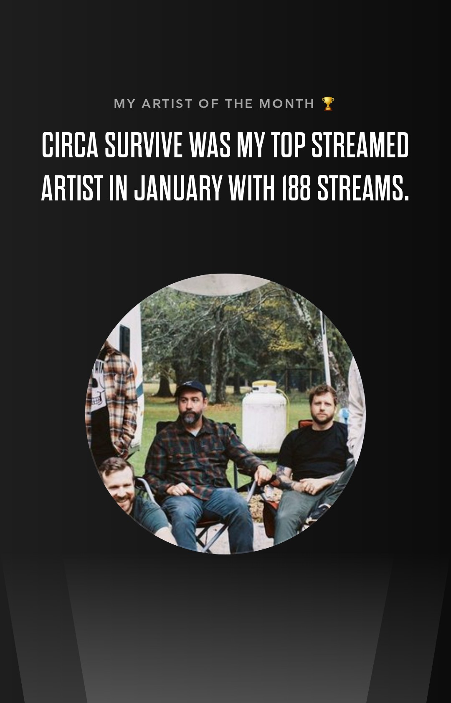
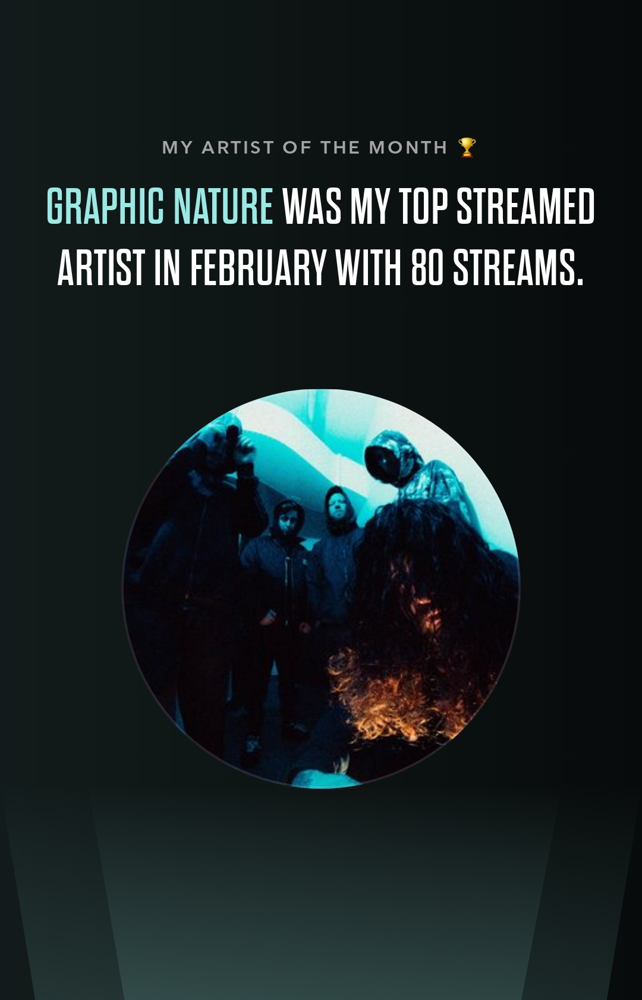
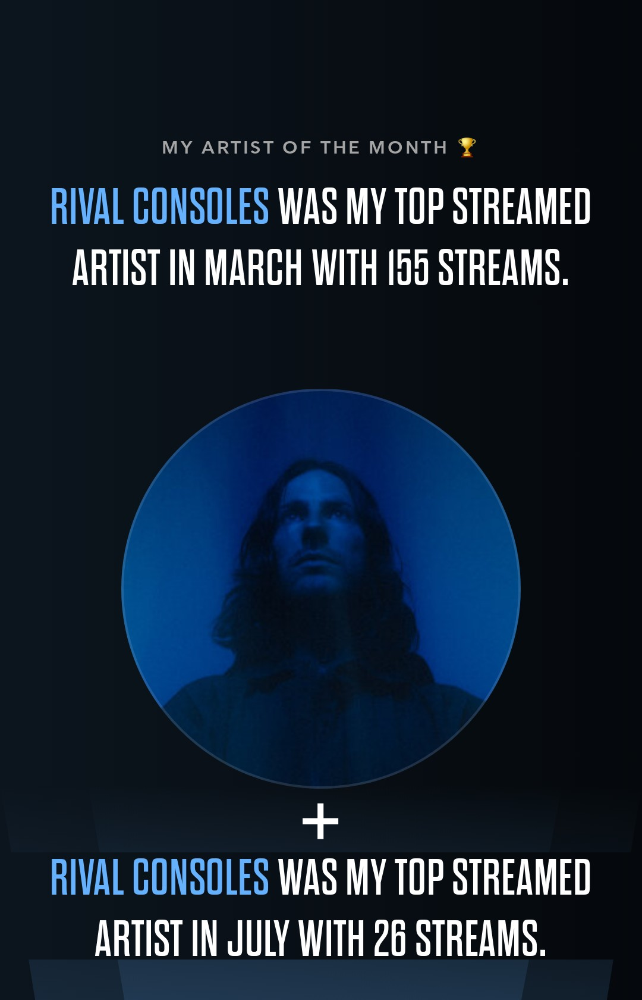
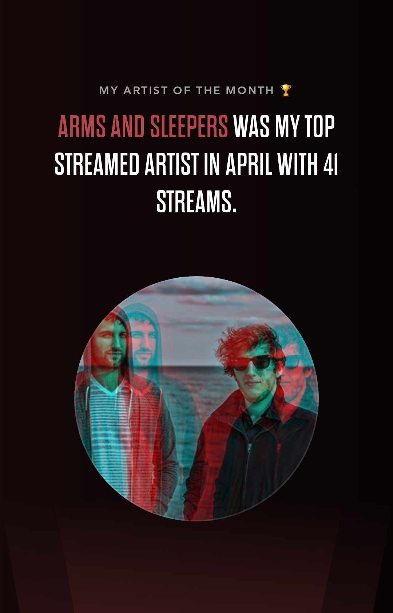
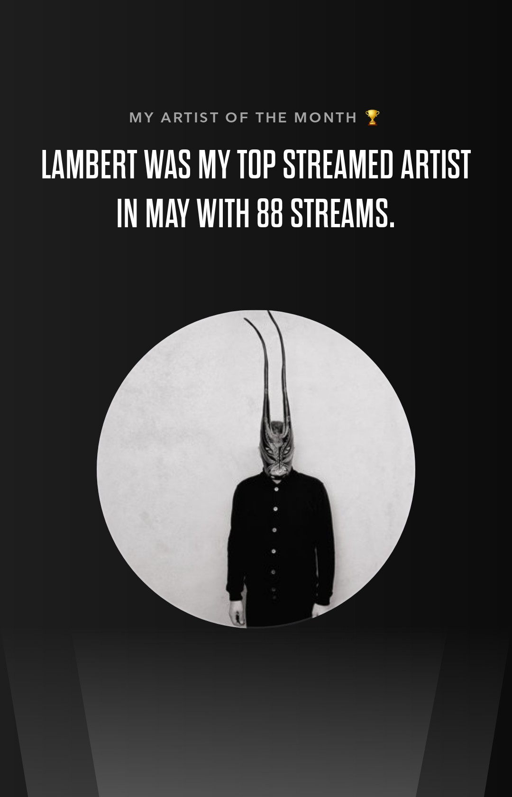
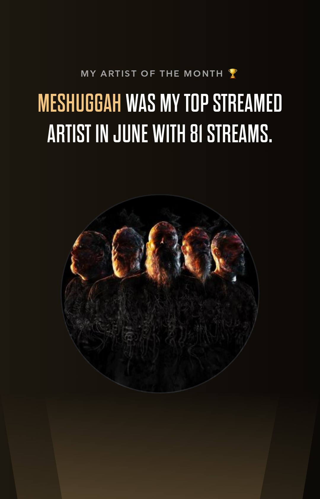
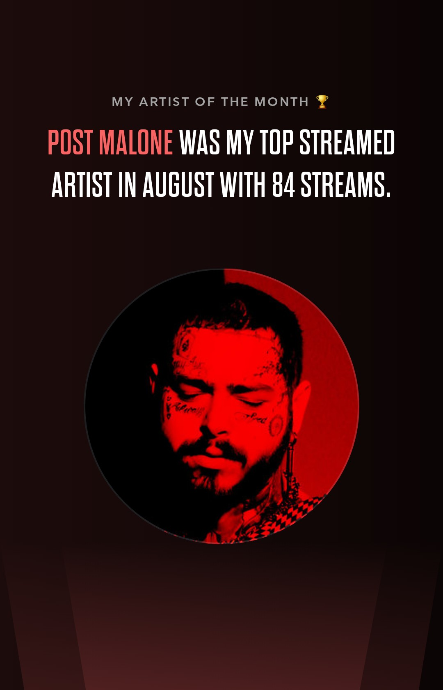
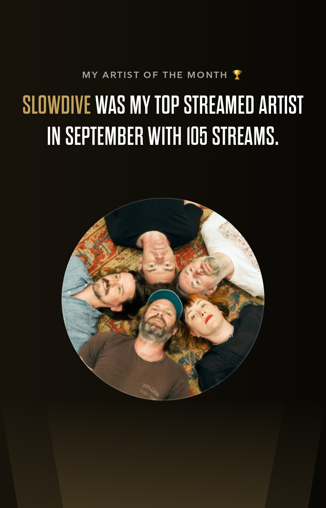
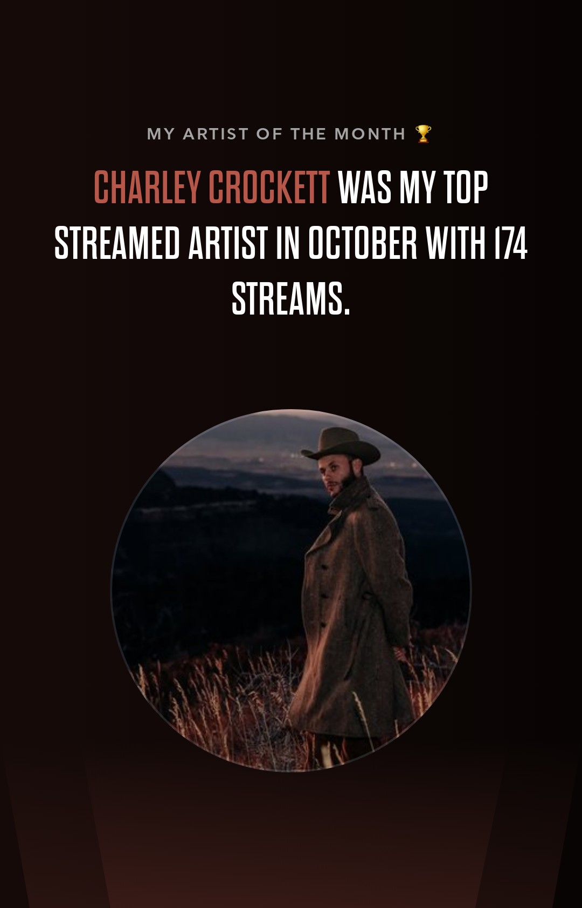
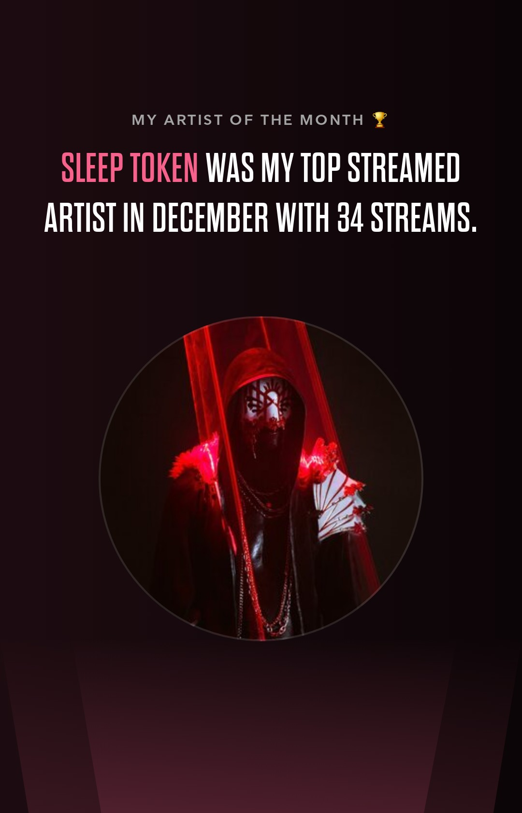

It's a shame that TIDAL doesn't offer a summary at the end of the year like Spotify, but you can see which artists you've streamed and how much each month. [Apparently this used to exist in the past](https://thenaturehero.com/tidal-rewind-2023/) and was called "Rewind", but that was before I switched. Let's see what I listened to the most each month and what my personal album of the year is:

## January 2023

"Two Dreams" by Circa Survive was my soundtrack for the beginning of the year because it hit the spot with its melancholic but not too calm songs. I never really had the band on my radar, but I'm glad I listened to it because I liked the cover so much. When I'm working as a sound engineer at shows, I like to play this as the background music. It's just perfect for any occasion!

[Listen to "Two Dreams" by Circa Survive](https://songwhip.com/circa-survive/two-dreams)

## February 2023

I don't remember how I became aware of "A Mind Waiting To Die" by Graphic Nature, probably during the short time I had Instagram. Their producer [Sam Blood](https://www.sambloorproducer.com/) had mentioned in an ask-me-anything that some of the songs were in Drop F (guitar tuning), which made me curious. When I describe the record to people I always say "Slipknot in cool and without clean singing" and god damn it I love it. It's so heavy and such a great piece of art.

[Listen to "A Mind Waiting To Die" by Graphic Nature](https://songwhip.com/graphicnature/a-mind-waiting-to-die)

## March 2023 & July 2023

"Night Melody / Articulation" by Rival Consoles is my go-to record when it comes to instrumental music for concentrated work. The soundscapes have a certain nostalgia and a slight Stranger Things charm that is perfect for getting into the "tunnel". I've tried listening to lo-fi while coding but it's too cliché and too random. I need that certain something only Rival Consoles can give me!

[Listen to "Night Melody / Articulation" by Rival Consoles](https://songwhip.com/rival-consoles/night-melody-articulation)

## April 2023

I haven't listened to much music this month and I wasn't picky about what was on at work. I guess after Rival Consoles came random songs that were supposed to fit and at some point "Kiss Tomorrow Goodbye" by Arms And Sleepers came on and I listened to it on repeat. If you're a fan of Massive Attack, you should definitely check out this record:

[Liste to "The Organ Hearts" by Arms And Sleepers](https://songwhip.com/arms-and-sleepers/the-organ-hearts)

## May 2023

"False" by Lambert stands out from the discography for me, as it is very percussive and experimental by his standards. Another record to get into the "tunnel" without being too intrusive or too boring.

[Listen to "False" by Lambert](https://songwhip.com/lambert/false)

## June 2023

That month I saw Meshuggah live for the third time, as the last band at the Rock am Ring Festival at midnight. Seeing this band at their own shows at an earlier time is already a different experience, but this gig was something very special. They just get better every time I see them live, especially visually. I don't like all of their albums, but there's one that always works any time of year or day:

[Listen to "Catch Thirty Three" by Meshuggah](https://songwhip.com/meshuggah/catch-thirty-three)

## August 2023

I never missed the hype surrounding him, but the music never caught my attention. That was until I heard "AUSTIN" for the first time. It's definitely the best pop album of this year for me, almost every song has vocal melodies that burn into my brain without being annoying. I'm very impressed that such a well-known artist can write such good songs that sound like him and don't too obviously follow a certain formula.

[Listen to "AUSTIN" by Post Malone](https://songwhip.com/post-malone/austin)

## September 2023

How I was looking forward to "everything is alive" by Slowdive and was almost not disappointed! They are THE band of the shoegaze genre for a reason. I feel a physical sense of well-being when I listen to this record and immerse myself in the warm reverb of their guitars. Only "Andalusia plays" is a song that bores me a lot and I always skip it, otherwise this record is perfect!

[Listen to "everything is alive" by Slowdive](https://songwhip.com/slowdive/everything-is-alive)

## October 2023

Felt like I haven't listened to anything else in the last quarter, so I'm surprised it didn't get the most streams from me. 😅 I've always wanted to dip my foot in the country water, but always found it too corny from a lyrical and / or musical perspective. Thanks to a personal recommendation I discovered him and find his live albums better than the studio version, similar to Johnny Cash. If you like blues mixed with country and a pinch of jazz, give it a listen:

[Listen to "Live from the Ryman" by Charley Crockett](https://songwhip.com/charley-crockett/live-from-the-ryman)

## November 2023

"Parallels: Shellac Reworks" by Christian Löffler is another record that popped up after my regular selection and stuck. The perfect music for the gray, rainy German autumn. What fascinates me about this record is that the samples sound kind of creepy, also because they sometimes don't fit the timing and key of the rest of the song...

[Liste to "Parallels: Shellac Reworks" by Christian Löffler](https://songwhip.com/christian-loffler/parallelsshellacreworksbychristianloffler)

## December 2023

What would a musical review of the year be without "Take Me Back To Eden" by Sleep Token, eh? Even though I think the hype is justified, as an album it's not as strong as "Sundowning" for me. The songs are either REALLY rad or just meh. "Chokehold" isn't just the best Sleep Token song, it's simply the best song of 2023.

[Listen to "Take Me Back To Eden" by Sleep Token](https://songwhip.com/sleep-token/take-me-back-to-eden)

## Award ceremony

Hm... Rival Consoles doesn't really count for me because I haven't actively listened to it, so I'd pick the three winners as follows:

- 1st place: Circa Survive 🥇
- 2nd place: Charley Crockett 🥈
- 3rd place: Slowdive 🥉

That looks better and two of the artists have even released a album in 2023. 😅 Looking at these artists, I can safely say that a lot has been going on musically in the last year. A very diverse list!
