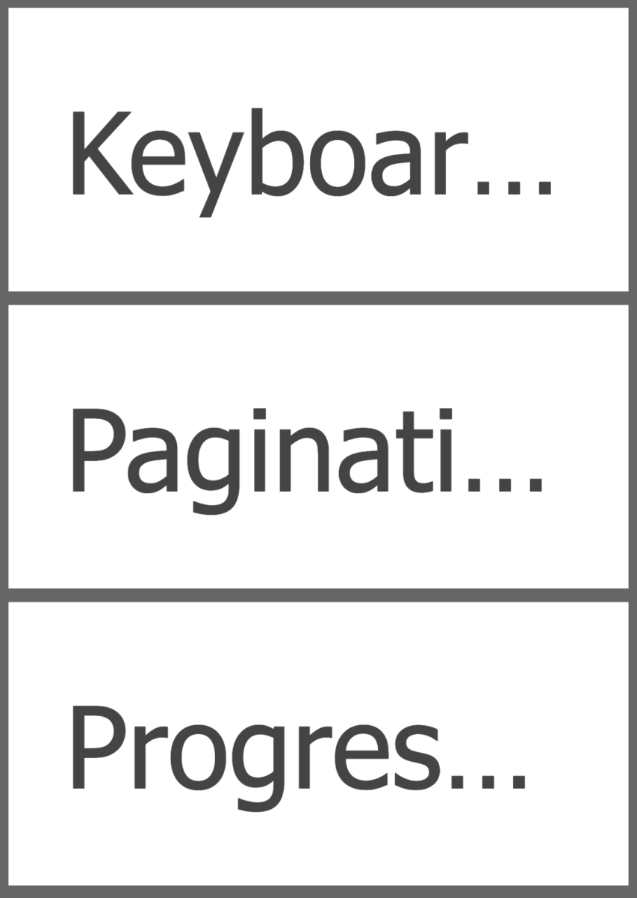

_Photo credit: Cover image by [Markus Winkler](https://unsplash.com/@markuswinkler?utm_content=creditCopyText&utm_medium=referral&utm_source=unsplash) on [Unsplash](https://unsplash.com/photos/silver-scissors-on-blue-surface-bNhCzmKZ_dI?utm_content=creditCopyText&utm_medium=referral&utm_source=unsplash), example screenshots by James Edwards_

## Short answer: No

There's no benefit for the user to have truncated text and it's a CSS feature which should have never made it into production in the first place.

## Long answer: No, you should not

While browsing through one of my favourite newsletters [Accessibility Weekly](https://a11yweekly.com/), I came across this article by [Doug Abrams](https://www.tpgi.com/author/doug/): [Reflow Red Flags](https://www.tpgi.com/reflow-red-flags/). This article is about [Success Criterion 1.4.10 Reflow](https://www.w3.org/TR/WCAG21/#reflow), but what caught my attention was the part about truncated text. Personally, I never saw a benefit in using it, because I always asked myself:

- Why would I obscure text information? If it has to be truncated, it's obviously not that important.
- So why not ditch the text or make it shorter?
- If it's for "consistency" and "corporate identity", it's still not a good idea and shouldn't be done?

Doug links to another article about this topic by [James Edwards](https://www.tpgi.com/author/brothercake/), called [The Ballad of Text Overflow](https://www.tpgi.com/the-ballad-of-text-overflow/). Here he showcases how bad truncated text for low vision users is.

Have a look at this screenshot, it shows truncated text in a width-constrained list of 640px viewport:

This one shows the same list 400% zoomed in, like low vision users might do:

This not only fails the success criterion mentioned earlier but could also fail [Success Criterion 1.3.1 Info and Relationships](https://www.w3.org/TR/WCAG/#info-and-relationships). So what are the alternatives to text truncation? I'll leave you with a quote from James himself:

> The real answer here is not to rely on text truncation at all.
> Designs should be flexible enough to accommodate any content they might have, in any viewport size (from 320px), and any increases in zoom (up to 400%).
> This is not as challenging as it might sound.
