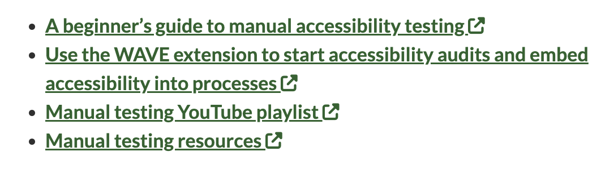

_Photo credit: Photo by [Sebastiaan Stam](https://unsplash.com/@sebastiaanstam?utm_content=creditCopyText&utm_medium=referral&utm_source=unsplash) on [Unsplash](https://unsplash.com/photos/man-wearing-red-hoodie-RChZT-JlI9g?utm_content=creditCopyText&utm_medium=referral&utm_source=unsplash)_

Disclaimer: When talking about "links", I actually mean [anchor elements](https://developer.mozilla.org/en-US/docs/Web/HTML/Element/a). But for the sake of simplicity, I will use the term "link". Also I should practice what I preach, but for now external links do not have a visual or audible indicator. I am aware of it and it's on my evergrowing to-do-list for this blog.

The question in the title seems to be as old and unanswered as the discourse on "links versus buttons" and "should I use section or article?". My personal preference is that links should open in the same tab, as I make heavy use of the back button. This article is largely based on [How to make external links accessible](https://blog.pope.tech/2024/01/02/how-to-make-external-links-accessible) by Whitney Lewis.

## Table of contents

- [The arguments in favour](#the-arguments-in-favour)
- [The arguments against](#the-arguments-against)
- [Damage control](#damage-control)

## The arguments in favour

Let's look at the dilemma from the positive side for reasons to open a link in a new tab:

When filling out a form, you may lose progress if you navigate forward or backward. If you open the form in a new tab, you are safe from this. An alternative to this would be to make the form persistent and display new information in an overlay that can be easily closed.

If you are on a website that logs the user out after a certain amount of time, it can be useful for links to open in a new tab to avoid this mechanism. In this context, however, it is important to give users the option of adjusting the time limit, otherwise it might fail [Success Criterion 2.2.1 Timing Adjustable](https://www.w3.org/TR/WCAG22/#timing-adjustable).

These are two very specific examples and in general you should consider (preferably on the basis of user feedback) whether and at what point links should open in a new tab.

## The arguments against

Whitney made what I consider the most important argument first, so I'll quote her directly:

> "The most important reason why links should open in the same tab is to give users a choice. If a link is set to open in the same tab, the user always has the choice to open it in a new tab."

The World Wide Web Consortium also has a clear opinion on this:

> "In general, it's better not to open new windows and tabs, as they can be confusing for people, especially those who have difficulty perceiving visual content." - [W3C](https://www.w3.org/TR/WCAG20-TECHS/G200.html)

In her article, Whitney lists many more reasons against it, but the core problem is: You are taking a piece of self-determination from your visitors and forcing something on them.

## Damage control

Let's say you couldn't convince the marketing team that it's better for users to have links open in the same tab. What can you do to minimize the negative effects of this decision?

For one thing, you can add an icon to all external links that visually signals what will happen when you click or press "enter". The symbol looks more or less like this and seems to be becoming an unofficial standard:



If you use a screen reader, however, this symbol would be announced every time. That's why Whitney suggests hiding it with `aria-hidden` and adding a screen reader exclusive hint. It could look like this, for example:

```html
<a href=“LINK_URL” target=“_blank”>
    LINK_TEXT
    
    <span class="visually-hidden”>Opens in new tab</span>
</a>
```

With this solution, there would not only be a visual, but also an audible indicator that a link will open in a new tab. This would be a compromise that the marketing team could perhaps live with, as they may have seen this icon before and your suggestion would appear less "exotic".
