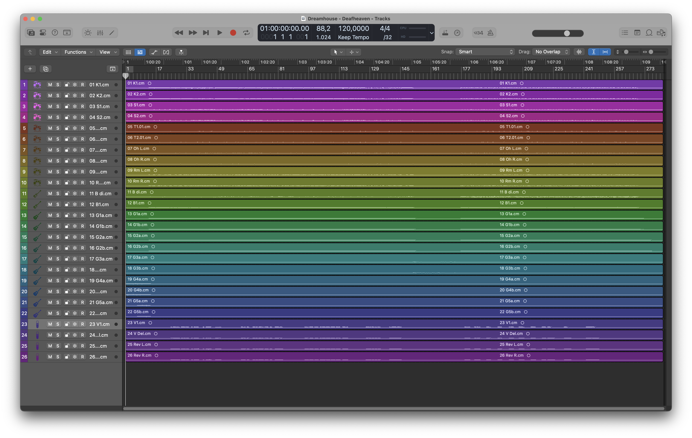

## Table of contents

- [TL;DR](#tldr)
- [Why I’m writing this](#why-im-writing-this)
- [Example project](#example-project)
- [File and folder management](#file-and-folder-management)
- [Changing the order](#changing-the-order)
- [Renaming](#renaming)
- [Color-coding and symbols](#color-coding-and-symbols)
- [Clean-up](#clean-up)
- [Gain staging](#gain-staging)
- [Markers](#markers)
- [Creating alternatives](#creating-alternatives)

## TL;DR

For fast and effective work in a Logic Pro X (mixing) session, the following things can be done:

- Audio files are divided into appropriate folders before importing
- They are grouped into summing stacks within the session
- The order of the individual tracks is adjusted according to personal taste
- If necessary, the individual tracks are renamed
- Color coding is applied, also according to personal preference
- Silent passages are cut out and unnecessary files are deleted from the project
- Gain staging is applied to summing stacks to avoid clipping
- Sections are marked with global markers
- Project alternatives are created

## Why I’m writing this

I've been working with Logic Pro for more than 15 years and since then I've seen some session files from other people, some of which were very wildly organized.

This makes it difficult for me to work with them at first because I find it hard to find my way around and there are a lot of questions on my part.

For this reason, I would like to show you how I prepare a session so that not only I can find my way around it, but also people who are seeing it for the first time.

Your future you will also be very grateful when it opens a session again after several years and immediately finds their way around.

## Example project

For this example, we are using the individual tracks from the song [“Dream House” by Deafheaven](https://tidal.com/browse/track/20749617?u), one of my favorite bands! 😍 These tracks are provided by the ISOLATE/CREATE project. You can download the tracks here to try it out for yourself. But first the disclaimer:

> USAGE: Unless specifically stated otherwise in the project notes, assets provided via ISOLATE/CREATE are for EDUCATIONAL PURPOSES ONLY.
>
> No license is granted and any commercial usage or duplication of any materials herein is strictly prohibited.

[Download “Dream House” audio tracks by Deafheaven](https://www.isolatecreate.com/deafheaven/)

In this hypothetical scenario, I assume that I should create a mix. The band has sent me the individual tracks with the note that no more editing and producing is necessary and that the song structure is final. The next step is to prepare the project accordingly.

## File and folder management

In this case, we have a fantastic hand-off, as the tracks are numbered in the same way as I would arrange them in my mixing session. The file names are a bit cryptic, but the first letter gives a clue as to which instrument is being played. If I'm unsure, I listen briefly and divide the files into the following folders:

1. Drums
2. Bass
3. Guitars
4. Vocals

I will use this folder structure for my Logic Pro session. Since I prefer a certain order of the instruments in the mix, I already pay attention to which files I import first. Just for fun, let's import all audio tracks at once and have a look at this beautiful mess:

This color gradient is possible because I have set under “Settings”, “View” and “Tracks” that the track color should be assigned automatically:

In the next step, I sort the tracks into summing stacks based on my folder structure. These can be created with SHIFT + CMD + D. For the drums, I create a subfolder for kick and snare. Personally, it is important to me that the numbering of the busses corresponds to the visual order, so I go from top to bottom and name them accordingly:

We can see the bus routing in the mixer view (by pressing CMD + 2):

## Changing the order

The folder structure corresponds to the way I work, but I would like to rearrange the drums and guitars. I prefer the following order:

- Overheads
- Kick
  - Kick in
  - Kick out
- Snare
  - Snare top
  - Snare bottom
- Toms
- Room

The order of kick and snare seems correct, only the overheads have to be moved to the top.

I arrange the guitars in chronological order. So the signal that is heard first appears at the top and so on. This ruins the beautiful color gradient, but I'll take care of that later.

## Renaming

The file names of the individual tracks are inherited by Logic Pro. If these are very long, it may make sense to rename them in the project to make them easier to read. This can also improve the work flow for projects with a large number of tracks.

In this case, however, it is already very clear (thanks to the summing stacks), so I will skip this step.

## Color-coding and symbols

For the summing stacks, I start at the top left with red and work my to the right. I also update the symbols, because why not?

For the tracks within the summing stack, I work my way from blue to the left.

This also applies to the kick and snare subfolder, for which I also start on the left, but with the darker version from the row below.

I use the same color for pairs that belong together (overheads, room, guitars, etc.).

## Clean-up

If there are completely silent sections, I remove them roughly and without fades, with the exception of the drums:

Then I press “F” to display all the project files. Under “Edit” and “Select unused” I can see which files I can delete without worrying. Hit backspace and they're gone!

In the last step, I select “Clean Up...” under “File”, “Project Management” to get rid of everything that is not being used. This can also significantly reduce the file size of a session.

## Gain staging

There are sometimes heated debates on the subject of [gain staging](https://en.wikipedia.org/wiki/Gain_stage). My personal approach is to set -6.0 dBFS on the respective summing stacks so that I have enough headroom later in the mix and nothing is clipping.

## Markers

By pressing “G”, you can display global tracks above the regions. In addition to chords, time signatures and tempos, markers can also be created here. These are not only extremely useful for mixing when communicating with artists, but also during recordings.

At best, the song tempo and tempo changes are known and can be created accordingly. If not, you can create the markers roughly based on the audio tracks. For more precise markers, you can use the stock BPM counter to find out the tempo.

For this project, I saved myself the trouble and simply created very rough markers, as this song basically only consists of four parts: Intro, Blast 1, Break and Blast 2. Since the energy is very consistent in the [blast beat](https://en.wikipedia.org/wiki/Blast_beat) parts, I didn't divide them into subsections again.

## Creating alternatives

Almost done! We have created a session that is ready to be edited by us. As an additional safety net, I create an alternative from this session called “V1” under “File”, “Project Alternative” and “New Alternative...”.

This will be my first mix, which I will send to my fictitious customer. If they want me to change something, I will create an alternative called “V2” on work on that one.

I rename the first alternative to “Original” under “File”, “Project Alternative” and “Edit Alternatives...”. This means I can always go back to a session that has been prepared but not yet edited.

